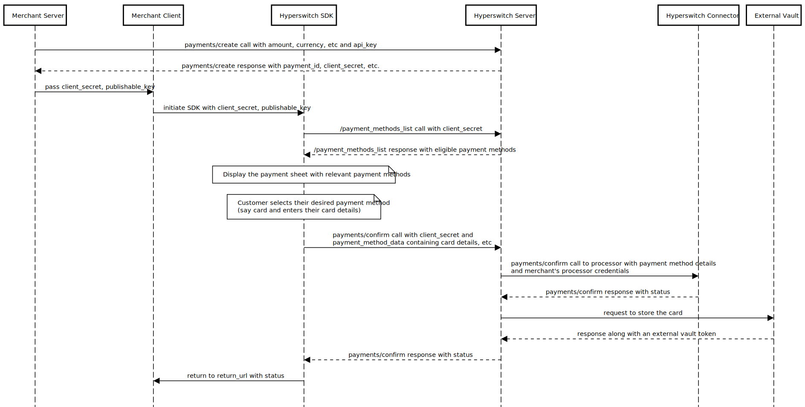

# Hyperswitch SDK + External Vault Setup

In this approach, the Hyperswitch SDK is used to capture card details, but card storage and tokenization are handled by an external vault. Hyperswitch backend orchestrates payments using tokens issued by the external vault.

The merchant configures connectors and routing rules in the Hyperswitch Dashboard. Hyperswitch backend translates orchestration decisions into PSP specific requests using the provided external vault tokens.

#### **Understanding Payment and Vault flow**

**Vaulting**

<figure><figcaption></figcaption></figure>

**1. Create a Payment Intent**

Your Merchant Server sends a request to the Hyperswitch Server containing the transaction details (amount, currency, etc.). Hyperswitch records this intent and returns a `client_secret`. This secret is a secure identifier used to manage the payment session safely on the frontend.

**2. Initialize the Payment Sheet**

Your Merchant Client (frontend) uses the `client_secret` to initialize the Hyperswitch SDK. The SDK then requests a list of available payment methods from the Hyperswitch Server, which filters them based on your configuration and the customer’s eligibility (e.g., location or currency).

**3. Customer Selection & Data Entry**

The SDK displays the payment interface to the customer. Once the customer selects a payment method (such as entering credit card details), the SDK captures this information. Note: This data is handled within the secure SDK environment, ensuring sensitive details do not pass through your servers.

**4. Payment Confirmation**

When the customer clicks "Pay," the SDK sends a confirmation request to the Hyperswitch Server. Hyperswitch then communicates with the designated Processor Server (e.g., Stripe, Adyen) to authorize the transaction using your stored merchant credentials.

**5. Secure Card Vaulting**

After the processor confirms the payment is successful, Hyperswitch sends the card details to an External Vault. The vault stores the information securely and returns a unique `payment_method_id`. This allows for secure, "one-click" future transactions without needing to re-enter card details.

**6. Status Finalization & Redirect**

The Hyperswitch Server sends the final transaction status (Success or Failure) back to the SDK. Finally, the SDK redirects the customer to your specified `return_url`, where you can display a confirmation message and proceed with order fulfillment.

**Payment using stored card**&#x20;

<figure><figcaption></figcaption></figure>

**1. Session Initialization**

Similar to a standard transaction, the process begins when your Merchant Server calls the [`payments/create`](https://api-reference.hyperswitch.io/v1/payments/payments--create) API. Hyperswitch generates a `payment_id` and a `client_secret`, which your server then passes to your frontend.

**2. Identifying the Customer**

When the Hyperswitch SDK initializes, it recognizes the returning customer. Instead of prompting for new card details, the SDK retrieves a list of eligible saved payment methods from the Hyperswitch Server.

**3. Selection of Stored Credentials**

The SDK presents the "Payment Sheet" to the customer, displaying their saved cards. The customer selects their preferred card and initiates the payment.

**4. Secure Retrieval from Vault**

Upon confirmation, the Hyperswitch Server does not ask the customer for their card number. Instead, it sends the `payment_method_id` to the External Vault. The vault identifies the record and securely releases the raw card data back to the Hyperswitch Server for the duration of the transaction.

**5. Payment Execution (Connector)**

The Hyperswitch Server forwards the raw card data, along with your merchant credentials, to the Hyperswitch Connector (the integration point for your chosen processor). The processor validates the funds and authorizes the charge.

**6. Transaction Finalization**

The connector returns the transaction status (e.g., "Succeeded" or "Failed") to the Hyperswitch Server. This status is passed down to the SDK, which then handles the final redirect to your `return_url`.

**Integration Documentation :**

* [**Unified Checkout  Integration guide**](https://docs.hyperswitch.io/explore-hyperswitch/merchant-controls/integration-guide)
* [**Payment Create API** ](https://api-reference.hyperswitch.io/v1/payments/payments--create)&#x20;
* [**Unified Checkout: Saving Payment Methods**](https://docs.hyperswitch.io/explore-hyperswitch/payment-orchestration/quickstart/tokenization-and-saved-cards/save-a-payment-method)
