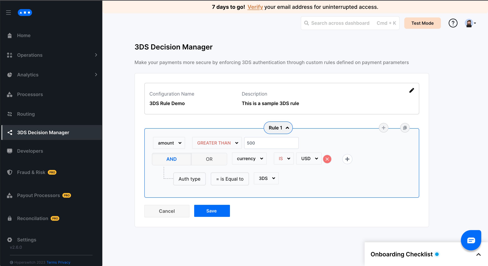

# Setup


This section covers the steps to setup 3ds decision manager using the Hyperswitch Control Center


## Steps to setup a rule on 3DS Decision Manager?

**Step 1:** Go to 3DS Decision Manager tab on the Hyperswitch Control Center

**Step 2:** Click on create new rule&#x20;

<figure><figcaption></figcaption></figure>

**Step 3:** Save the rule name and description&#x20;

<figure><figcaption></figcaption></figure>

**Step 4:** Configure your desired rule by selecting the operators and values for the various fields&#x20;

<figure><figcaption></figcaption></figure>

**Step 5:** Add more rules using the plus icon on the top right of the current rule panel&#x20;

<figure><figcaption></figcaption></figure>

**Step 6:** Click save to configure and activate the rule&#x20;

<figure><figcaption></figcaption></figure>

**Step 7:** Your rule is now successfully configured and 3D Secure authentication would be enforced all payments conforming to this rule

**Note:** 3DS decision manager supports only one active configuration at a time. Multiple rules can be combined into a single configuration as shown in the example


