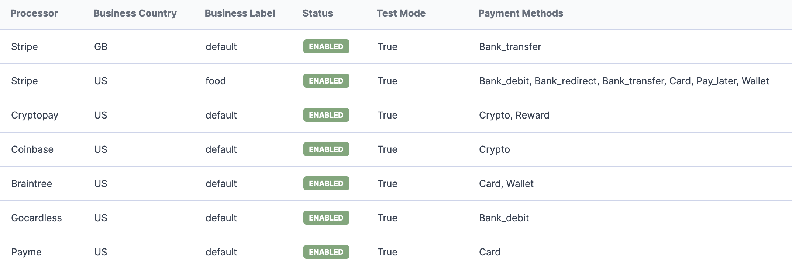
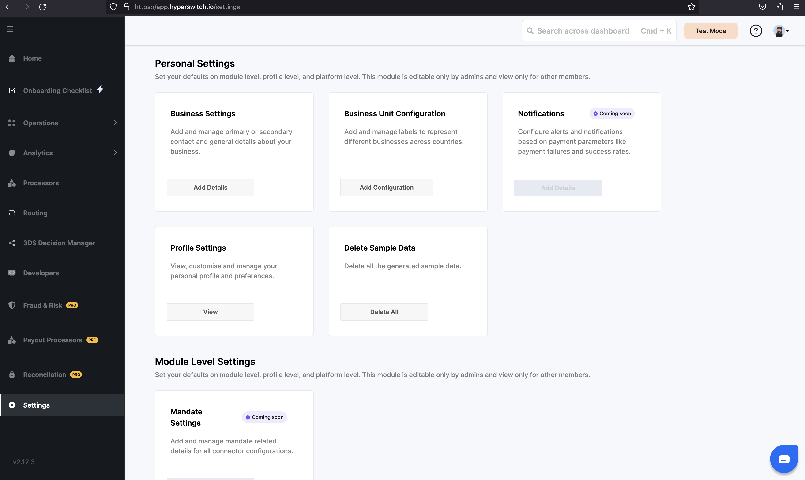
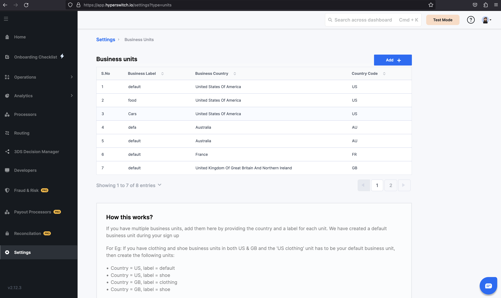
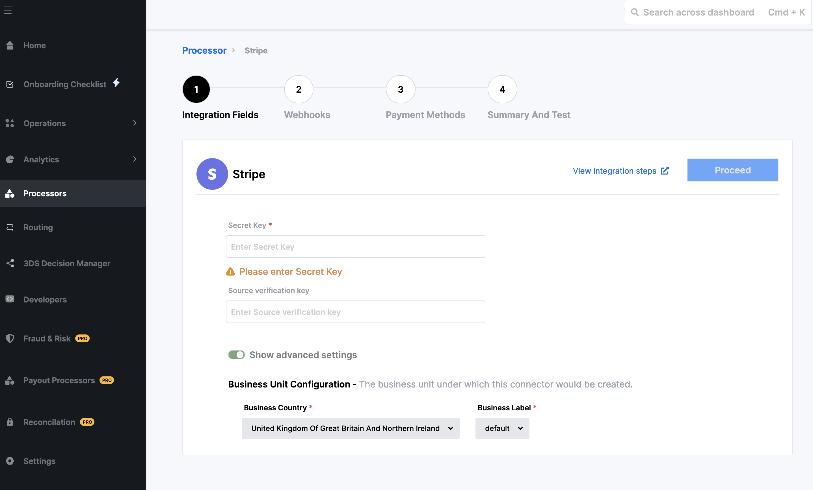
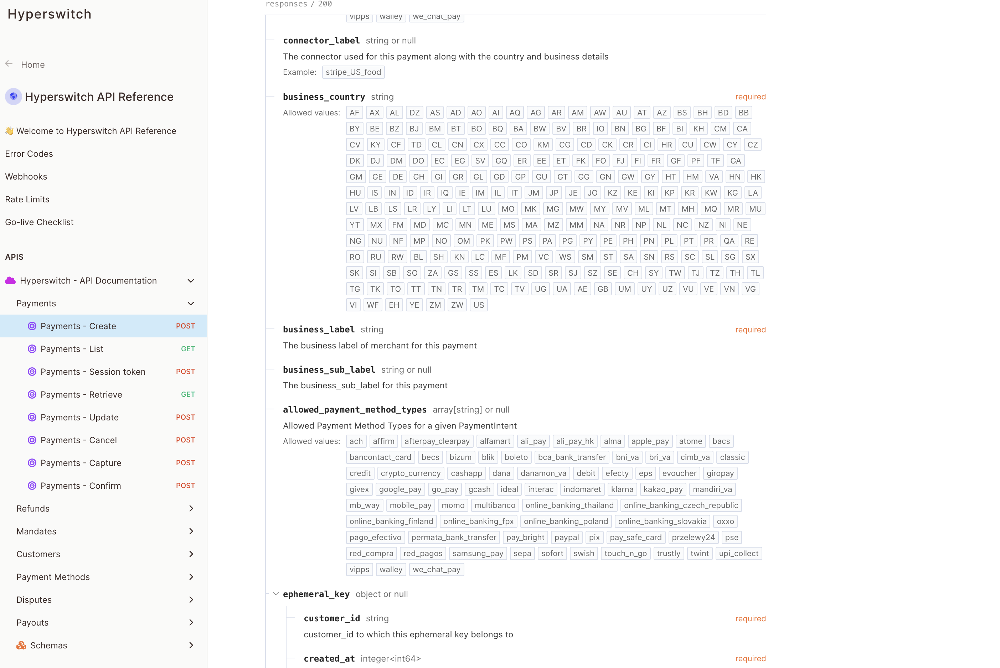
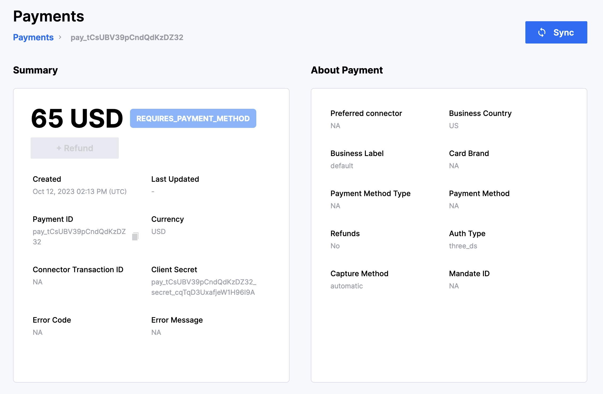
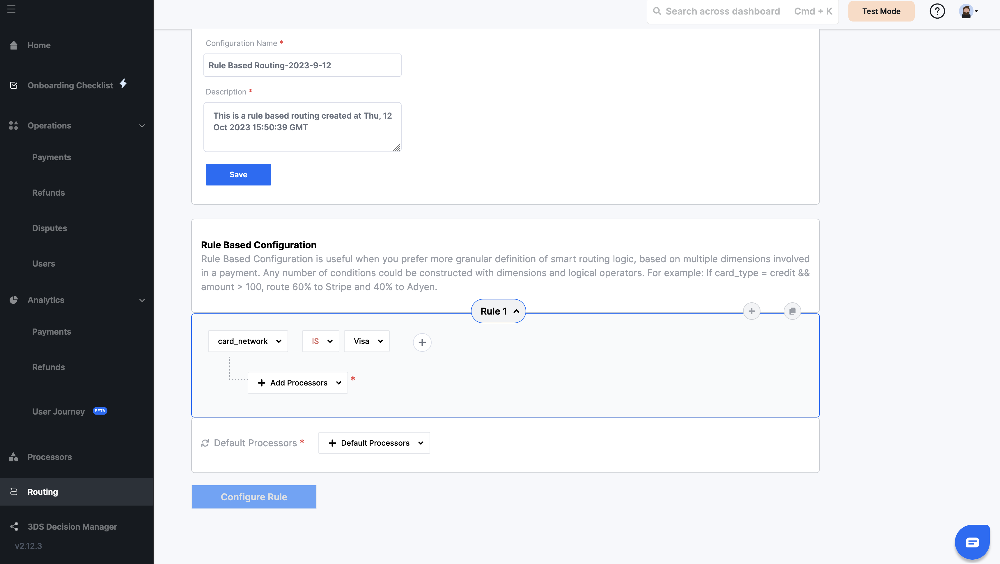

# 📊 Business units manager


In this section, we will cover the steps to create new business unit, attach connector to it, and send corresponding transactions.


When you sign up on Hyperswitch, we automatically create a business unit under your merchant\_id with the Business country as the country you selected during sign-up and Business Label as default. When you create a new processor account, it is automatically attached to this business unit. You would be able to configure one account for every processor/connector under one business unit.

<figure><figcaption></figcaption></figure>

List of connectors configured along with the business unit that they are attached to can be viewed under the Processors section on your Hyperswitch dashboard

## How to create a new Business unit?

Now, if you want to add more accounts from the same processor, you can create a new business unit under Settings -> Business Unit configuration on your Hyperswitch dashboard.&#x20;

<figure><figcaption></figcaption></figure>

If you have multiple business units, add them here by providing the country and a label for each unit.

\-For Eg: If you have clothing and shoe business units in both US & GB and the 'US clothing' unit has to be your default business unit, then create the following units:

* Country = US, label = default (created during signup if US was chosen as your country)
* Country = US, label = shoe
* Country = GB, label = clothing
* Country = GB, label = shoe

<figure><figcaption></figcaption></figure>

## How do I attach a connector to a new business unit?

After creating a second business unit apart from the default unit that was created during sign up, whenever you try to create a new connector you can select a business unit that the connector needs to be attached to by toggling the show advanced settings option.

<figure><figcaption></figcaption></figure>

## How do I send a transaction through a particular business unit in Hyperswitch?

If you have more than one business unit, you need to send the business\_country & business\_label fields during [payments/create API request](https://api-reference.hyperswitch.io/api-reference/payments/payments--create). &#x20;

<figure><figcaption></figcaption></figure>

You would be able to see the Business Unit that each payment was processed through when you click on a payment in the Operations -> Payments section on your Hyperswitch dashboard.

<figure><figcaption></figcaption></figure>

## How do I set business unit specific routing rules?

If no business\_country and business\_label fields are included in the routing rules, the rules are applied to all business units. But if you want to restrict a rule to a particular business unit, you can include the business\_country and business\_label fields in your routing rule.&#x20;

<figure><figcaption></figcaption></figure>
