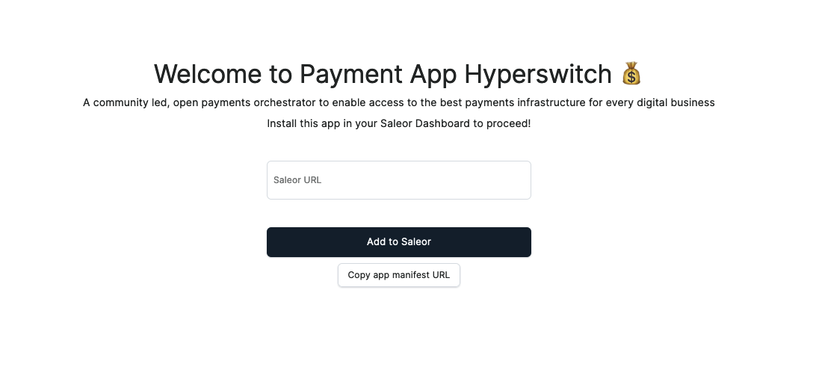

# Setup


This section covers the steps to setup Hyperswitch payment app through saleor


## Prerequisites

1. Sign up on the Hyperswitch dashboard [here](https://app.hyperswitch.io/) and navigate to connectors tab to configure connector(s) and enable various Payment Methods.
   - **Note:** While configuring connectors, please ensure that you also set up connector's webhook with hyperswitch. Hyperswitch-Saleor app relies on these webhooks to update the payment status accurately and in real-time.

2. Sign up for [Saleor](https://auth.saleor.io/realms/saleor-cloud/login-actions/registration?client_id=cloud-console&tab_id=ZC70teubjvo), set up a new project, and tailor your store to meet your unique needs.

## 1. Setting up the App on your Saleor Dashboard

### 1.1 Install the App

1. To access the Hyperswitch-Saleor Payment App, [click here](https://github.com/juspay/hyperswitch-saleor-payment-app). You will be directed to a form where you can enter your Saleor API URL.
<figure><figcaption></figcaption></figure>

2. Input your Saleor API URL and click `Add to Saleor`. This action will start the installation process and display the installation page.
3. Finally, click on `Install App`, this will install the app in your dashboard    


### 1.2 Configure the App

1. Open Hyperswitch App installed on your saleor dashboard.
2. Click on `Add new configuration`. This will open a form to collect hyperswitch credentials
- Enter a unique configuration name. This name will be used later to assign the configuration to Saleor channels.
- Enter your Hyperswitch API Key. For instructions on how to create an API Key with Hyperswitch, refer to [this guide](https://docs.hyperswitch.io/hyperswitch-cloud/account-setup#user-content-create-an-api-key-1).
- Enter your Hyperswitch Publishable Key. You can find this key under the Developers > API Keys section of hyperswitch dasboard.
- Enter your Hyperswitch Profile ID. For more information on Profile ID, please refer to [this guide](https://docs.hyperswitch.io/features/account-management/multiple-accounts-and-profiles)
- Enter your Hyperswitch Payment Response Hash Key. You can find this key under the Developers > API Keys section of hyperswitch dasboard
3. Click on `Save Configuration`
4. Once you save the configuration, You will be provided with a webhook URL, please update it in your [hyperswitch dashboard](https://docs.hyperswitch.io/hyperswitch-cloud/webhooks)

### 1.2 Assign Channel to your configuration
For each channel, payments will be processed using the Hyperswitch configurations assigned to it.

Now Hyperswitch Saleor App is configured to recieve payments 


# Accept payments through hyperswitch

### Get available payment gateways

If you have configured hyperswitch in your saleor dashboard you will get hyperswitch app id, in the response

```
query {
  checkout(id: "saleor_checkout_id") {
    availablePaymentGateways {
      id
      name
    }
  }
}
```

Response

```
{
  "data": {
    "checkout": {
      "availablePaymentGateways": [
        {
          "id": "app.saleor.hyperswitch",
          "name": "Hyperswitch"
        }
      ]
    }
  }
}
```

### Initialize the transaction

To initialize the transaction with hyperswitch, one needs to create a transaction in Saleor by calling the transactionInitialize mutation.

```
mutation StripeTransactionInitialize($data: JSON!) {
  transactionInitialize(
    id: "saleor_checkout_id"
    amount: 54.24
    paymentGateway: { id: "app.saleor.hyperswitch", data: $data }
  ) {
    transactionEvent {
      pspReference
      amount {
        amount
        currency
      }
      type
    }
    data
    errors {
      field
      message
      code
    }
  }
}
```

You can pass additional fields while initiating the transaction through the $data JSON object. 
The additional fields you can pass include:

1. customerId: [Optional String] The identifier for the customer
2. connector: [Optional String] The connector used for the payment
3. authenticationType: Pass this parameter to force 3DS or non 3DS auth for this payment. Some connectors will still force 3DS auth even in case of passing 'no_three_ds' here and vice versa. Default value is 'no_three_ds' if not set
   Available options: `three_ds`, `no_three_ds`
4. billingEmail [Optional String]
5. shippingEmail [Optional String]
6. statementDescriptorName: [Optional String] For non-card charges, you can use this value as the complete description that appears on your customers’ statements. Must contain at least one letter, maximum 22 characters
7. statementDescriptorSuffix: [Optional String] Provides information about a card payment that customers see on their statements. Concatenated with the prefix (shortened descriptor) or statement descriptor that’s set on the account to form the complete statement descriptor. Maximum 22 characters for the concatenated descriptor.
8. description: [Optional String] A description for the payment
9. returnUrl: [Optional String] The URL to which you want the user to be redirected after the completion of the payment operation (Mandatory Field for Payment Links),
10. allowedPaymentMethodTypes: [Option array of string] Use this parameter to restrict the Payment Method Types to show for a given PaymentIntent.
11. manualRetryAllowed: [Optional Boolean] If true the payment can be retried with same or different payment method which means the confirm call can be made again.

Response of transaction initialize 

```
"transactionEvent": {
        "pspReference": "hyperswitch_payment_id",
        "amount": {
          "amount": 50,
          "currency": "USD"
        },
        "type": "AUTHORIZATION_ACTION_REQUIRED",
        "externalUrl": "payment_link_url"
      },
      "data": {
        "clientSecret": "hyperswitch_client_secret",
        "publishableKey": "hyperswitch_publishable_key",
        "paymentLinkId": "hyperswitch_payment_link_id",
        "errors": []
      }
```

##### Handle transaction initialize response
- You can use `clientSecret` and `publishableKey` to invoke the [Hyperswitch SDK](https://docs.hyperswitch.io/learn-more/sdk-reference) </br>
OR
- You can use the `externalUrl` to redirect the customer to hyperswitch payment page. Additionally, this URL can also be embedded within an iframe


#### Retrieve the transaction
The payment status will be automatically updated by the plugin in the backend upon Hyperswitch receiving a webhook from the connector. Alternatively, you can call Saleor's Transaction Process mutation to retrieve the status of an initiated payment.
```
mutation TransactionProcess {
  transactionProcess(
    id: "saleor_transaction_id"
  ) {
    data
    errors {
      code
      field
      message
    }
    transaction {
      actions
    }
    transactionEvent {
      type
      pspReference
    }
  }
}
```


The Hyperswitch Saleor Plugin also supports additional flows such as payment capture, cancellation, and refunds. These actions can be triggered directly through the Saleor dashboard. 

>Note: If you trigger refunds through the Hyperswitch dashboard instead of the Saleor dashboard, you will need to manually update the refund status in the Saleor dashboard.

