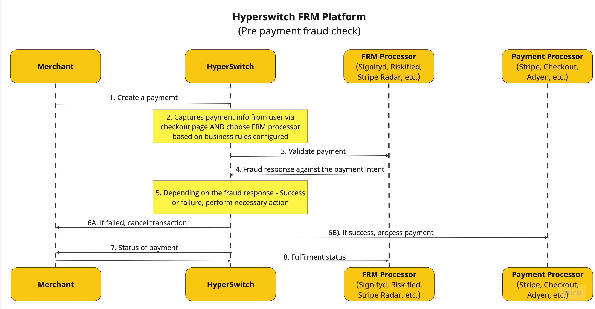
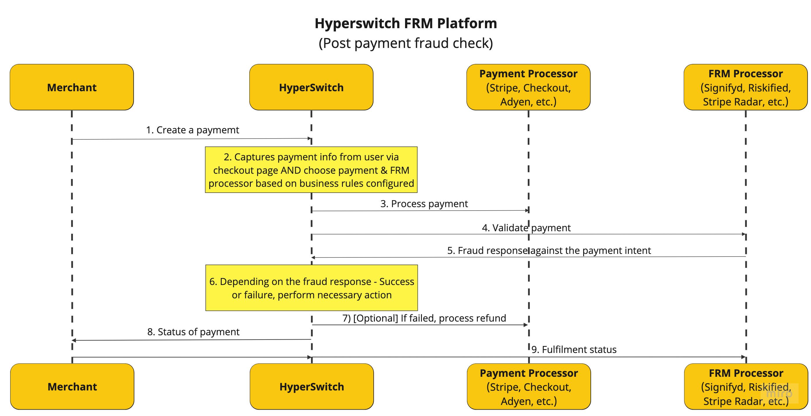
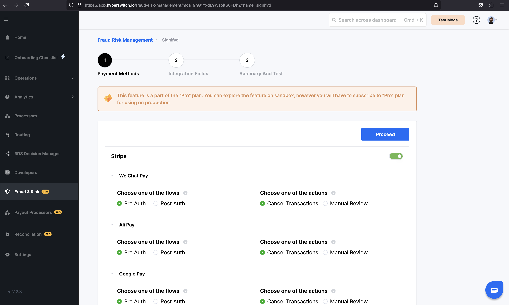
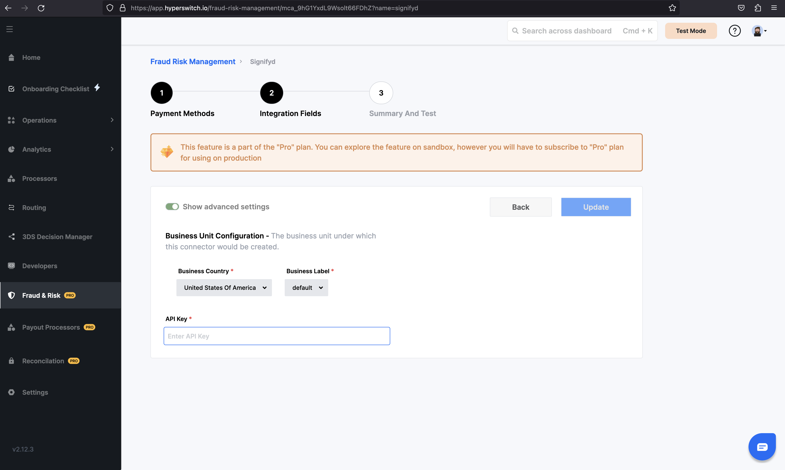

# 🛡 Fraud & risk management


With this section you will get a good understanding of FRM, it's need, use cases, architecture and steps to integrate it in your system.


The Hyperswitch Fraud & Risk Management (FRM) platform offers a comprehensive Unified API designed to cater to your specific payment validation needs, effectively enhancing fraud protection across various currencies within your payment ecosystem.

## Benefits

* **Processor-Agnostic Integration:** Single API connect lets you seamlessly connect with an FRM solution of choice.
* **Customized Fraud Strategies:** Enables users to adjust fraud prevention measures by allowing them to select between Pre-Auth and Post-Auth checks based on specific payment methods and connectors.
* **Unified Dashboard:** A consolidated interface that displays all flagged transactions, making decision-making on potential frauds a breeze.
* **Real-Time Alerts:** Immediate notifications are sent when potential fraudulent activity is detected, ensuring quick action and minimal losses.
* **Insightful Analytics:** Detailed reports on fraud patterns help inform decisions and strategy adjustments.

## Use cases

<table data-view="cards"><thead><tr><th align="center"></th><th></th><th></th></tr></thead><tbody><tr><td align="center"><strong>Online Marketplaces</strong></td><td>Secure transactions on e-commerce platforms like Amazon or eBay, regardless of payment methods or processors</td><td><ul><li>Chargeback guarantees</li><li>Dispute resolution</li><li>Account security</li><li>Real-time fraud alerts</li><li>Streamlined fraud investigation tools.</li></ul></td></tr><tr><td align="center"><strong>High-Value Transactions</strong></td><td>Protect high value orders in luxury retail, or high-end custom services</td><td><ul><li>Ensure payment validity</li><li>Prevent chargebacks</li><li>Optimize PSD2 compliance</li><li>Reduce transaction friction</li><li>Gain valuable fraud trend insights</li><li>Utilize predictive fraud analysis</li></ul></td></tr></tbody></table>

## Overview

You can enable the FRM solution of your choice with few clicks and very minimal code changes. Below are the two scenarios in which FRM can be activated through Hyperswitch.

## Prerequisite

* You will have to signup with an FRM solution provider and configured the API keys with Hyperswitch

## Pre-Authorization Flow

In the PreAuth flow, the FRM solution is invoked before authorizing a payment with your Payment processor. When a customer attempts to make a payment, the transaction details are sent to the FRM solution for analysis. The FRM solution assesses the risk associated with the transaction based on various parameters such as the customer's historical behavior, transaction patterns, location, device information, and any other relevant data. It then provides a risk score or recommendation to the Payment Gateway. Based on the risk score or recommendation, one can decide whether to proceed with the transaction, decline it, or take additional verification steps to ensure its legitimacy. The goal is to prevent potentially fraudulent transactions from being authorized in the first place.

<figure><figcaption></figcaption></figure>

## Post-Authorization Flow

In the PostAuth flow, the FRM solution is called into action after the payment has been processed by the Payment processor. Once the transaction is completed, the details of the transaction are sent to the FRM solution for a second layer of validation. The FRM solution reevaluates the transaction using the latest data available and cross-references it with historical patterns and known fraud indicators. The PostAuth flow acts as a safety net to catch any suspicious or fraudulent transactions that might have slipped through the PreAuth flow. If the FRM solution identifies a transaction as potentially fraudulent during the PostAuth flow, appropriate actions can be taken, such as issuing a chargeback, notifying the customer, or initiating further investigation.

<figure><figcaption></figcaption></figure>

## Supported FRM Processors

* Signifyd
* Riskified
* Stripe Radar

## How to get started?

**Step 1:** Log in to your [Hyperswitch account](https://app.hyperswitch.io/login).

<figure><figcaption></figcaption></figure>

**Step 2:** Navigate to the 'Fraud & Risk' tab.

<figure><figcaption></figcaption></figure>

**Step 3:** Select the FRM processor(s) you want to use. And provide your processor credentials and configure your preferred payment methods.

<figure><figcaption></figcaption></figure>

<figure><figcaption></figcaption></figure>

## Next steps

Once set up, head to the [API Docs](https://api-reference.hyperswitch.io/api-reference/payments/payments--create) to integrate the FRM API and start testing payments with fraud checks.

## FAQs

* **I am already using a FRM solution. How can I start using Hyperswitch FRM?** Yes, you can start using your preferred FRM provider via Hyperswitch.&#x20;
* **What are the prerequisites for integrating with the Hyperswitch FRM platform?** Depending on the FRM processor of your choice, you may need to pass additional parameters regarding order fulfilment as a webhook to Hyperswitch. Please refer to the section here for more details.
* **Can I adjust my fraud prevention measures based on specific payment methods and connectors?** Yes, the Hyperswitch FRM platform allows you to customize your fraud prevention measures by selecting between pre-authorization and post-authorization checks for each payment method for a processor and the corresponding action to be taken.
