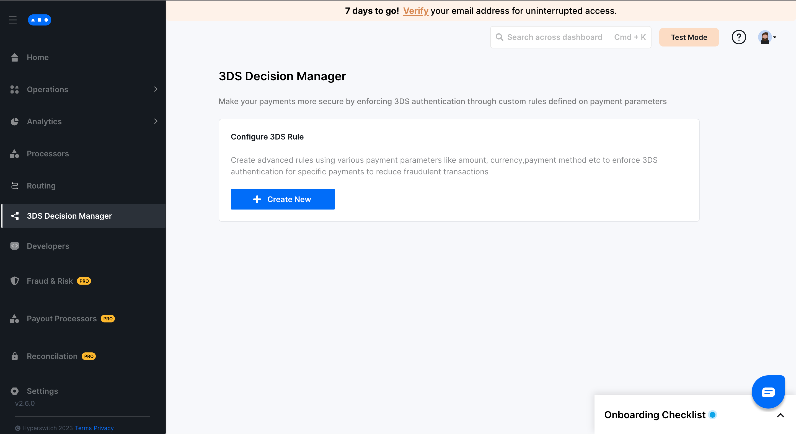
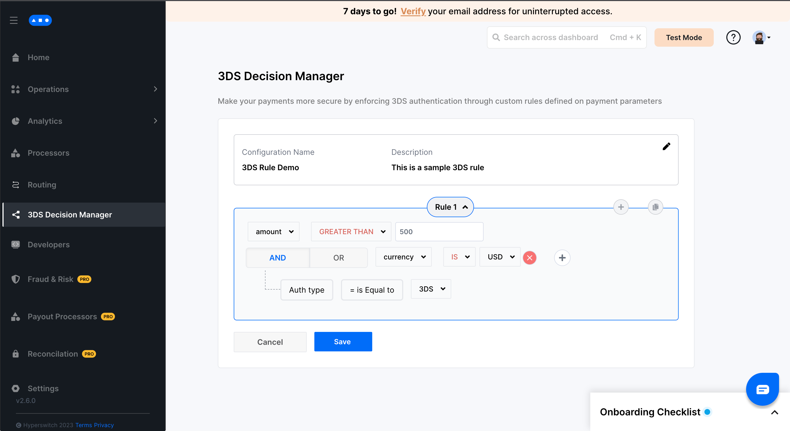
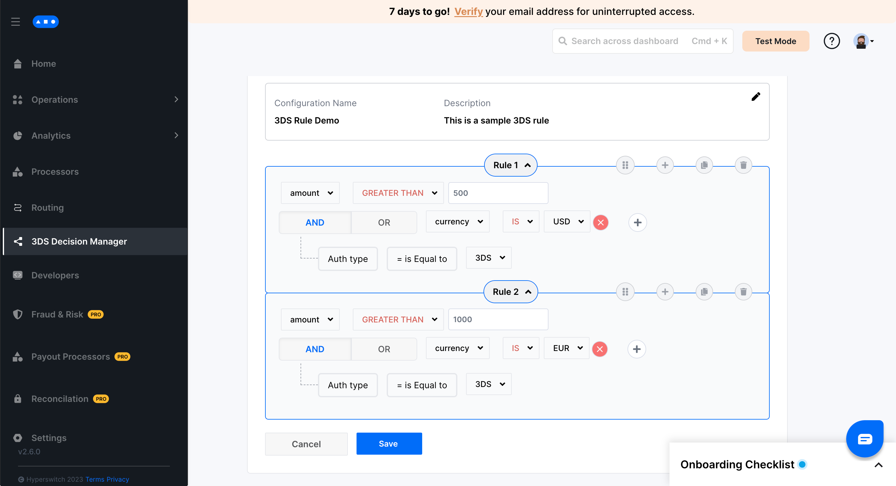
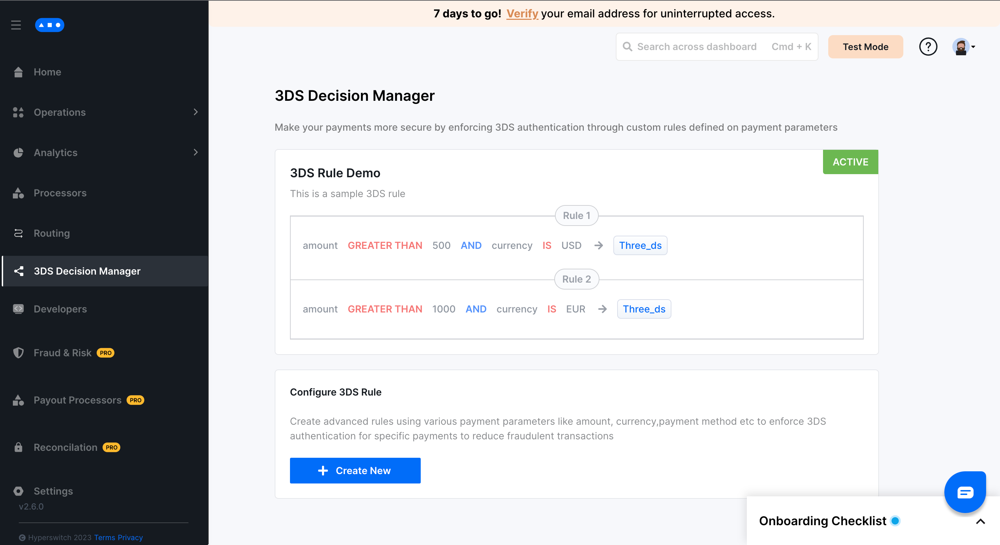

# Setup guide


This section covers the steps to setup 3ds decision manager using the Hyperswitch Control Center


## Steps to setup a rule on 3DS Decision Manager?



**Step 1:** Go to 3DS Decision Manager tab on the Hyperswitch Control Center

**Step 2:** Click on create new rule&#x20;

<figure><figcaption></figcaption></figure>

**Step 3:** Save the rule name and description&#x20;

<figure><figcaption></figcaption></figure>

**Step 4:** Configure your desired rule by selecting the operators and values for the various fields&#x20;

<figure><figcaption></figcaption></figure>

**Step 5:** Add more rules using the plus icon on the top right of the current rule panel&#x20;

<figure><figcaption></figcaption></figure>

**Step 6:** Click save to configure and activate the rule&#x20;

<figure><figcaption></figcaption></figure>

**Step 7:** Your rule is now successfully configured and 3D Secure authentication would be enforced all payments conforming to this rule

**Note:** 3DS decision manager supports only one active configuration at a time. Multiple rules can be combined into a single configuration as shown in the example

### FAQs

1. What are some of the payment parameters that I can use to configure 3DS rules?

* amount - set rules for a specific value or a range of values for the transaction amount
* currency - select the currency of transaction
* card\_type - choose between credit and debit cards
* card\_network - choose between card networks like visa, mastercard etc.
* billing\_country - to select the billing\_country

2. How do I update the current configuration?\
   Click on Create New and configure a new rule that would replace the existing configuration
3. What happens if I set `authentication_type` as `three_ds` in `/payments` request?\
   3D Secure will be enforced and override the 3DS Decision Manager's decision
