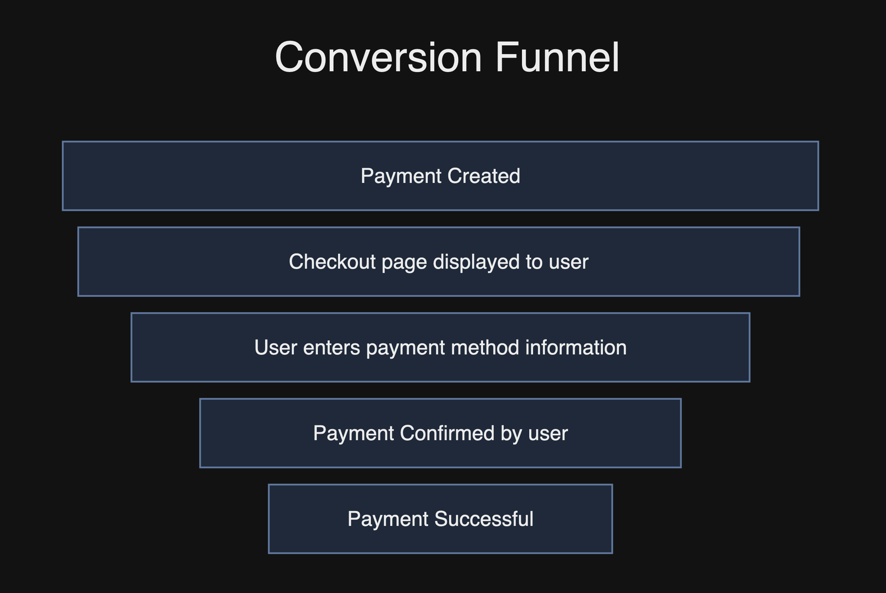

# 🎛 Analytics & operations


This section covers the day-to-day use cases of payments operations which Hyperswitch dashboard can support


## Payment Analytics

Typical payment conversion funnel of a user through Hyperswitch involves five stages as shown below.

<figure><figcaption></figcaption></figure>

### Understanding the payment conversion funnel 

Lets take a scenario where you website had initiated 100,000 payments with Hyperswitch.

| **Payments created**                                                                                                                                                                                                                                                                      | **100,000**                   |
| ----------------------------------------------------------------------------------------------------------------------------------------------------------------------------------------------------------------------------------------------------------------------------------------- | ----------------------------- |
| User dropout at before checkout page is displayed                                                                                                                                                                                                                                         | (10,000)                      |
| User dropout at checkout page                                                                                                                                                                                                                                                             | (10,000)                      |
| User inputs payment information and clicks pay button (payment confirmed by user)                                                                                                                                                                                                         | 80,000                        |
| **Payment confirmation rate**                                                                                                                                                                                                                                                             | **80% = (80,000 / 100,000)**  |
| User fails 3DS verification                                                                                                                                                                                                                                                               | (2,000)                       |
| User dropout at 3DS verification page                                                                                                                                                                                                                                                     | (3,000)                       |
| Payment declined due to fraud                                                                                                                                                                                                                                                             | (1,000)                       |
| Payment authorized, but pending to be captured by merchant                                                                                                                                                                                                                                | (4,000)                       |
| Successful payments                                                                                                                                                                                                                                                                       | 70,000                        |
| 
<strong>Payment success rate</strong>

Total successful payments processed out of all user confirmed payments

<em>*includes user dropouts at 3DS verification page, bank transfer login page, pages powered by digital wallets (Paypal, Googlepay, Applepay etc.,)</em>
 | **87.5% = (70,000 / 80,000)** |
| 
<strong>Overall conversion rate</strong>

Total successful payments processed out of total payments created.

<em>*includes user dropouts at shopping cart and checkout page.</em>
                                                                                       | **70% = (70,000 / 100,000)**  |

### Terminology 

#### **Overall conversion rate**

Total successful payments processed out of total payments created.

_This includes user dropouts at shopping cart and checkout page._

#### **Payment success rate**

Total successful payments processed out of all user confirmed payments.

_This includes user dropouts at 3DS verification page, bank transfer login page, pages powered by digital wallets (Paypal, Googlepay, Applepay etc.,)._

_Payment success rate does not include payments which are authorized by but not captured, because non-captured payments will be be settled to your merchant account by your payment processor._

#### **Processed amount**

Sum of amount of all payments with status = succeeded.

_Please note that there could be payments which could be authorized but not captured. Such payments are not included in the processed amount, because non-captured payments will be be settled to your merchant account by your payment processor._

#### **Average ticket size**&#x20;

The total amount for which payments were created divided by the total number of payments created.

**Successful payments**

Total number of payments with status as succeeded.

### FAQs 

#### **Why is the conversion rate on my Payment processor dashboard higher that what I observe on Hyperswitch dashboard?**

There are two aspects which you need to be aware of:

* Once you start using the Hyperswitch, the role of the payment processor is involved only in the last leg of the payment processing (i.e) after the user enters payment information
* Most payment processors report only the authorization rate excluding user dropouts on the checkout page and failed 3DS verifications.

Hyperswitch measures conversion rate including user dropouts, so that you get full visibility on your user dropouts and take appropriate measures to reduce user dropouts.

Please refer here for detailed understanding how popular payment processors track payment lifecycle and measure conversion rates.

* [Stripe - Conversion analysis](https://stripe.com/docs/dashboard/conversion-analysis)
* [Adyen - Reporting and payment lifecycle](https://docs.adyen.com/reporting/reports-and-the-payments-lifecycle/)
* [Paypal - Reports](https://developer.paypal.com/docs/reports/)

#### **What should I do to improve my conversion rate?**

The analytics section on the Hyperswitch dashboard offers you the tools to derive insights on patterns of payment failures. Here are some frequently faced problems and actionables.

| **Most frequent problems faced by merchants**                              | **Actionables**                                                                                                                                                                                                                                                                                                                                  |
| -------------------------------------------------------------------------- | ------------------------------------------------------------------------------------------------------------------------------------------------------------------------------------------------------------------------------------------------------------------------------------------------------------------------------------------------ |
| Majority of my users are dropping off at the checkout page                 | <ul><li>Offer a wide range of payment methods preferred by your target audience</li><li>Eliminate any inconsistency in the total amount displayed to user across the product catalog page, shopping cart, checkout page</li><li>Ensure that the proceed to pay button is clearly visible to the user within minimal clutter on the UX.</li></ul> |
| I am facing lower conversion rates through my primary payment processor    | <ul><li>Enable an alternative payment processor via Hyperswitch and use Smart Routing to optimize conversion rate</li><li>Reachout to Hyperswitch support to enable Smart Retries</li></ul>                                                                                                                                                      |
| I am facing low conversion rates for USD payments compared to EUR payments | <ul><li>Try enabling an alternative payment processor via Hyperswitch and use Smart Routing to route EUR payments (typically local payment processor offer higher conversion rates which you could benefit from)</li></ul>                                                                                                                       |
| I am facing zero conversion rate for a particular payment method/ currency | <ul><li>Check with your payment processor whether the payment method/ currency has been enabled for your merchant account</li></ul>                                                                                                                                                                                                              |
| I need help and suggestions to improve conversion rate                     | <ul><li>Please drop a note to biz@hyperswitch.io with your query.</li></ul>                                                                                                                                                                                                                                                                      |

## Payment Operations

"Payment Operations" refers to the operational time and effort spent by businesses beyond the payment processing step to manage the entire lifecycle of payments. It is cross-functional responsibility and shared across various teams of your business which is responsible for Customer Experience, Finance and Business Growth.

And, as you begin to process payments through multiple payment processors, the complexity increases multifold, thereby increasing fixed costs and siphoning out mind share from focussing on the core business.

Below are some of the day-to-day use cases of payments operations across teams which could potentially extract significant bandwidth from focusing on your core business growth.

### **Customer Experience Team**

* Issuing refunds to customers
* Proactive monitoring of failed refunds and delayed refunds
* Customer queries on double debits
* Customer queries on incomplete/ delayed payments

### **Finance Team**

* Reconciliation of Payment Processed versus Amount Settled to Bank
* Timely submission of evidence for chargeback claims from customers
* Reducing the cost of fraud through monitoring
* Optimizing payment processing cost with Smart Routing
* Reporting across multiple business units / product lines
* Triggering bulk refunds

### **Business Operations and Growth**

* Tracking, analyzing, and enhancing payment authorization rate
* Expanding to new markets and accepting new payment methods
* Product Returns versus Refunds issued to customers
* Reporting across multiple business units/ product lines

Inadequate attention to payment operations might negatively impact your Net Promoter Score and impact the growth of your business.

## How could Hyperswitch simplify Payment Operations?

Hyperswitch Control Center is a single interface that all your teams will be required to use for all Payment Operations use cases. This provides more power to your team for managing payments seamlessly.

In addition to the above, it also includes rich features to make operations more automated for your teams, such as

* Real-time analytics
* Checkout analytics
* Automated Reports
* Alerts automation
* Managing user roles and access

##
