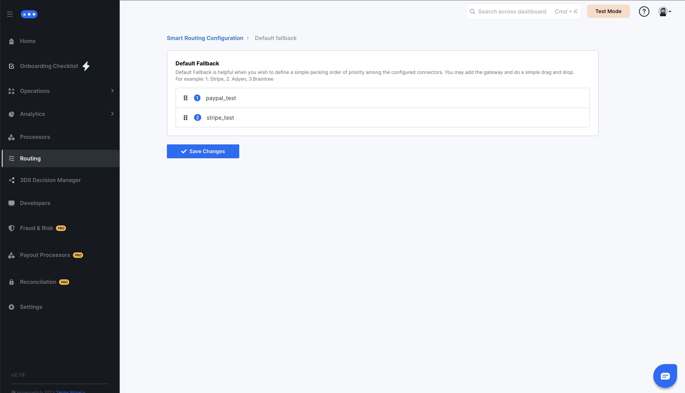

# Default Fallback Routing


This section will guide you on how to manage Default fallback routing using the Hyperswitch Control Center by drag and drop


## Get started with Default Fallback Routing

In the Default Fallback , if the active routing rules are not applicable, the priority order of all configured payment processors is used to route payments. This priority order is configurable from the Dashboard.

### Steps to configure Default fallback Configuration in Smart Router:

_**Step 1:**_ Click on `Manage` for configuring Default fallback

<figure><figcaption></figcaption></figure>

**Step 2:** You will see a list of all of your configured processors. This list can be reordered based on what you want your default processor priority to be when either :-

* You have no routing algorithm active
* The payment method for the current payment is not enabled for the processor(s) returned by the active routing algorithm

<figure><figcaption></figcaption></figure>
