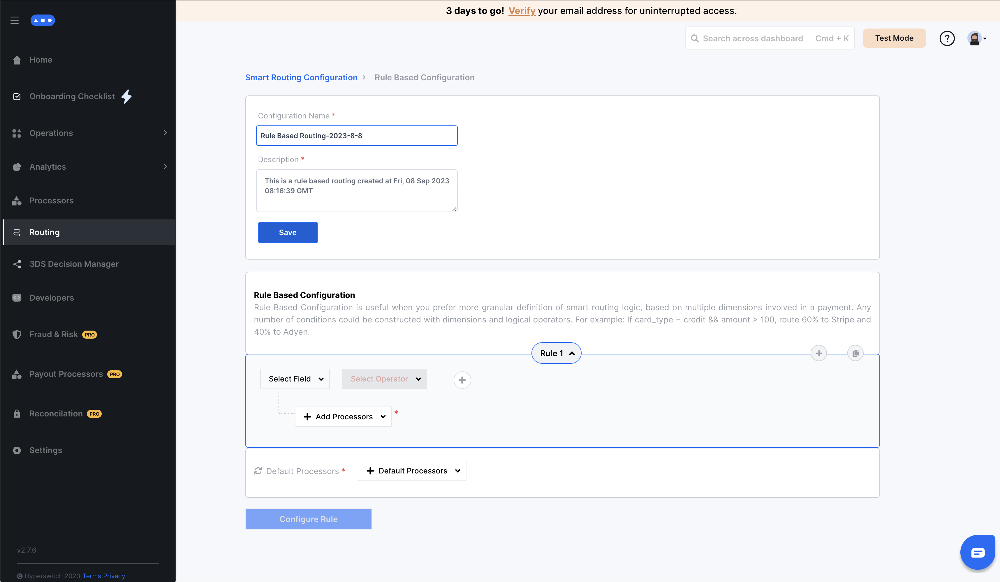

# Rule Based Routing


This section will guide you on how to setup Rule based routing using the Hyperswitch Control Center


## Get started with Rule Based Routing

A rule-based routing configuration comprises of one or more rules with each rule having a payment processor preference and a set of conditions associated with it. The implication being that if one of the conditions matches, the associated processor preference is considered for the ongoing payment. The order in which rules and conditions are evaluated is sequential from top to bottom as presented in the UI, with preference given to the first condition (and the associated preference) that's fulfilled by the current payment.

**Condition:** A condition is constructed with dimensions and logical operators. Routing rules can be pivoted upon numerous dimensions which include payment method, amount of payment, currency, etc. Also, there are six logical operators - equal to, greater than, lesser than, is, is not, contains, not contains, which are used to evaluate the condition.

**Processor Preference:** Every rule has an associated Processor Preference which dictates the processor(s) to route the ongoing payment through if the rule is fulfilled. A Processor Preference can be one of the following types:

1. **Single choice of processor:** Only a single processor should be targeted for a specific condition Eg: (Stripe)
2. **Split payments across processors:** The payment volume could be distributed across more than one processor. Eg: (Stripe: 70%, Paypal: 30%)
3. **Single choice of processor with fallback:** A single processor should be targeted for a specific condition with an option of one or more fallback processors to automatically retry the transaction through if the initial processor fails to process the payment. Eg: (Stripe, Paypal)

## Steps to configure Rule Based Configuration in Smart Router:

_**Step 1:**_ Click on `Setup` for Rule Based Configuration

<figure><figcaption></figcaption></figure>

_**Step 2:**_ Save the rule name and description

<figure><figcaption></figcaption></figure>

_**Step 3:**_ Use the no-code UI to configure your desired rules as per your business logic (an instance for configuring rule is displayed)

<figure><figcaption></figcaption></figure>

_**Step 4:**_ Select your default preferred processors and click on Configure Rule

<figure><figcaption></figcaption></figure>

_**Step 5:**_ In the popup, select the appropriate action based on whether you want to simply `save the rule`, or `save and also activate` it for all payments henceforth

<figure><figcaption></figcaption></figure>

_**Step 6:**_ You can view your active routing algorithm as well as all previously configured algorithms on the [Hyperswitch Dashboard](https://app.hyperswitch.io/routing)

<figure><figcaption></figcaption></figure>
