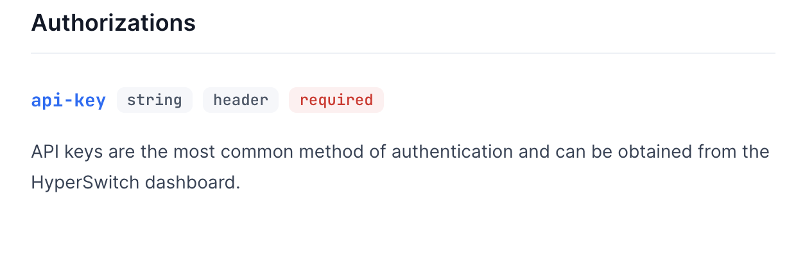
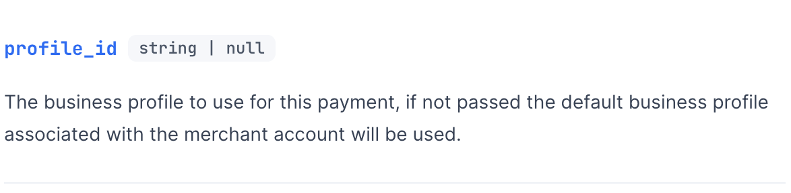

# 🤹 Multiple accounts & profiles


Follow this guide to understand where your business use case fits with hyperswitch architcture.



If there are more than one `business_profiles` for a merchant account, then passing `profile_id` when creating a payment is mandatory


Hyperswitch Architecture supports 

* Creating multiple merchant accounts under an Organization.
* Creating multiple business profiles under each merchant account.
* Create multiple instances of a processor ( stripe, adyen etc ) under a business profile.

Let's have a visual of how the Architecture looks like.

<figure><figcaption>
The architecture of hyperswitch with one organization, two merchant accounts, two business profiles in each merchant account and five connectors in each business profile
</figcaption></figure>

### Let's understand the hierarchy

#### Organization

Organization refers to the main business. Roles and permissions for users can be assigned at the organization level. When a new user registers, an organization is created and the user assumes the role of organization admin.

#### Merchant Account

A merchant account is associated with an `api_key` and `publishable_key` which is used for authentication. There can be many merchant accounts that can be created under an organization by an organization admin.&#x20;

#### Business profile


Every merchant account has atleast one business profile. For easier integration`profile_id` is not mandatory if there is only one business profile.&#x20;


A Business profile serves as a logical separation of businesses for seamless integration and onboarding. Every business profile  is uniquely identified by a `profile_id`. All the payment settings can be configured at the profile level and will apply to all the payments make via the business profile. If there is more then one business profile, then `profile_id` has to be passed when creating the payments. Business profile allows to configure

* Routing Algorithm.

_Only gateways that are available under the business profile can be used to configure the routing algorithm._&#x20;

_If a routing algorithm is not available, a default fallback, which consists of all the processors configured under the business profile based on priority order would be used. The priority of processors in the default fallback can be configured_

* Webhook url and Return url for payments.

#### Processors

There can be multiple processors configured under a business profile. Each processor is associated with a globally unique identifier `merchant_connector_id` and unique identifier under a business profile called `label`

A processor  created under one business profile cannot be used in another business profile to route payments.

### Use cases

*   #### Multiple merchant accounts - for **merchants who need different API keys for each of their businesses**

    Consider a merchant A who has three different businesses - A\_Shoes, A\_Clothing, A\_Bags. They can create three merchant accounts (Shoes, Clothing, Bags) on Hyperswitch and get separate set of API keys for each of them.

<figure><figcaption>
A merchant with multiple merchant accounts and a single business profile in each merchant account
</figcaption></figure>

In case of Marketplace merchants with multiple sub-merchants, the parent merchant can create one Hyperswitch merchant account (with an API key) for themself and as many separate merchant accounts as they need for the sub-merchants under them with separate API keys for each of them

<figure><figcaption>
A merchant with multiple merchant accounts and a single business profile in each merchant account
</figcaption></figure>

* **Multiple business Profiles - For merchants who want to manage all businesses with one API key**

For a merchant A with three different businesses (A\_Clothing, A\_Shoes, A\_Bags) they can create just one merchant account on Hyperswitch with three business profiles (Clothing, Shoes, Bags) under it. This way, the merchant can use only one Hyperswitch API key to manage transactions for all three businesses.

<figure><figcaption>
A merchant with single merchant account and multiple business profile under the merchant account
</figcaption></figure>

For Marketplace merchants with multiple sub-merchants, the parent merchant can create one Hyperswitch merchant account with an API key access and multiple business profiles under it to represent the different sub-merchants. This way the parent merchant will be able to manage their multiple sub-merchants tightly under one Hyperswitch merchant account and API key.

<figure><figcaption>
A merchant with single merchant account and multiple business profile under the merchant account
</figcaption></figure>

### How to configure multiple merchant accounts

When you sign up on Hyperswitch, a merchant account is created under your Organization and every merchant account automatically has one profile created under it.

To create more merchant accounts, click the merchant account dropdown from the right top corner in your Hyperswitch dashboard.

<figure><figcaption>
Creating additional merchant accounts
</figcaption></figure>

### How to configure multiple business profiles

* On your Hyperswitch dashboard, visit Settings → Business Profiles, click ‘Add' button to create another business profile. Here you will also see a list of already configured business profiles for your merchant account. As mentioned already, a ‘default’ profile is already created during your merchant account creation. 'profile\_id’ of various business profiles can also be found here.

<figure><figcaption>
Add a business profile
</figcaption></figure>

* Enter a name for your profile in the next pop-up screen and click ‘Add’ again. A new profile with the given ‘profile\_name’ and an automatically generated ‘profile\_id’ is created.

**How to route a payment to a particular merchant account and a particular profile?**

In order to route a payment to a specific merchant account, the [payment create API](https://api-reference.hyperswitch.io/api-reference/payments/payments--create) call has to be made from the merchant server using the correct API key attached to the required merchant account. To route the payment to a particular profile, the `profile_id` parameter of the required profile is to be passed.

<figure><figcaption>
api key to be passed in headers when creating a payment
</figcaption></figure>

<figure><figcaption>
profile id to be passed in the body when creating the payment
</figcaption></figure>

When a payment is created under a business profile, it would use the routing algorithm ( if available ) that is configured for that business profile, to choose an appropriate gateway. All the **Refunds, Mandates** that are created for a payment will be under the same business profile as the payment.
