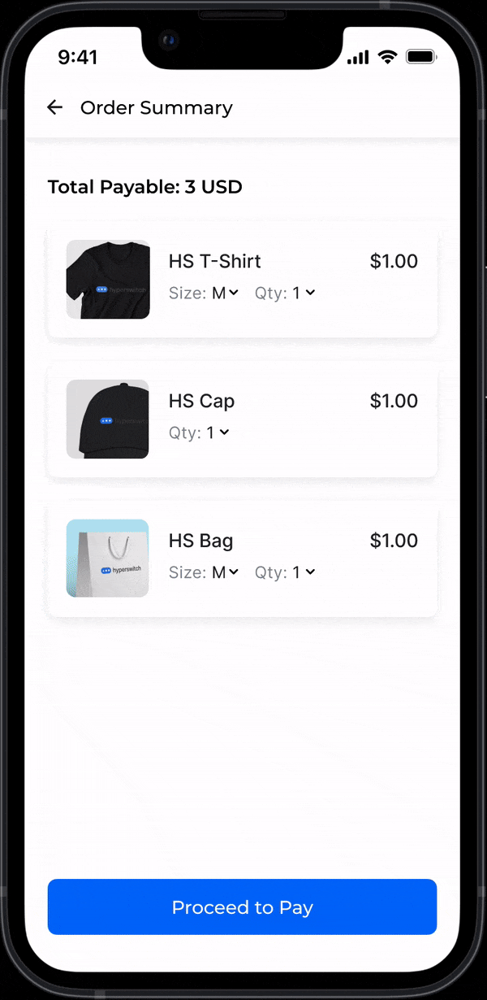

# 🌠 Native 3DS Authentication

<figure><figcaption></figcaption></figure>

## What is 3DS?

3D Secure is a security protocol designed to reduce credit/ debit card fraud in Card-Not-Present (CNP) transactions, where customer doesn't present the physical card to merchant during the transaction. The customer is authenticated using multi factor authentication (usually through passive data, biometric, SMS or email-based one-time passcode). This enables the issuer to have more trust over the authenticity of the transaction.

The latest version of 3DS - **3DS 2.0** supports two flows - **Frictionless and Challenge**. In the Challenge flow, the cardholder is authenticated with an active interaction like entering an email OTP or authentication on the bank app. In the frictionless flow, however, the acquirer, issuer and the card scheme exchange the necessary data in the background and the issuer passively authenticates the cardholder.

## What are the benefits of 3DS 2.0?

1. **Liability Shift**: The most important benefit of 3DS 2.0 for the merchant is the shifting of fraud liability to the issuer. When the issuer authenticates the cardholder, the issuer takes the liability in case a chargeback is filed for such a transaction.
2. **Regulatory Compliance**: In the EEA(European Economic Area) region, where [PSD2](https://hyperswitch.io/blog/simplifying-acquirer-exemptions-in-PSD2-markets) mandates strong customer authentication (SCA), 3DS 2.0 helps merchants comply with the regulatory requirements.&#x20;
3. **Improved User Experience over 3DS 1.0:** Using more data, the issuers can passively authenticate most of the cardholders without friction. If the transaction is deemed risky, a challenge flow is triggered. The ecosystem has tried to optimize this challenge flow experience by providing a consistent, and a mobile friendly interface.
4. **Higher Approval Rates**: As a lot more data is exchanged under 3DS protocol, merchants see an uplift in their transaction approval rates.

## What is Native 3D Secure 2.0?

Native 3D Secure refers to the seamless integration of 3D Secure (3DS) authentication directly within a merchant's app or website, without redirecting the user to an external page for authentication. By eliminating redirections and embedding authentication directly into the checkout process, native 3DS enhances both customer satisfaction and conversion rates, making it a preferred choice for merchants looking to optimize their payment flow.

<figure><figcaption>
<strong>Sample of Native Authentication on mobile</strong> 
</figcaption></figure>

## Why Native 3D Secure?

### **1. Enhance Customer Experience**:&#x20;

Even though 3DS 2.0 greatly optimizes the customer experience, it still has some scope for improvement. The multiple redirections for both challenge and frictionless flows lead to poor customer experience and increased dropouts. The customer authentication experience also varies according to the issuers, depending on the capabilities and upgrades of the issuers’ technology.

With native 3DS, the challenge can happen in the merchant app without redirections. This in-line, in-app experience greatly reduces the customer checkout time, and provides a consistent checkout experience. Native 3DS is optimized for mobile platforms. Since 3DS 2.0 supports mobile-friendly features like biometric verification (fingerprint or facial recognition), merchants can provide a more secure and intuitive experience for customers using smartphones or tablets.

### 2. Reduce customer dropout rate

By providing a native 3DS experience, the users never leave the merchant app. It helps to reduce customer dropouts happening earlier because of confusing UX, time consuming loading screens and un-optimized flow.

### 3. Get control over Branding

Since the authentication occurs natively, merchants have more control over the branding and design of the authentication experience. This keeps the look and feel consistent with the rest of the app or website, offering a smoother, more professional user experience.

## Native 3D Secure on Hyperswitch

1. **In-line 3DS Challenge for web** - No redirections for the user.

<figure><figcaption></figcaption></figure>

2. **No redirections for Frictionless flow** - Risk based authentication without unnecessary redirections.

<figure><figcaption></figcaption></figure>

3. **Native Authentication on mobile** - Provide your customers a seamless, native 3DS OTP experience, instead of clunky web-views.

<figure><figcaption></figcaption></figure>

4. **Advanced Authentication Analytics** - Understand the authentication journey of your users; get the top authentication vs authorization failure reasons.

<figure><figcaption></figcaption></figure>

To enable the Native 3DS Authentication on your website or mobile app, you need to integrate an external 3DS authentication providers. **Hyperswitch allows you to integrate external 3DS authenticators like Netcetera and 3dsecure.io with minimal development efforts, Visit the below page for detailed steps.**


[external-authentication-for-3ds.md](external-authentication-for-3ds.md)

