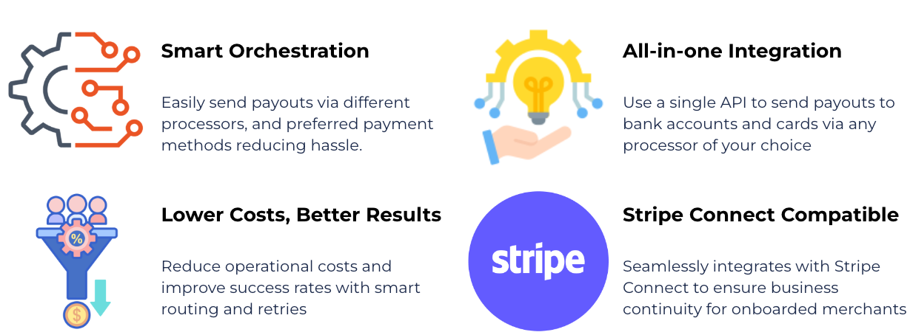

# 💵 Payouts


After reading this section, you will know about Payout features, supported processors, methods, working and how to get started with it.


Effortlessly facilitate swift payouts to your global network of sellers, merchants, and service providers using our automated system. Whether you're managing payments received through Hyperswitch or from other sources, leverage our infrastructure to streamline and orchestrate your payout processes efficiently.

<figure><figcaption></figcaption></figure>

## Payouts combined with Payments

A way of paying out third parties combined with Hyperswitch's payments processing

*   **Supercharge Conversions**

    * Effortlessly send funds to bank accounts or cards using your preferred method
    * Boost success with smart retries.

    _Hyperswitch currently supports Adyen, Wise, and Stripe for payouts, with new processors added within 10 days._
* **Simplify Operations**
  * All-in-One View: Monitor all payouts across partners in a single dashboard view
  * Bulk Payouts (submit a feature request [here](https://github.com/juspay/hyperswitch/discussions/new?category=ideas-feature-requests)): Manage large-scale payouts via simple file (.xlsx/.csv) uploads
  * Recurring Payouts (submit a feature request [here](https://github.com/juspay/hyperswitch/discussions/new?category=ideas-feature-requests)): Set up scheduled fixed-value payouts.
* **Stay Secure**
  * Secure Card Handling: PCI-compliant methods to accept, authenticate, and safely store card details. Plus, independent tokenization, irrespective of your payment processor.
  * Tokenize Bank Details (submit a feature request [here](https://github.com/juspay/hyperswitch/discussions/new?category=ideas-feature-requests)): Checkout page to accept and verify bank account verification for Stripe, along with processor-agnostic tokenization of bank details.

## Supported Processors and Payment Methods

#### Adyen

| Regions       | Cards          | Banks       | Wallets                      |
| ------------- | -------------- | ----------- | ---------------------------- |
| Europe        | Major Networks | SEPA, SWIFT | Paypal, Neteller\*, Skrill\* |
| North America | Major Networks | ACH         | Paypal                       |
| Others        | Major Networks | SWIFT       | Paypal                       |

#### Wise

| Regions       | Cards          | Banks       | Wallets |
| ------------- | -------------- | ----------- | ------- |
| Europe        | Major Networks | SEPA, SWIFT | -       |
| North America | Major Networks | ACH         | -       |
| Others        | Major Networks | SWIFT       | -       |

**\*** _Payout methods supported by processor but not recommended (can be enabled upon request)_

**Payouts for Stripe Connect users (submit a feature request** [**here**](https://github.com/juspay/hyperswitch/discussions/new?category=ideas-feature-requests)**)**

* Business continuity with compatibility ensured for your Stripe connect onboarded sellers, merchants and service providers

## How does it work?

<figure><figcaption></figcaption></figure>

## How to get started?

**Step 1:** Log in to your [Hyperswitch account](https://app.hyperswitch.io/login).

<figure><figcaption></figcaption></figure>

**Step 2:** Navigate to the 'Payout Processors' tab.

<figure><figcaption></figcaption></figure>

**Step 3:** Select the payout processor(s) you want to use. And provide your processor credentials and configure your preferred payment methods.

<figure><figcaption></figcaption></figure>

**Step 4:** Provide your processor credentials and configure your preferred payment methods.&#x20;

<figure><figcaption></figcaption></figure>

**Step 5:** Once set up, head to the [API Docs](https://api-reference.hyperswitch.io/api-reference/payouts/payouts--create) to integrate the Payouts API and start testing payouts.

## FAQ?

* **Can I use Hyperswitch solely for payouts without payments?** Absolutely. You can payout with embedded payments or directly to a third party by providing direct payment info or token ID.
* **What does "independent tokenization" mean?** Independent tokenization means that your card and bank data are converted into a secure token, irrespective of which payment processor you use, with Hyperswitch. (We tokenize only when the user permits us to save their card/bank info)

