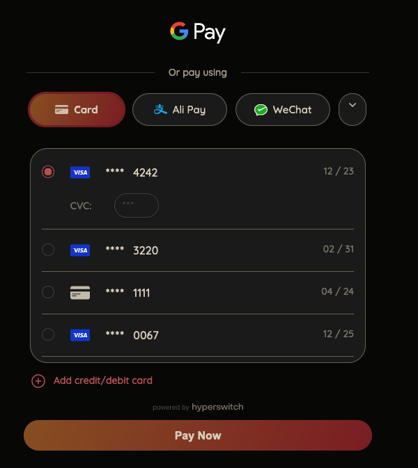

# 🔓 Tokenization & saved cards


In this section, you will learn how to store your customers cards securely and use them on subsequent payments


Hyperswitch provides you with the capability to store your customers cards securely in a centralized PCI DSS Level 1 compliant vault. Our Unified checkout automatically handles saved cards flow. Customers choose the 'Save card details' checkbox while providing their card details for the payment and the transaction is successfully processed while the card is tokenized and stored securely in the card vault.

<figure><figcaption></figcaption></figure>

For a returning customer, our Unified Checkout automatically shows the list of their saved cards from previous sessions if the same `customer_id` is passed during payments/create API call from your server.

The list customer payment methods API is used here which retrieve the list of cards saved against that customer in a tokenized form. These payment\_tokens can then be used to confirm a payment. ([API Reference](https://api-reference.hyperswitch.io/api-reference/payment-methods/list-payment-methods-for-a-customer-1))

<figure><figcaption></figcaption></figure>

Once the user selects a particular card on the checkout page, the corresponding `payment_token` is used by Hyperswitch to  communicate with the card vault and securely retrieve card information to make the payment.

## Migrating your customers’ saved cards from your processors to Hyperswitch

Hyperswitch also supports migrating your customers’ saved cards from your processors’ vaults to Hyperswitch. This process typically involves requesting your processor’s support team to share your customers’ saved cards data to Hyperswitch in a secure file transfer format and may involve sharing Hyperswitch’s PCI DSS certificate with them. Please write to <mark style="color:blue;">biz@hyperswitch.io</mark> to know more and kickstart your card migration process.

## Network Tokenization

This features is current not present in Hyperswitch. Submit a feature request [here](https://github.com/juspay/hyperswitch/discussions/new?category=ideas-feature-requests). Hyperswitch can support Network Tokenization which will enable you to securely store your customers’ card details with various networks such as Visa, Mastercard, American Express, etc. This would bring in additional benefits such as higher authorization rates, fraud reduction, liability shift, lower network fees in some cases, etc.&#x20;
