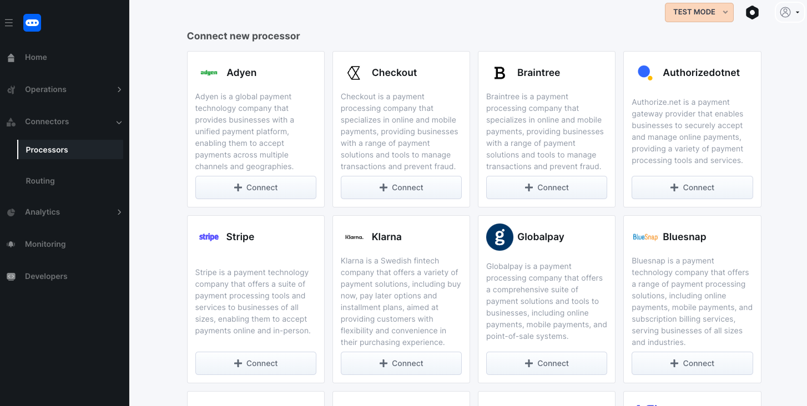
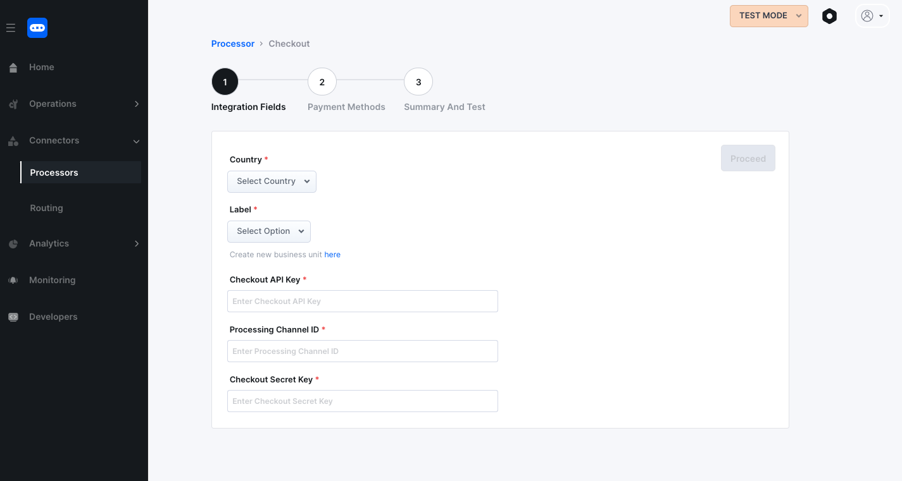
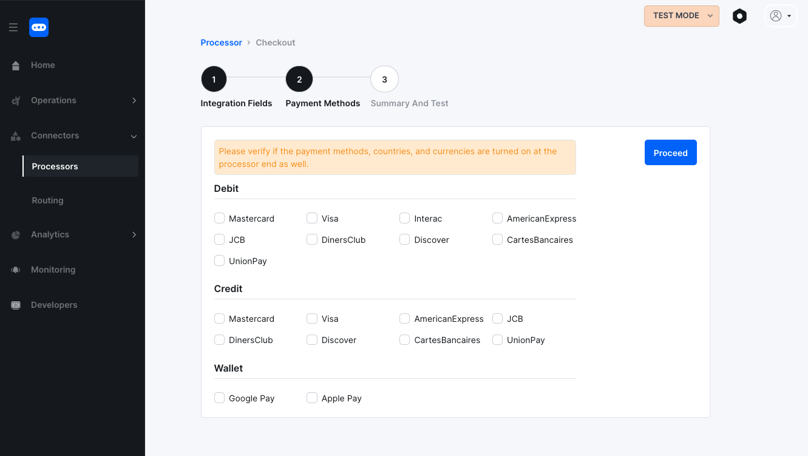
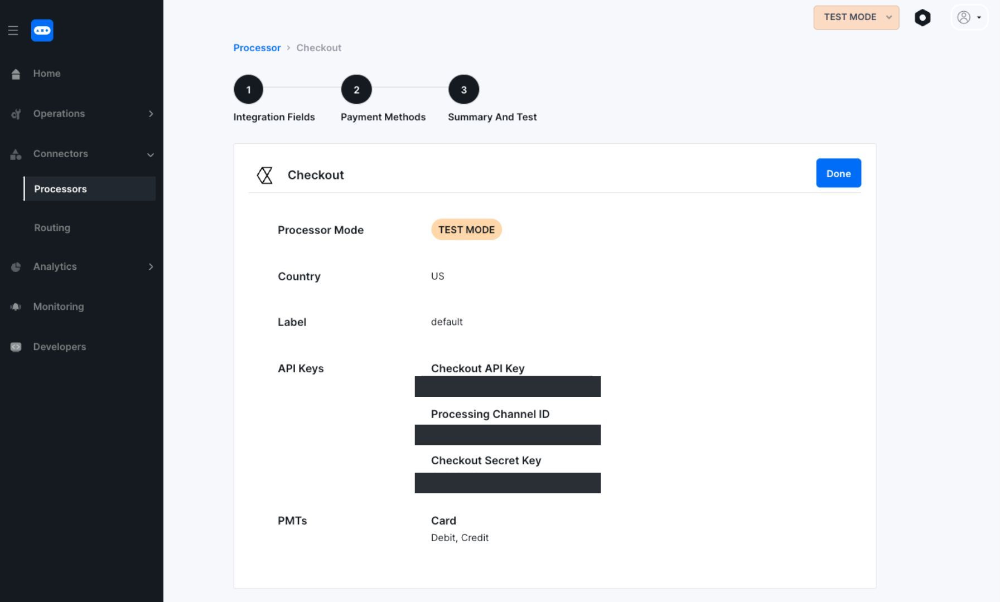
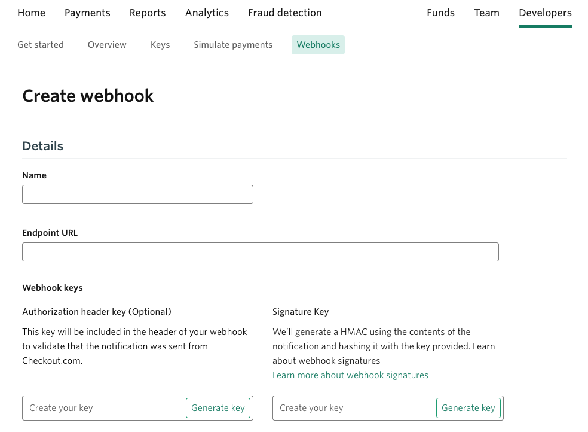

# Checkout


### About

Checkout.com is a global payment company that provides a gateway, an acquirer and processor as part of its end-to-end solution. They provide solutions to help businesses and their communities thrive in the digital economy.

### Features supported by Hyperswitch

| Payment Methods | Features supported                                                               | Payment Flows                   |
| --------------- | -------------------------------------------------------------------------------- | ------------------------------- |
| `Cards`         | All major card networks like Mastercard, Visa, Diners, American Express and more | One-time and recurring payments |
| `Wallets`       | Google pay, Apple pay                                                            | One-time payments               |

#### Additional features

* Refunds and Subscriptions
* Support for 3DS 2.0 and non-3DS transactions

#### I. Prerequisites

1. You need to be registered with Checkout in order to proceed. In case you aren't, you can quickly setup your Checkout account [here](https://www.checkout.com/get-test-account)
2. You should have a registered Hyperswitch account. You can access your account from the [Hyperswitch dashboard](https://app.hyperswitch.io/register)
3. Request the Checkout support team to enable handling raw card data for your Checkout account via email (support@checkout.com). This will enable Hyperswitch to securely handle your customer's payment details

#### II. Steps to activate Checkout on the Hyperswitch Dashboard

1. Ensure that you are on the Test Mode of the Hyperswitch Dashboard. You would be able to toggle between the Live and Test modes from the top right corner of the Dashboard
2. Navigate to the [Connectors](https://app.hyperswitch.io/connectors) section on the Hyperswitch Dashboard and select Checkout using the '+ Connect' button

<figure><figcaption></figcaption></figure>

3. Enter your Country, Checkout API key, Processing Channel ID and Checkout Secret Key. These are available in your Checkout dashboard under the [Developers section](https://dashboard.sandbox.checkout.com/developers/get-started)

<figure><figcaption></figcaption></figure>

4. Select all the payment methods you wish to use Checkout for. Ensure that this is the same as the ones configured on your Checkout account

<figure><figcaption></figcaption></figure>

5. Click Done and you will see a successful message that the configuration is complete

<figure><figcaption></figcaption></figure>

6. Webhooks: Navigate to the webhooks section of your Checkout dashboard and create a new Webhook.

<figure><figcaption></figcaption></figure>

7. Enter the hyperswitch url under the server configuration section: `{{hyperswitch_base_url}}`/webhooks/Hyperswitch\_Merchant\_ID/checkout. Note that Hyperswitch currently does not support source verification.

_Congratulations! You have successfully integrated with Checkout via Hyperswitch. Now in order to test the integration you can follow one of the following steps Test via Hyperswitch dashboard_

#### III. Test the Configuration using Dashboard

1. Upon configuration of the Connector, navigate to the dashboard [home page](https://app.hyperswitch.io/home)
2. Proceed with the "Try out Unified Checkout" option on the home page of the dashboard

<figure><figcaption></figcaption></figure>

3. Use the test payment details provided by Checkout to test a transaction and click on Pay Now

```
Card Number: 4242424242424242
Expiry: 10/25
CVC: 123
Country: United States
```

4. Click on Pay Now and you will get a Success message
5. Validate transaction on Hyperswitch dashboard. \
   \- Goto the left pane on the Hyperswitch dashboard \
   \- Click on Operations -> Orders \
   \- Your transactions should be visible under the order management tab
6. Open your Checkout dashboard and validate the transaction

_Congratulations! You have successfully tested the a payment via Hyperswitch and processed by Checkout_

### Need support?

In case you continue to face issues reach us at [Hyperswitch support](https://hyperswitch.io/docs/support)
