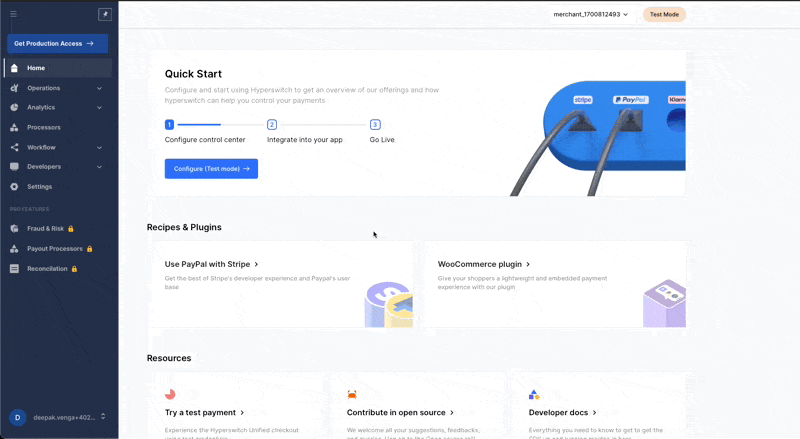

# ⚙ Control Centre Account setup


In this section, you will be creating a Hyperswitch account and connecting your payment processor via the Hyperswitch control center


***

Hyperswitch Control Center is a single interface that all your teams will be required to use for all payment operations & analytics use cases. This provides more power to your team for managing payments seamlessly. It also includes rich features to make operations more automated for your teams, such as

* Real-time analytics
* Checkout analytics
* Automated Reports
* Alerts automation
* Managing user roles and access

## Getting started with the dashboard - Login / Register

Navigate to the control center's landing page, click on the sign up button. Enter your email and set a strong password. Click on the sign up button.

The signup process will create a user with the provided email id. A merchant is also created which will be tagged to the user.&#x20;

On the left nav bar, click on your email on the bottom to access the profile section, where you can see all the details.

## Pre-Requisites 


Ensure you have easy access to essential information such as API keys and secrets necessary for connecting to your chosen processor. Additionally, have a well-defined plan in place for configuring routing settings, if applicable.


## Create an API key 

From the left nav bar, navigate to Developers --> Keys.

<figure><figcaption></figcaption></figure>

Click on create API key from the page. A pop-up appears where you have to enter details like the description and validity of the key. Enter the details and click Next.

An API key will be created and you will get the option to download and copy the API key.


Ensure that you download or copy the API key as it will be available only once through the dashboard for security reasons. In case you miss this, please create another API key.

You can use the Hyperswitch Dashboard to reveal, revoke, and create secret API keys. If you’re setting up Hyperswitch through a third-party platform (3PP), reveal your API keys in live mode to begin processing payments


## Add a payment processor

On the left nav bar, navigate to the processors tab.

<figure><figcaption></figcaption></figure>

You can see the list of payment processors already integrated with Hyperswitch. Click on the processor you want to connect.

To connect a payment processor:

1. Provide the necessary details like API key, secret for the processor. Details vary depending on the chosen processor
2. Configure the Hyperswitch endpoint in the processor dashboard to receive webhooks
3. Configure the relevant payment methods (like cards, wallets) to be enabled for this processor
4. Review and confirm the connection

## Setup Routing

The Hyperswitch control center gives you full control on how and where you route your payments.&#x20;

In the left nav bar, navigate to workflow --> routing to access the smart routing module.

<figure><figcaption></figcaption></figure>

By default, a priority-based routing based on the processor created time (first connected processor with highest priority) is enabled for you. This also acts as your fallback routing - which means if all else fails, routing will follow this priority.&#x20;

Currently, you can configure two types of routing with more on the way:

1. Volume based routing: As the name suggests, this routing is based on the volume provided. You can assign percentage volumes that needs to be processed with the connected processors and Hyperswitch will route in a way to ensure that the volume distribution is maintained
2. Rule based routing: Rule based routing gives you finer control over payment routing. It exposes payment parameters like amount, payment\_method, card\_type etc. with which you can configure multiple rules. Rule based routing also provides an option to enable default processors through which the routing will happen in case the rule fails

## **Next step:**


[integration-guide](integration-guide/)


You can also refer to the [Smart Router](../features/smart-router.md) section to learn more about how you can route your payments and then later you can [Test a Payment](../hyperswitch-open-source/testing/test-a-payment.md).
