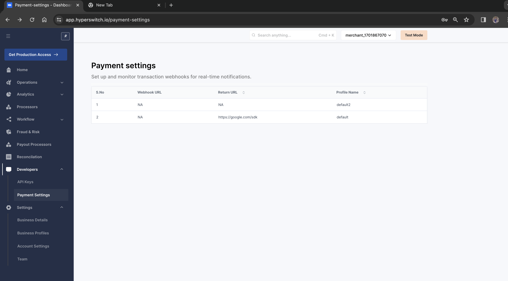
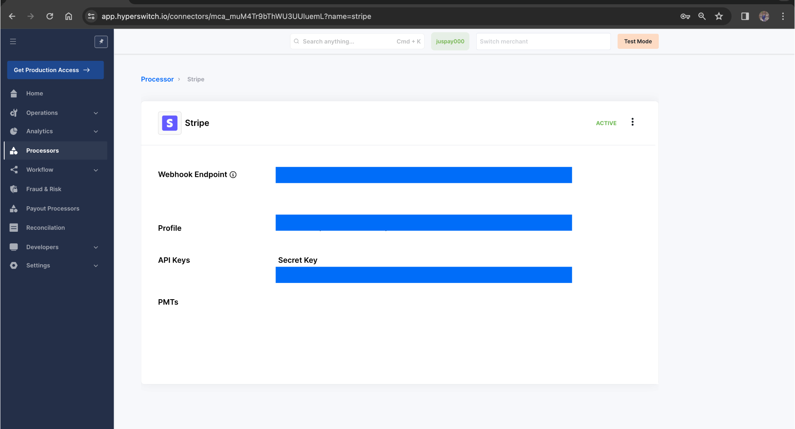

# Stripe


This section gives you an overview of how to make payments via Stripe through Hyperswitch


Stripe is a suite of APIs powering online payment processing and commerce solutions for internet businesses of all sizes. It allows businesses to accept payments and scale faster. To know about more about payment methods supported by stripe via hyperswitch visit [here](https://hyperswitch.io/pm-list).

### Activating Stripe via Hyperswitch

#### Prerequisites

1. You need to be registered with Stripe in order to proceed. In case you aren't, you can quickly setup your Stripe account [here](https://dashboard.stripe.com/register)
2. You should have a registered Hyperswitch account. You can access your account from the [Hyperswitch control center](https://app.hyperswitch.io/).
3. Enable handling raw card data for your Stripe account by enabling the 'Handling card information directly' toggle from the [Settings > Integrations](https://dashboard.stripe.com/settings/integration) tab on your Stripe dashboard. This will enable Hyperswitch to securely handle your customer's payment details in a PCI compliant manner.
4. Enter your Country, Business Label and Stripe API Key. The Stripe API key can be found in your Stripe dashboard under \[Developers -> API keys]\(https://dashboard.stripe.com/test/apikeys) as \*\*Secret Key\*\*\
   Note: Ensure to use the Secret Key -> Starts with \`sk\`
5. Select all the payment methods you wish to use Stripe for. Ensure that this is the same as the ones configured on your Stripe dashboard under Settings -> Payments -> Payment methods
6. Webhooks: Navigate to the webhooks section of your Stripe dashboard (Developers -> Webhooks) and create a new webhook by clicking on \`Add an endpoint\`.

### Configuring webhooks

Step 1: Setup your webhook endpoint on Hyperswitch dashboard under Settings -> Payment settings -> Click on the profile

<figure><figcaption></figcaption></figure>

Step 2: Configure Hyperswitch’s webhooks endpoint on your Stripe dashboard. You can find Hyperswitch’s endpoint for your Stripe account by clicking Processors -> Stripe

<figure><figcaption></figcaption></figure>

This will ensure that if your Stripe transaction was sent through Hyperswitch,

* Stripe sends webhooks to Hyperswitch endpoint in Step 2
* Hyperswitch sends these corresponding webhooks to your endpoint in Step 1

&#x20;[Steps](https://docs.hyperswitch.io/hyperswitch-cloud/connectors/activate-connector-on-hyperswitch) to activate Stripe on Hyperswitch control center.
