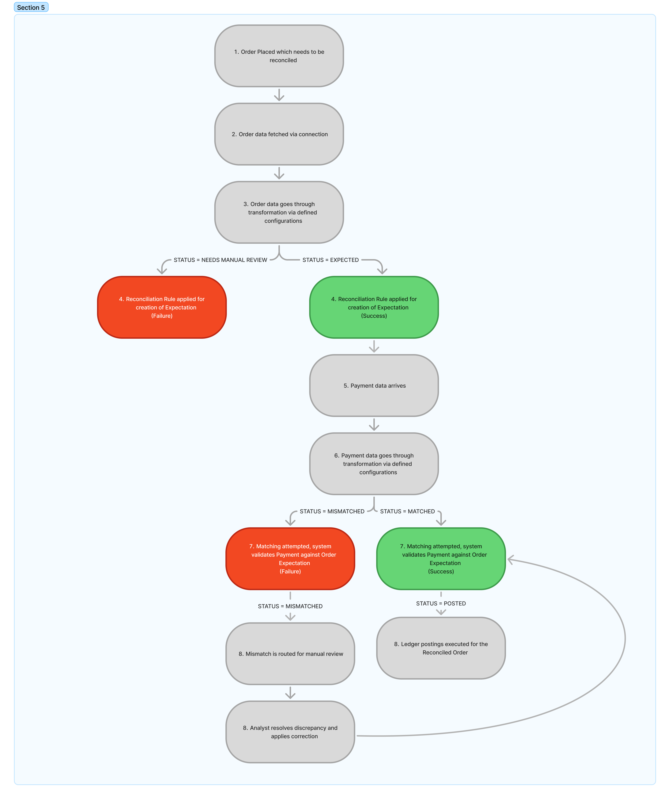

# 📦 Integration guide

## Global Checkout Experience

Hyperswitch Unified Checkout is an inclusive, consistent and blended payment experience optimized for the best conversion rates.

**Inclusive:** A variety of global payment methods including cards, buy now pay later and digital wallets are supported by the Unified Checkout, with adaptation to local preferences and ability to local language customization.

**Consistent:** With a diverse set of payment methods supported, the Unified Checkout provides a singular consistent payment experience across platforms (web, android and ios) powered by smart payment forms, minimal redirections and intelligent retries.

**Blended:** The Unified Checkout includes 40+ styling APIs, which could be tweaked to make the payment experience blend with your product. Your users will get a fully native and embedded payment experience within your app or website

## Modify and Experiment

While the Unified Checkout is pre-optimized for maximum conversions, Hyperswitch does not restrict you to stick to a one-size-fits-all approach. Using Hyperswitch SDK APIs, you get complete control over modifying the payment experience by,

* **Including new fields to the payment form:** Quickly adapting to use cases such as collecting billing addresses, or zip code as additional information, since you will have complete control of your payment experience.
* **Prioritizing payment methods:** You can make an impact on the payment mix or conversion rates by prioritizing/ promoting specific payment methods for your customers.
* **Switching themes and layouts of checkout page:** The Unified Checkout comes with a wide range of pre-designed themes and layouts which you can choose from.

## Optimize

You can further optimize Unified Checkout web SDK by preloading all the resources that are needed by the iframe. By the time iframe is to be mounted (checkout button), everything that is required can be fetched from their server and stored in the disk cache.

* \<Elements /> wrapper has to be used in the top-level of the merchants app , say web app has two pages eg: homepage and checkout page, the wrapper must be added in the homepage itself.
* \<Elements/> has the required props to load our Hyperloader (script) which will
  1. Preload the all the resources that are required by the SDK ie. files, svgs, icons, css, fonts etc.
  2. Prefetch the two main API calls and is ready with response

**This will significantly decrease the SDK load time from \~10-15s (in slow 3G network) to just \~1-5ms.**

## **Web and mobile client SDK Preview**

<figure><figcaption></figcaption></figure>

<figure><figcaption></figcaption></figure>

## How to get started?

[Click here](https://app.hyperswitch.io/register) to signup for hyperswitch.


**Announcement:** We are coming up with a no-code interface to enable you to experiment limitlessly on your payment experience, without having to depend on the development team.

