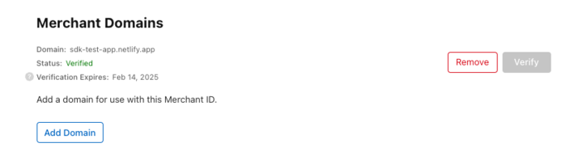
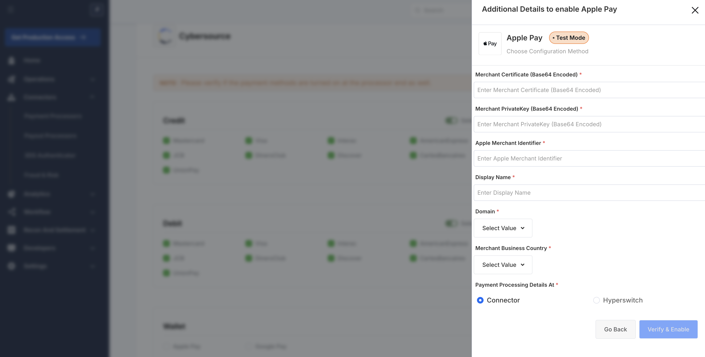
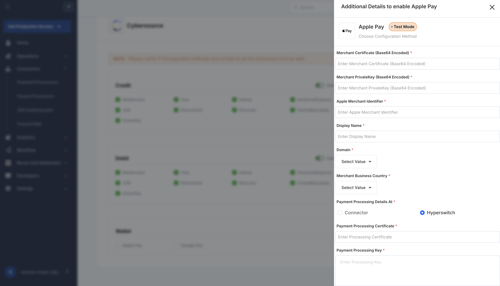
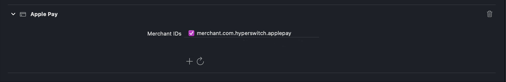

# iOS Application

## **Prerequisites**

Before beginning to integrate Apple Pay with Hyperswitch, below prerequisites need to be fulfilled. _Please feel free to reach out to Hyperswitch support if you are stuck at any stage when integrating and testing Apple Pay._

1. Apple Pay requires an Apple Developer Account. You can [Sign Up](https://developer.apple.com/programs/enroll/) for one here.
2. You must have a valid SSL certificate on your domain _(meaning it begins with **https**)_

Apple Pay requires additional steps, and requires macOS 10.12.1+ or iOS 10.1+. Follow the steps given below to setting up Apple Pay -

## **Creating an Apple MerchantID**

You can create an Apple MerchantID referencing the video or following the steps mentioned below&#x20;

- Log in to your [Apple Developer account](https://developer.apple.com/account/resources/certificates/list)
- Go to the [add MerchantIDs section](https://developer.apple.com/account/resources/identifiers/add/merchant), select Merchant IDs and click Continue
- Add a useful description _(like merchant id for test environment)_
- Enter a unique descriptive identifier _(like merchant.com.testdomain.sandbox)_ and click Continue
- Verify the description and identifier and click on Register

## **Validating Merchant Domain**

You can validate the merchant domain by following the steps mentioned below -

- Log in to your [Apple Developer account](https://developer.apple.com/account/resources/certificates/list), go to Identifiers and select the Merchant ID you created previously
- Under the Merchant Domains section, click on **Add Domain**
- Enter your _merchant_domain_ as domain and click on Save
- Click on Download and a **.txt** file will be downloaded
- Host this file on _merchant_domain_/.well-known/apple-developer-merchantid-domain-association.txt
- Once you host the .txt file in the path mentioned above, click on Verify
- Make sure the status is verified as shown in the following image

<figure><figcaption></figcaption></figure>

## **Creating Apple MerchantID Certificate and Private Key**

You can create an Apple MerchantID certificate and private key by following the steps mentioned below -

**Note:** It is recommended that you keep all the generated files in the same workspace for the sake of simplicity

- Open a terminal and create **.csr** and **.key** file using the following command -

```cmd
openssl req -out uploadMe.csr -new -newkey rsa:2048 -nodes -keyout certificate_sandbox.key
```

- Enter your details asked in the prompt. You will get a **.csr** and **.key** file
- Log in to your [Apple Developer account](https://developer.apple.com/account/resources/certificates/list), go to Identifiers and select the Merchant ID you created previously
- Under the **Apple Pay Merchant Identity Certificate** section _(make sure you are not in the Apple Pay Payment Processing Certificate section)_, click on Create Certificate
- Upload the **.csr** file you just created by running the command _(it would be called **uploadMe.csr** if you copy-pasted the command)_ and click on Continue
- You will get a **.cer** file on clicking on Download _(it will probably be named **merchant_id.cer**)_
- You will need to convert this **.cer** file into a **.pem** file using the following command -

```cmd
openssl x509 -inform der -in merchant_id.cer -out certificate_sandbox.pem
```

## **Configuring Apple Pay on Hyperswitch**

You can configure Apple Pay on Hyperswitch by following the steps mentioned below -

- Login to [Hyperswitch dashboard](https://app.hyperswitch.io/)
- In the Connectors tab, select your processor
- While selecting Payment Methods, click on Apple Pay in the Wallet section
- Select the iOS Certificate option

<figure><figcaption></figcaption></figure>

- In Apple Merchant Identifier, add your identifier which you added while creating Apple MerchantID
- In Merchant Certificate, **base64 encode** the entire content of your **.pem** file _(it will be **certificate_sandbox.pem**, if you used the exact command mentioned above)_, and enter the encoded data in the form field. Use the below command to base64 encode it.

```
base64 -i certificate_sandbox.pem
```

- In Merchant Private Key, **base64 encode** the entire content of your **.key** file _(it will be **certificate_sandbox.key**, if you used the exact command mentioned above)_, and enter the encoded data in the Merchant PrivateKey form field. Use the below command to base64 encode it.

```
base64 -i certificate_sandbox.key
```

- Display Name should be your merchant name that you want to present to the customers when the make ApplePay payment on your platform.
- In Domain, enter `web` in the form field.
- In Domain Name, add the verified domain name you configured in Merchant Domains in Apple Developer Account.

<figure><figcaption></figcaption></figure>

## **Creating Apple Pay Payment Processing Certificate**




<figure><figcaption></figcaption></figure>

- You will need to get a **.csr** file from your processor's dashboard, _(like Adyen, Cybersource)_
- Log in to your [Apple Developer account](https://developer.apple.com/account/resources/certificates/list), go to Identifiers and select the Merchant ID you created previously
- Under the **Apple Pay Payment Processing Certificate** section, click on Create Certificate
- After answering whether the Merchant ID will be processed exclusively in China mainland, click on Continue
- Upload the **.csr** you received from your processor and click Continue
- Click on the prompted Download button and you will get a .**cer** file, Upload this **.cer** file you received while creating Apple MerchantID Certificate on the processor's dashboard.


This final step is specific to the processor being used and is not necessary in Sandbox Test environment for some processors, such as Authorize.Net.





<figure><figcaption></figcaption></figure>

You can create an Apple Payment Processing Certificate and Payment Processing Key by following the steps mentioned below

- Note: It is recommended that you keep all the generated files in the same folder for the sake of simplicity
- Open a terminal and create .**key** file using the following command

```
openssl ecparam -name prime256v1 -genkey -noout -out ppc_private.key
```

- You can create .**csr** file using the following command and enter your details asked in the prompt. You will get a .**csr** file.

```
openssl req -out ppc_uploadMe.csr -new -key ppc_private.key
```

- Log in to your [Apple Developer account](https://developer.apple.com/account/resources/certificates/list), go to Identifiers and select the Merchant ID / Payment Platform Integrator ID you created previously

- Under the Apple Pay Payment Processing Certificate, click on Create Certificate

- Upload the .**csr** file you just created (it would be called uploadMe.csr if you copy-pasted the command) and click on Continue.

* You will get a .**cer** file on clicking Download (it will probably be named **apple_pay.cer**).

* In Payment Processing Certificate, **base64 encode** the entire content of your .**cer** file and paste it.

```
base64 -i apple_pay.cer
```

- In Payment Processing Key, copy the content from **ppc_private.key** file and paste it.

<figure><figcaption></figcaption></figure>


Please note since this flow involves decryption at Hyperswitch, you may need to write to your payment processor to get this feature enabled for your account. Stripe is one among them.


<details>

<summary>You can use the following text in the email</summary>

- Attach our PCI DSS AoC certificate and copy our Support team (biz@hyperswitch.io).

- Stripe Account id: <`Enter your account id:` you can find it [here](https://dashboard.stripe.com/settings/user)>

- A detailed business description:
  <`One sentence about your business`>. The business operates across `xx` countries and has customers across the world.

- Feature Request:
  We are using Hyperswitch, a Level 1 PCI DSS 3.2.1 compliant Payments Orchestrator, to manage payments on our website. In addition to Stripe, since we are using other processors as well to process payments across multiple geographies, we wanted to use Hyperswitch’s Payment Processing certificate to decrypt Apple pay tokens and send the decrypted Apple pay tokens to Stripe. So, please enable processing decrypted Apple pay token feature on our Stripe account. We’ve attached Hyperswitch’s PCI DSS AoC for reference.

</details>




## Integrate with Xcode

Add the Apple Pay capability to your app. In Xcode, open your project settings, click the Signing & Capabilities tab, and add the Apple Pay capability. You might be prompted to log in to your developer account at this point. Select the merchant ID you created earlier, and your app is ready to accept Apple Pay.

<figure><figcaption><p>Enable the Apple Pay capability in Xcode</p></figcaption></figure>
