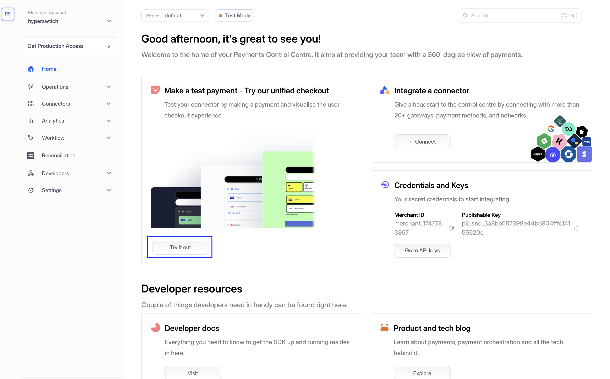

# Test a payment

## Test on Web Client <a href="#user-content-create-a-payment" id="user-content-create-a-payment"></a>

Once you have successfully run the [control centre](../local-setup-guide.md), you should be able to test the payments.&#x20;


[Account setup ](./)is a pre-requisite before you can test the payments.


There are three conditions in which you might want to make a test payment:

**Local:** Once you have got the Control Centre running (at [http://localhost:9000](http://localhost:9000/dashboard/home)) and have configured your payment processor via it. You can go to Home section in Control Centre, and you will find a `"try it out"` button (Highlighted with blue colour in the image below).

**Self Hosted Web App:** In case you have hosted the SDK and integrated it on your app, you can do a usual release of your app. Post successful deployment, you can test the payments on your app url.

**Playground deployment:** In case you have [deployed the demo app playground](../deploy-hyperswitch-on-aws/component-wise-deployment/deploy-web-client/playground-deployment-for-prototyping-optional.md), you will see the playground up and running on the public IP that you received after deployment.

***

On Local, click on **Connectors -> Payment Processors** and **Connect a Dummy Processor**:

<figure><figcaption></figcaption></figure>

Go ahead and connect any dummy processor, we'll show an example with the fauxpay processor:

<figure><figcaption></figcaption></figure>

Just connect and proceed with the provided credentials:&#x20;

<figure><figcaption></figcaption></figure>

From there, navigate back to the **Home** page and click on **Try it out**:&#x20;

<figure><figcaption></figcaption></figure>

&#x20;Input the credentials and Click on **Pay 100**: :

```
Card Number - 4242 4242 4242 4242
Card Expiry - Any future date
CVC - Any 3 digits
```

<figure><figcaption></figcaption></figure>

You'll see a successful Payment:

<figure><figcaption></figcaption></figure>

Congrats! You have successfully tested an end-to-end payment with your own app server and the control center


In case you have integrated the web client on your app and want to test a payment, the payment status confirmation screen has to be handled by you. You will see that post payment confirmation.


<details>

<summary>Troubleshooting/FAQs</summary>

1. **I cannot see the Web app playground running on `http://localhost:5252`**\
   This can happen when the playground's server or client are not run properly. Please check your terminal for any errors. The errors are directive, and should be able to pinpoint the issue. You can restart the playground using `npm run start:playground`\
   Please make sure that you are sending the publishable key correctly.
2. **I have hosted the web client successfully, but cannot see the payment element**\
   Please check the console errors. Please make sure that the publishable key and api key are correct. Please verify if the web client is initiated with a valid client secret.\
   Also make sure that HyperLoader.js is hosted successfully. You can open that URL on browser and see if the bundle is correct. In Network tab, check if the HyperLoader.js is called correctly. If not, please verify the env file and make sure that the correct URL is set.
3. **I am unable to complete the payment**\
   There can be multiple reasons for this. Please make sure that you have correctly followed all the steps in [account setup ](./)section.\
   Also make sure that you have configured at least 1 connector.
4. **After payment, I see a `Page Not Found` error.**\
   This can be a demo playground issue and not an issue with the web client. Please make sure that the return URL is correctly set.
5. **My transactions are  failing.** \
   This can happen when the connector is not correctly configured. Please make sure that the configured API keys are correct. In case of card payments, make sure that you have enabled raw card processing on the connector dashboard.\
   An exhaustive list of error and the corrective items are [here](https://api-reference.hyperswitch.io/essentials/error_codes).

</details>

## Next step:


[going-live](../../check-list-for-production/going-live/)


### Explore Further

Once you are done with the test payment, you can explore more about these:

<table data-card-size="large" data-view="cards"><thead><tr><th></th><th data-hidden data-card-target data-type="content-ref"></th></tr></thead><tbody><tr><td><mark style="color:blue;"><strong>How to set up routing rules</strong></mark></td><td><a href="../../explore-hyperswitch/payment-orchestration/smart-router.md">smart-router.md</a></td></tr><tr><td><mark style="color:blue;"><strong>How to integrate Hyperswitch with your app</strong></mark></td><td><a href="../../explore-hyperswitch/merchant-controls/integration-guide/">integration-guide</a></td></tr><tr><td><mark style="color:blue;"><strong>List of supported payment processors and payment methods</strong></mark></td><td><a href="https://hyperswitch.io/pm-list">https://hyperswitch.io/pm-list</a></td></tr><tr><td><mark style="color:blue;"><strong>AI Powered observability to reduce cost</strong></mark></td><td><a href="../../about-hyperswitch/payments-modules/ai-powered-cost-observability/">ai-powered-cost-observability</a></td></tr></tbody></table>

