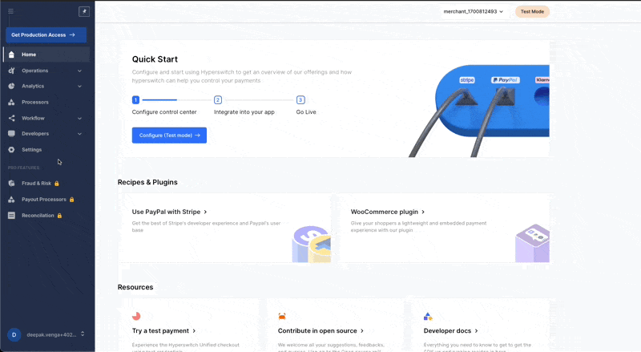

# 🎛 Using Hyperswitch control center


Here, you will be creating a Hyperswitch account and connecting your payment processor via the Hyperswitch control center


## Video 

***



## Getting started with the dashboard - Login / Register

During the local setup, a user has been configured automatically for you. You can use username: admin, password: admin to access the dashboard

Alternatively, on the landing page, click on the sign up button. Enter your email and set a strong password. Click on the sign up button.

The signup process will create a user with the provided email id. A merchant is also created which will be tagged to the user.&#x20;

On the left nav bar, click on your email on the bottom to access the profile section, where you can see all the details.

## Create an API key 

From the left nav bar, navigate to Developers --> Keys.

<figure><figcaption></figcaption></figure>

Click on create API key from the page. A pop-up appears where you have to enter details like the description and validity of the key. Enter the details and click Next.

An API key will be created and you will get the option to download and copy the API key.


Ensure that you download or copy the API key as it will be available only once through the dashboard for security reasons. In case you miss this, please create another API key.


## Add a payment processor

On the left nav bar, navigate to the processors tab.

<figure><figcaption></figcaption></figure>

You can see the list of payment processors already integrated with Hyperswitch. Click on the processor you want to connect.

To connect a payment processor:

1. Provide the necessary details like API key, secret for the processor. Details vary depending on the chosen processor
2. Configure the Hyperswitch endpoint in the processor dashboard to receive webhooks
3. Configure the relevant payment methods (like cards, wallets) to be enabled for this processor
4. Review and confirm the connection

## Setup Routing

The Hyperswitch control center gives you full control on how and where you route your payments.&#x20;

In the left nav bar, navigate to workflow --> routing to access the smart routing module.

<figure><figcaption></figcaption></figure>

By default, a priority-based routing based on the processor created time (first connected processor with highest priority) is enabled for you. This also acts as your fallback routing - which means if all else fails, routing will follow this priority.&#x20;

Currently, you can configure two types of routing with more on the way:

1. Volume based routing: As the name suggests, this routing is based on the volume provided. You can assign percentage volumes that needs to be processed with the connected processors and Hyperswitch will route in a way to ensure that the volume distribution is maintained
2. Rule based routing: Rule based routing gives you finer control over payment routing. It exposes payment parameters like amount, payment\_method, card\_type etc. with which you can configure multiple rules. Rule based routing also provides an option to enable default processors through which the routing will happen in case the rule fails

## Next step


[test-a-payment.md](../testing/test-a-payment.md)

