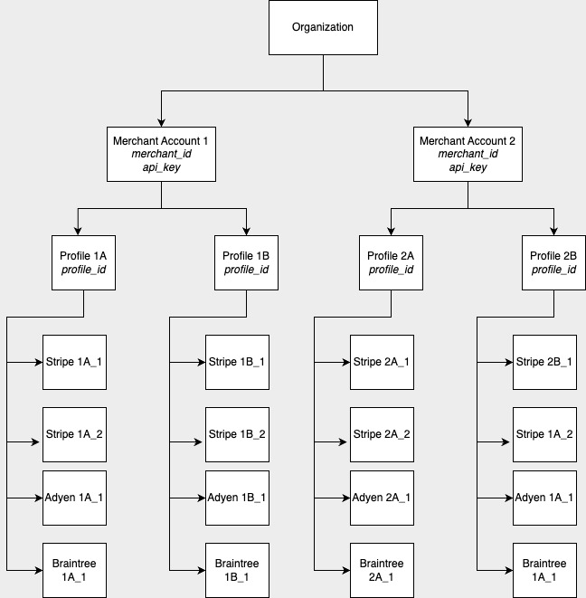

# Deploy Card Vault

The Juspay Hyperswitch Card Vault [(Repo Link)](https://github.com/juspay/tartarus), is a highly performant and secure locker to save sensitive data such as payment card details, bank account details etc.

It is designed in a polymorphic manner to handle and store any type of sensitive information making it highly scalable with extensive coverage of payment methods and processors.

Tartarus is built with a GDPR compliant personal identifiable information (PII) storage and secure encryption algorithms to be fully compliant with PCI DSS requirements.

### How does it work?

.jpg)

* The Juspay Hyperswitch application communicates with Tartarus via a middleware.
* All requests and responses to and from the middleware are signed and encrypted with the JWS and JWE algorithms.
* The locker supports CRD APIs on the /data and /cards endpoints - [API Reference](https://api-reference.hyperswitch.io/api-reference/cards/add-data-in-locker)
* Cards are stored against the combination of merchant and customer identifiers.
* Internal hashing checks are in place to avoid data duplication.

### Key Hierarchy

Master Key - AES generated key to that is encrypted/decrypted by the custodian keys to run the locker and associated configurations.

Custodian Keys - AES generated key that is used to encrypt and decrypt the master key. It is broken into two keys (`key 1` and `key 2`) and available with two custodians to enhance security.

### Setting up your Card Vault

| Option | Description |
|--------|-------------|
| [**Automated deployment of Card Vault as a standalone component**](production-ready-deployment-on-aws.md) | Deploy Card Vault automatically using CDK scripts on AWS |
| [**Manual setup of the card vault on AWS**](cloud-setup-guide.md) | Manual step-by-step setup of Card Vault on AWS |
