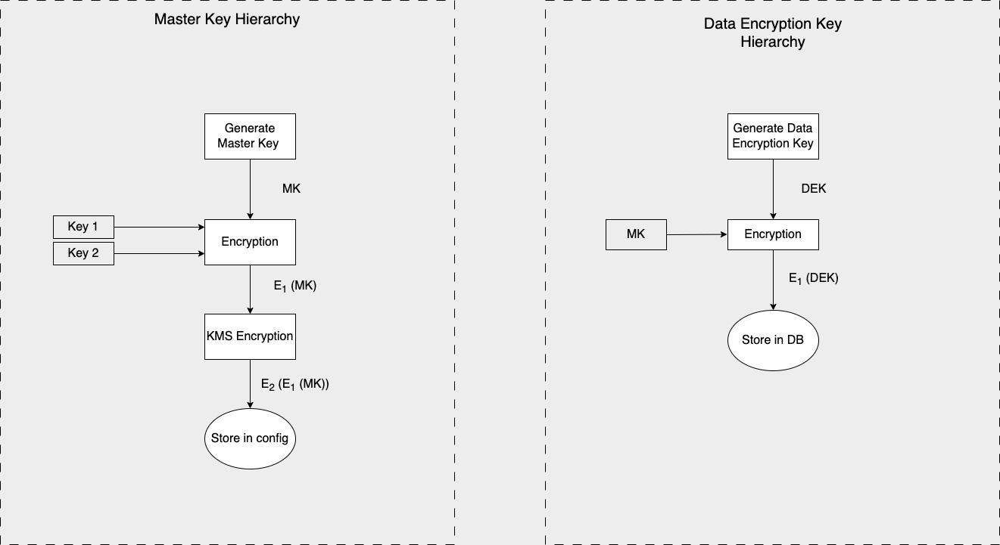

# Deploy Card Vault

The Hyperswitch Card Vault [(Repo Link)](https://github.com/juspay/tartarus), is a highly performant and a secure locker to save sensitive data such as payment card details, bank account details etc.&#x20;

It is designed in an polymorphic manner to handle and store any type of sensitive information making it highly scalable with extensive coverage of payment methods and processors.

Tartarus is built with a GDPR compliant personal identifiable information (PII) storage and  secure encryption algorithms to be fully compliant with PCI DSS requirements.

## How does it work?

<figure><figcaption></figcaption></figure>

* The Hyperswitch application communicates with Tartarus via a middleware.&#x20;
* All requests and responses to and from the middleware are signed and encrypted with the JWS and JWE algorithms.&#x20;
* The locker supports CRD APIs on the /data and /cards endpoints - [API Reference](https://api-reference.hyperswitch.io/api-reference/cards/add-data-in-locker)
* Cards are stored against the combination of merchant and customer identifiers.&#x20;
* Internal hashing checks are in place to avoid data duplication.&#x20;

## Key Hierarchy

Master Key - AES generated key to that is encrypted/decrypted by the custodian keys to run the locker and associated configurations.

Custodian Keys - AES generated key that is used to encrypt and decrypt the master key. It broken into two keys (`key 1` and `key 2`) and available with two custodians to enhance security.

<figure><figcaption></figcaption></figure>

## Setting up your Card Vault

<table data-card-size="large" data-view="cards"><thead><tr><th></th><th data-hidden></th><th data-hidden></th><th data-hidden data-card-cover data-type="files"></th><th data-hidden data-card-target data-type="content-ref"></th></tr></thead><tbody><tr><td><strong>Automated deployment of Card Vault as a standalone component</strong></td><td></td><td></td><td><a href="../../../../.gitbook/assets/aws.jpg">aws.jpg</a></td><td><a href="production-ready-deployment-on-aws.md">production-ready-deployment-on-aws.md</a></td></tr><tr><td><strong>Manual setup of the card vault on AWS</strong></td><td></td><td></td><td><a href="../../../../.gitbook/assets/aws.jpg">aws.jpg</a></td><td><a href="cloud-setup-guide.md">cloud-setup-guide.md</a></td></tr></tbody></table>
