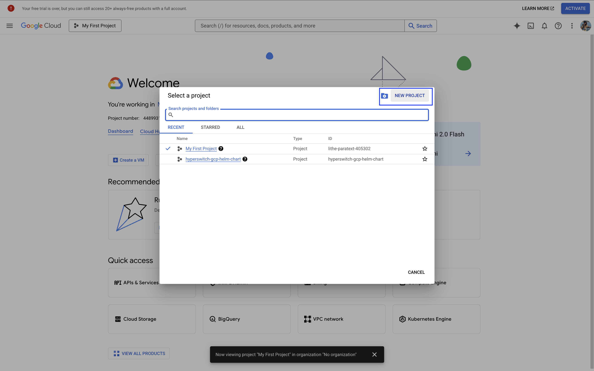

# Deploy on GCP Using Helm Charts


**Note:** This tutorial deploys the full Hyperswitch stack, launching multiple services that may exceed compute limits on smaller clusters.


Part 1: Setting Up a Kubernetes Cluster on GCP

#### Step 1: Set Up GCP Account and Enable Kubernetes Engine API

1. **Sign In to Google Cloud Console**:

* Navigate to the [Google Cloud Console](https://cloud.google.com/cloud-console), and click on **Go to my console.**

2. **Create a Project**:

* Open your project picker:

<figure><figcaption></figcaption></figure>

* Click **New Project:**

<figure><figcaption></figcaption></figure>

* Provide a project name, and click **Create:**

<figure><figcaption></figcaption></figure>


If you are using an existing project, note the project ID for later use.


3. **Enable Kubernetes Engine API**:

* Navigate to **APIs & Services > Library** or search for it:

<figure><figcaption></figcaption></figure>

* Search for **Kubernetes Engine API** and click **Enable:**

<figure><figcaption></figcaption></figure>


You'll need to provide billing information in order to proceed further. Follow the necessary steps and ensure the Kubernetes Engine API is enabled.


#### Step 2: Install Required Tools

1. **Google Cloud CLI (`gcloud`)**

The Google Cloud Command-Line Interface (CLI) is a cross-platform tool that allows you to manage GCP resources. To install `gcloud`, please refer to the official Google[ Cloud SDK installation guide](https://cloud.google.com/sdk/docs/install).

2. **kubectl**

`kubectl` is the command-line tool for interacting with Kubernetes clusters. To install `kubectl`, please refer to the [Kubernetes documentation](https://pwittrock.github.io/docs/tasks/tools/install-kubectl/).


Ensure you only have 1 version of kubectl installed to avoid enviornmental conflict.


3. **Helm**

Helm is a package manager for Kubernetes applications. To install Helm, please refer to the [official Helm documentation](https://helm.sh/docs/intro/install/#through-package-managers).

#### Step 3: Create a Kubernetes Cluster

1. **Create the Cluster**:

* Run the following command to create a Kubernetes cluster:

```bash
gcloud container clusters create <CLUSTER_NAME> \
    --zone <ZONE> \
    --num-nodes <NUMBER_OF_NODES> \
    --machine-type e2-standard-4
```

Replace:

* `<CLUSTER_NAME>`: A unique name for your cluster.
* `<ZONE>`: The GCP zone (e.g., `us-central1-a`).
* `<NUMBER_OF_NODES>`: Number of nodes in your cluster.
* `e2-standard-4`: Machine type with 4 CPUs and 16GB RAM per node.

Example:

```bash
gcloud container clusters create hypers-cluster \
    --zone us-central1-a \
    --num-nodes 1 \
    --machine-type e2-standard-4    
```


Choose a **--zone** that's near you


2. **Verify the Cluster**:

*   Fetch cluster credentials to allow `kubectl` to interact with it:

    ```bash
    gcloud container clusters get-credentials <CLUSTER_NAME> --zone <ZONE>
    ```
*   Confirm the nodes are ready:

    ```bash
    kubectl get nodes
    ```

## Part 2: Deploy Hyperswitch on Kubernetes Using Helm

#### Step 1: Add and Update the Hyperswitch Helm Repository

1. Add the Hyperswitch Helm repository:

```
helm repo add hyperswitch https://juspay.github.io/hyperswitch-helm
```

2. Update Helm repository to fetch the latest charts:

<pre><code><strong>helm repo update
</strong></code></pre>

#### Step 2: Prepare the Kubernetes Cluster

1. **Label Kubernetes Nodes**: Ensure nodes meet the minimum requirements: **4 CPUs and 6GB memory**.

* Label your nodes:

```bash
kubectl label nodes <your-node-name> node-type=generic-compute
```

* List nodes to confirm labels:

```bash
kubectl get nodes --show-labels
```

2. **Create a Namespace**:

* Create a dedicated namespace for Hyperswitch:

```
kubectl create namespace hyperswitch
```

#### Step 3: Install Hyperswitch

1. Deploy Hyperswitch using Helm. Replace `<release-name>` with your desired release name and `<namespace>` with the namespace you created:

```bash
helm install hypers-v1 hyperswitch/hyperswitch-stack -n hyperswitch
```

2. Verify the Deployment:

* Check the status of all deployed pods:

<pre><code><strong>kubectl get pods -n hyperswitch
</strong></code></pre>

* Ensure all pods are in the `Running` state.


That's it! Hyperswitch should be up and running on your GCP account 🎉 🎉


### Expose Hyperswitch Services Locally

Use the following command for port-forwarding to access the services. Replace `<namespace>` with your namespace:

```bash
kubectl port-forward service/hyperswitch-server 8080:80 -n hyperswitch > /dev/null 2>&1 & \
kubectl port-forward service/hyperswitch-control-center 9000:80 -n hyperswitch > /dev/null 2>&1 & \
kubectl port-forward service/hyperswitch-web 9050:9050 -n hyperswitch > /dev/null 2>&1 & \
kubectl port-forward service/hypers-v1-grafana 3000:80 -n hyperswitch > /dev/null 2>&1 & \
kubectl port-forward service/hypers-v1-vector 3103:3103 -n hyperswitch > /dev/null 2>&1 & \
kubectl port-forward service/mailhog 8025:8025 -n hyperswitch > /dev/null 2>&1 &
```

Access the services at:

* App server: [http://localhost:8080](http://localhost:8080)
* Control center: [http://localhost:9000](http://localhost:9000)
* Hyperswitch Web: [http://localhost:9050/HyperLoader.js](http://localhost:9050/HyperLoader.js)
* Grafana: [http://localhost:3000](http://localhost:3000)
* Vector: [http://localhost:3103](http://localhost:3103)
* Mailhog: [http://localhost:8025](http://localhost:8025)

The quickest way to explore Hyperswitch is via the [Control Center](http://localhost:9000/). You can create an account or sign in with your email:

<figure><figcaption></figcaption></figure>

A magic link will be sent to [Mailhog](http://localhost:8025/). Click on the link in white:

<figure><figcaption></figcaption></figure>

Afterwards, you’ll be taken straight to the Control Center. If you're just taking things for a spin, feel free to skip authentication and start exploring right away.

### Test a payment

Use can now use the Hyperswitch Control Center and [make a payment with dummy card](https://opensource.hyperswitch.io/hyperswitch-open-source/test-a-payment).

Refer our [postman collection](https://www.postman.com/hyperswitch/workspace/hyperswitch/folder/25176183-0103918c-6611-459b-9faf-354dee8e4437) to try out REST APIs.

### **Troubleshooting**

* **View Pod Logs:** To check logs for a specific pod in Google Kubernetes Engine (GKE):

<pre class="language-sh"><code class="lang-sh"><strong>kubectl logs &#x3C;pod-name> -n hyperswitch
</strong></code></pre>

* **View Events:** To list events in the namespace sorted by creation time:

<pre class="language-sh"><code class="lang-sh"><strong>kubectl get events -n hyperswitch --sort-by='.metadata.creationTimestamp'
</strong></code></pre>

* **Deploy Hyperswitch Helm Chart on GKE:** If deploying for the first time or reinstalling, run:

<pre class="language-sh"><code class="lang-sh"><strong>helm uninstall hypers-v1 -n hyperswitch
</strong>helm install hypers-v1 hyperswitch/hyperswitch-stack -n hyperswitch
</code></pre>

### **Customization & Configuration**

To customize Hyperswitch, clone the Helm chart repository and modify `values.yaml`:

```sh
git clone https://github.com/juspay/hyperswitch-helm.git
```

Update the `values.yaml` file inside `hyperswitch-stack/` and apply changes with:

```sh
helm upgrade --install hypers-v1 hyperswitch/hyperswitch-stack -n hyperswitch
```

### **Uninstall Hyperswitch & Delete GKE Cluster**

* To uninstall Hyperswitch:

```sh
helm uninstall hypers-v1 -n hyperswitch
```

* To delete the GKE cluster completely:

```sh
gcloud container clusters delete <cluster-name> --region <region> --project <project-id> --quiet
```

### Explore Further

Once you are done with the test payment, you can explore more about these:

<table data-card-size="large" data-view="cards"><thead><tr><th></th><th data-hidden data-card-target data-type="content-ref"></th></tr></thead><tbody><tr><td><mark style="color:blue;"><strong>How to set up routing rules</strong></mark></td><td><a href="../../explore-hyperswitch/payment-orchestration/smart-router.md">smart-router.md</a></td></tr><tr><td><mark style="color:blue;"><strong>How to integrate Hyperswitch with your app</strong></mark></td><td><a href="../../explore-hyperswitch/merchant-controls/integration-guide/">integration-guide</a></td></tr><tr><td><mark style="color:blue;"><strong>List of supported payment processors and payment methods</strong></mark></td><td><a href="https://hyperswitch.io/pm-list">https://hyperswitch.io/pm-list</a></td></tr><tr><td><mark style="color:blue;"><strong>AI Powered observability to reduce cost</strong></mark></td><td><a href="../../explore-hyperswitch/payments-modules/ai-powered-cost-observability/">ai-powered-cost-observability</a></td></tr></tbody></table>
