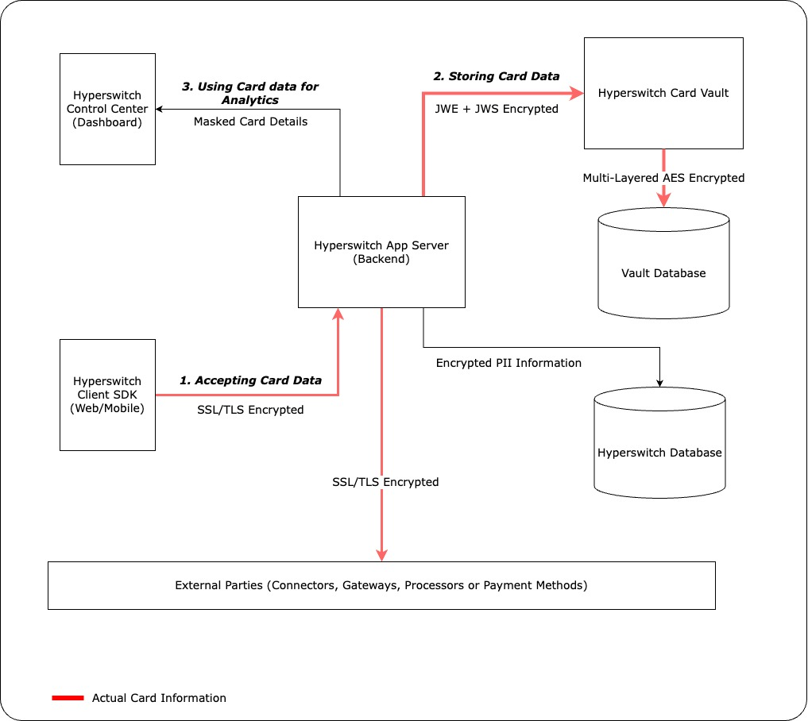

# 🔐 Data Security


In this chapter, you will learn about the security principles employed in the design on the Hyperswitch application


Hyperswitch is engineered with a meticulous focus on safeguarding sensitive data aligning with PCI standards. The application employs a multi-layered encryption strategy that encompasses various stages of data handling.&#x20;

The below sections highlight how Hyperswitch handles sensitive data such as master key, database passwords, RSA certificates, external API credentials and customer Personally Identifiable Information (PII).&#x20;

## Handling Sensitive Data

The Hyperswitch application employs multiple layers of encryption to safeguard sensitive card information during transmission between components as explained below. Our security framework is designed to meet PCI standards, ensuring maximum protection and confidentiality for all card-related data.

<figure><figcaption></figcaption></figure>

### 1. Accepting Card Data

Card information initially comes from the Hyperswitch SDK, where it's encrypted using the SSL/TLS protocol. This establishes end-to-end encryption between the SDK and the Hyperswitch backend.

### 2. Storing Card Data (vaulting)

When a payment is made using a saved card, the card details get stored in a secure storage system called the Hyperswitch Card Vault. The Hyperswitch App Server utilizes JWS and JWE to secure card data during its transmission to our Card Vault service, which is then decrypted and verified by Card Vault. The transfer and validation of this data involve a few steps:

**Card Data Preparation:** The card details undergo two important security measures:

* They're signed using the private key of the hyperswitch app server to ensure the integrity of the data.
* Then, the details are encrypted using the public key of the locker, ensuring their confidentiality during transmission.

**Data Storage Process:**&#x20;

* The card vault, after receiving the validated and encrypted data, further secures it by internally applying AES encryption.
* Finally, the data, now doubly encrypted, is stored in the database, ensuring an added layer of security for the stored information.
* For more details on how the locker internally handles the encryption and decryption you can visit the Github repository [juspay/hyperswitch-card-vault](https://github.com/juspay/hyperswitch-card-vault/blob/main/README.md)

### 3. Using Card Data for Analytics and Payment Operations

To provide transaction information and analytics, only partially masked card details (first 4 and last 4 digits) are sent to the Control Center from the Hyperswitch app server. This allows a high-level view of payments without revealing full customer information.

## Data Encryption Overview

The application places a high priority on safeguarding sensitive information tied to `external API credentials`, `customers`, and `card details` and uses multi-layered encryption for the same.

During transmission, data remains masked and never gets permanently stored on the local system, ensuring added security.

<figure><figcaption></figcaption></figure>

### Key Management System (KMS) Encryption


The current Hyperswitch setup only uses AWS KMS for storing and managing sensitive data and configurations. Support will be added for other 3rd party vault solutions (e.g., Hashicorp Vault) in the future.


* Sensitive keys crucial for the application's operation undergo encryption at startup.
* These encrypted keys are then stored securely in environment variables or configuration files using AWS's KMS service.
* Examples of encrypted values include the master key, database passwords, and RSA certificates, ensuring their confidentiality.

### Merchant-Specific Encryption

* Each merchant account is assigned a unique data encryption key generated internally and stored securely.
* This merchant-specific key undergoes encryption using AES-256 symmetric encryption via the master key, further securing it.

### Data Encryption for each Merchant account

* Data pertinent to individual merchant accounts, such as connector API keys, confidential merchant information, and any Personally Identifiable Information (PII) of customers, is encrypted using the same encryption method.
* However, this encryption process utilizes the unique data encryption key specific to that particular merchant, ensuring that each set of data remains protected and accessible only to authorized parties associated with that merchant.
* By employing a multi-layered encryption approach involving KMS encryption for critical keys, unique encryption keys for each merchant, and data-specific encryption, the application ensures robust security measures are in place to safeguard sensitive information at various levels.

### Concealing Sensitive Data in Logs

* For masking sensitive data, the application framework is designed with a wrapper type that categorizes all sensitive data as `Secret`.&#x20;
* This approach capitalizes on the advantages of `Rust` - a strongly typed language. Creating a wrapper type like `Secret<T>` offers a robust way to handle sensitive data.&#x20;
* Instead of logging the actual sensitive content, such as passwords or personal information, this approach logs the data type itself (e.g., `*** alloc::string::String ***`).&#x20;
* This practice of masking the data at source ensures that sensitive information remains protected and prevents inadvertent exposure in logs or debug outputs.


**Database at rest Encryption**

In the cloud-hosted version of Hyperswitch, we've encrypted the DB instances to offer an added layer of security, safeguarding the data from unauthorized access. For merchants self-hosting Hyperswitch, we highly recommend adopting similar practices to ensure robust protection for their data.

