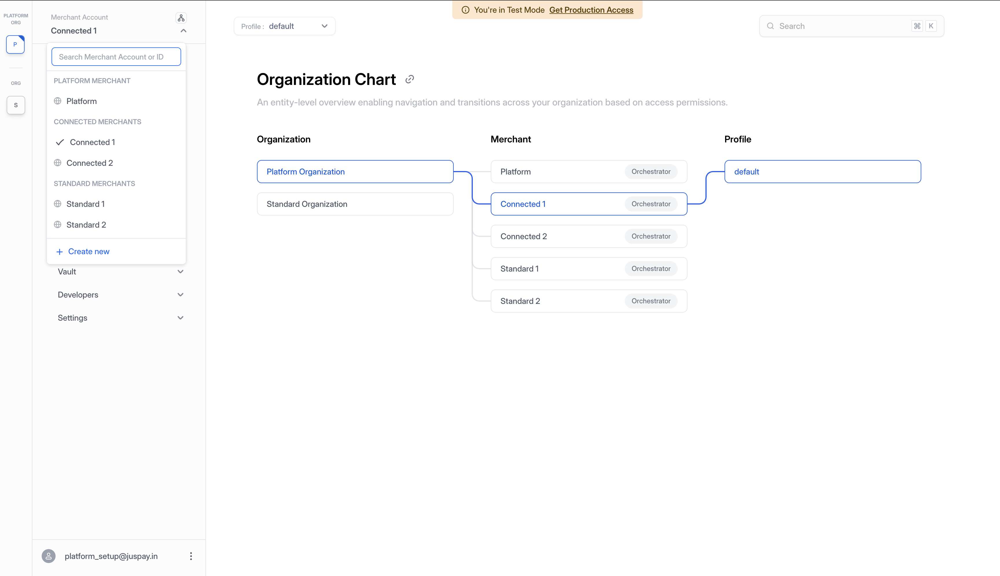
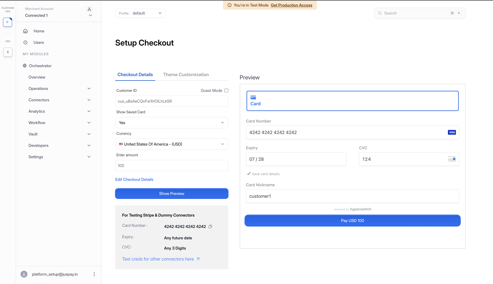
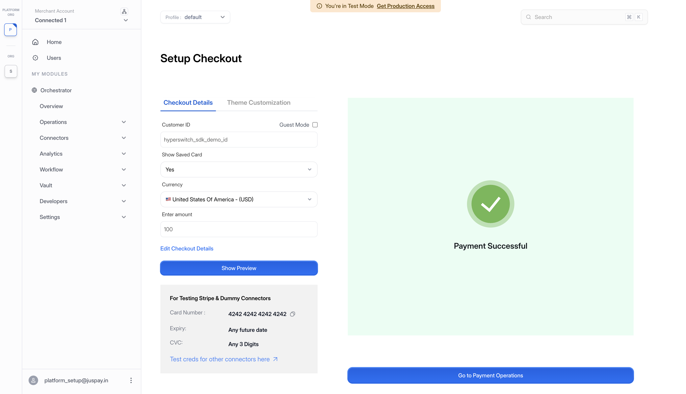
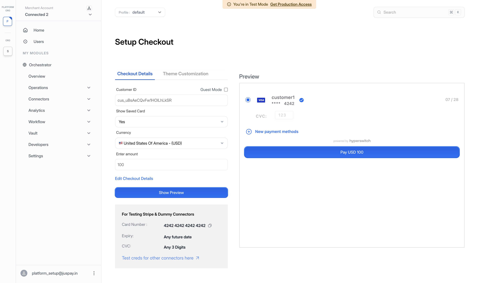

# Customers, Payment Methods, and Payments for Platform

Once your Platform Organization is set up and your Connected Merchants are created, you can start using the operational capabilities that come with the platform like a shared customer pool, shared payment methods, and the ability for the platform to initiate operations like payments on behalf of a connected merchant.

The walkthrough below uses a concrete example hierarchy end to end. Connected Merchants are merchants onboarded by the platform that share customers and payment methods across the connected group. Standard Merchants under the same organization operate in isolation.


Before starting, ensure you have already configured your Platform Organization along with its Connected and Standard Merchants. If you have not, see [Setting Up Your Platform Organization](setting-up-platform-organization.md) first.


### What We'll Cover

In order:

1. **Generating API keys and configuring connectors** for each Connected Merchant so they can process payments.
2. **Customer sharing**: how customers created in the platform pool are visible across all Connected Merchants, and how to create them via API.
3. **Payment method sharing**: saving a card on one Connected Merchant and reusing it on another.
4. **Operating on behalf of a Connected Merchant**: the Platform Merchant initiating operations using the Platform API Key.

***

### The Example Hierarchy

To make the behaviour concrete, we'll use a single example hierarchy throughout:

* **Platform Organization** containing:
  * **Platform Merchant**: the managing entity
  * **Connected Merchant 1** and **Connected Merchant 2**: share customers and payment methods
  * **Standard Merchant 1** and **Standard Merchant 2**: operate in isolation

<figure><figcaption>
Organization Chart showing the full platform hierarchy with all merchant types
</figcaption></figure>

| Merchant                | Customer Scope                         | Payment Method Scope                   | Platform can act on behalf? |
| ----------------------- | -------------------------------------- | -------------------------------------- | --------------------------- |
| Platform Merchant       | Owns the shared pool                   | Owns the shared pool                   | N/A                         |
| Connected Merchant 1    | Reads and writes to the shared pool    | Reads and writes to the shared pool    | Yes                         |
| Connected Merchant 2    | Reads and writes to the shared pool    | Reads and writes to the shared pool    | Yes                         |
| Standard Merchant 1     | Isolated to this merchant only         | Isolated to this merchant only         | No                          |
| Standard Merchant 2     | Isolated to this merchant only         | Isolated to this merchant only         | No                          |

***

### Generate API Keys and Configure Connectors for Each Connected Merchant

Before any payments can be processed, every Connected Merchant needs at least one connector configured under one of its profiles. Connectors are configured **per profile under each merchant**. Each Connected Merchant runs payments through its own processor credentials configured in that profile.

#### Two Ways to Authenticate Connector Configuration in Platform Setup

A connector for a Connected Merchant can be configured using either:

* **The Connected Merchant's own API key.** It can be generated by the Connected Merchant via the dashboard, or programmatically by the Platform Merchant using the Platform API Key (see [API Key Create](https://api-reference.hyperswitch.io/v1/api-key/api-key--create)).
* **The Platform API Key directly.** The platform configures the connector on behalf of the Connected Merchant. See [Connector Setup](platform-org-and-merchant-setup.md#5.1-connector-setup) for the API flow.

Either path lands the connector under the correct Connected Merchant context.

#### 1. Switch to Connected Merchant 1

From the sidebar merchant dropdown, select **Connected Merchant 1** under the **CONNECTED MERCHANTS** section. The dashboard updates to that merchant's context.

#### 2. Add a Connector

Navigate to **Connectors** from the sidebar and add the processor of your choice. Fill in the connector credentials and save.

<figure><figcaption>
Configuring a payment processor for Connected Merchant 1
</figcaption></figure>

#### 3. Repeat for Connected Merchant 2

Switch to **Connected Merchant 2** in the sidebar and add a connector following the same steps.

***

### The Shared Customer Pool

Within a Platform Organization, customers created on any Connected Merchant (or directly via the Platform Merchant) are stored in a single **shared customer pool**. Every Connected Merchant in the org reads and writes from this same pool, so a customer record is reusable across the connected group without any duplication.

Standard Merchants do **not** participate in the shared pool. Each Standard Merchant maintains its own isolated set of customers.

<figure><figcaption>
Shared customer pool across Connected Merchants, with Standard Merchants maintaining isolated customers
</figcaption></figure>

The same model applies to payment methods. A card or wallet saved against a customer in the shared pool becomes available to every Connected Merchant for that customer.

#### Creating a Customer via the API

Customers can be created via the customers endpoint.

* API: [Create Customer](https://api-reference.hyperswitch.io/v1/customers/customers--create) (`POST /v1/customers`)

The API key used to make the call determines where the customer is stored:

| API Key Used                     | Customer Is Stored In                                                |
| -------------------------------- | -------------------------------------------------------------------- |
| **Platform API Key**             | Shared customer pool, visible to every Connected Merchant in the org |
| **Connected Merchant API Key**   | Shared customer pool (same as above)                                 |
| **Standard Merchant API Key**    | That Standard Merchant's isolated scope only                         |

Customers created with either the Platform API Key or any Connected Merchant API Key all land in the same shared pool. Customers created with a Standard Merchant API Key remain isolated to that Standard Merchant.

***

### Save a Card While Making a Payment in Connected Merchant 1

Create a payment in Connected Merchant 1 and save the card during checkout. The card will be stored against the customer in the shared pool.

#### 1. Switch to Connected Merchant 1

Use the sidebar merchant dropdown to switch context to **Connected Merchant 1**.

#### 2. Create a New Payment

Navigate to **Payments** and click **Create a Payment**. Choose an existing customer from the shared pool, or create a new one (it will land in the shared pool automatically).

<figure><figcaption>
Setup Checkout on Connected Merchant 1 with a shared pool customer and "Save card" enabled
</figcaption></figure>

#### 3. Pay and Save the Card

During checkout, enter the card details and select the **Save card for future payments** option. Complete the payment.

<figure><figcaption>
Payment completed successfully on Connected Merchant 1 with card saved
</figcaption></figure>

***

### Reuse the Saved Card in Connected Merchant 2

When Connected Merchant 2 starts a payment for the same customer, the saved card from Connected Merchant 1 appears automatically because both merchants read from the shared pool.

#### 1. Switch to Connected Merchant 2

From the sidebar merchant dropdown, select **Connected Merchant 2**.

#### 2. Create a New Payment for the Same Customer

Navigate to **Payments** and click **Create a Payment**. Pass the **same customer ID** used in the previous section so the payment is associated with that customer in the shared pool.

#### 3. Choose the Saved Card

In the payment method selection, the card saved earlier in Connected Merchant 1 appears in the customer's saved methods. Select it to use for this payment.

<figure><figcaption>
Connected Merchant 2 checkout showing the saved card from Connected Merchant 1 via the shared pool
</figcaption></figure>

#### 4. Complete the Payment

Complete the payment with the saved card. The transaction processes through Connected Merchant 2's connector credentials while reusing the payment method from the shared pool.


The customer record and saved card live in the shared pool, but each payment is still attributed to the merchant that initiated it. Connected Merchant 1 and Connected Merchant 2 each see their own payments in their own dashboards. Sharing applies to the customer and payment method only.


***

### Operate on Behalf of a Connected Merchant

Apart from a Connected Merchant initiating its own operations, the **Platform Merchant** can act on behalf of any Connected Merchant using the Platform API Key. This is not limited to payments. The platform can perform the full operational surface for a Connected Merchant from one credential, with every action recorded against the correct Connected Merchant for attribution and settlement.


On-behalf-of operations are currently API-only.


The walkthrough below uses a payment as the example, but the same authentication pattern applies to every supported on-behalf operation.

#### 1. Authenticate with the Platform API Key

Use the Platform API Key (generated from the Platform Merchant context) to authenticate the request. See [Generating a Platform API Key](platform-org-and-merchant-setup.md#2.-generate-a-platform-api-key) for how to create one.

#### 2. Identify the Connected Merchant in the Request

When making the API call, identify which Connected Merchant the operation is for. The request is authorised by the platform but executed against the Connected Merchant's context, using its connector credentials for payment-side operations and scoping configuration changes to that Connected Merchant.

#### 3. Inspect the Response

The response includes both the Platform Merchant and the Connected Merchant the operation was performed for, along with the initiator of the call. For every operation you can tell who initiated it and which merchant it was executed against.

For request and response schemas across the supported operations, see the [Hyperswitch API Reference](https://api-reference.hyperswitch.io/).

#### What This Enables

* **Centralized orchestration**: the platform can run payments, refunds, captures, disputes, connector setup, and account management for any Connected Merchant from one credential.
* **Clear attribution**: every operation records both the initiator (Platform) and the executing merchant (Connected), so reporting, settlement, and audit stay unambiguous.
* **Same shared customer and payment method pool**: on-behalf operations use the shared pool, so saved cards and customers are immediately reusable across the group. Cards can also be saved during a platform-initiated on-behalf payment, since these are the same payments a Connected Merchant would run itself, just initiated by the Platform Merchant. The saved card lands in the same shared pool.


On-behalf-of is **not** available for Standard Merchants. The Platform Merchant can still manage a Standard Merchant's account (creation, API key generation, and connector setup programatically), but the Platform API Key cannot perform payments, refunds, captures, or disputes on a Standard Merchant's behalf. Those must be initiated by the Standard Merchant directly using its own API key.

***

### Quick Reference

| Scenario                                                          | Initiated by | Executed against | Customer Scope       | Payment Method Scope |
| ----------------------------------------------------------------- | ------------ | ---------------- | -------------------- | -------------------- |
| Connected Merchant runs its own operation                         | Connected    | Connected        | Shared pool          | Shared pool          |
| Platform initiates an operation on behalf of a Connected Merchant | Platform     | Connected        | Shared pool          | Shared pool          |
| Standard Merchant runs its own operation                          | Standard     | Standard         | Isolated to Standard | Isolated to Standard |

The Platform-on-behalf path applies to the full operational surface, not payments alone: payments, refunds, captures, disputes, connector setup, profile management, and API key management.
