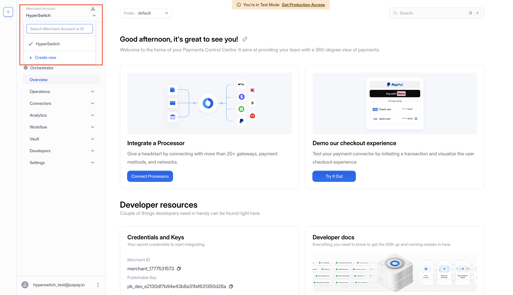
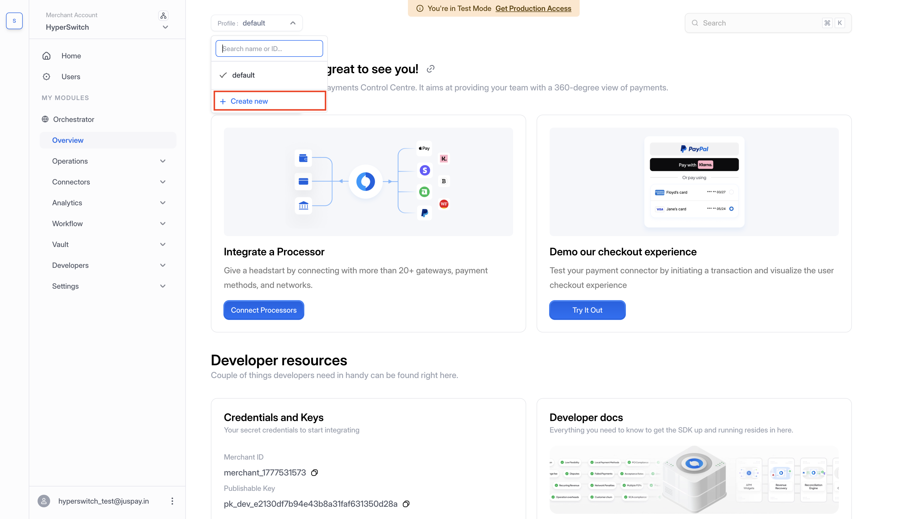

<!-- truth manifest; hyperswitch 502bfe8ddbe6a9a9619dc4e0b88900a780c2aac5; control-center 2c18b1da385bc79cfa9b4da6204bf869cfc50f42; spec api-reference/v1/openapi_spec_v1.json@502bfe8ddbe6a9a9619dc4e0b88900a780c2aac5
     symbols: OrganizationId, OrganizationResponse = crates/api_models/src/organization.rs
     symbols: MerchantAccountCreate, MerchantAccountResponse = crates/api_models/src/admin.rs
     symbols: ProfileCreate, ProfileUpdate, ProfileResponse = crates/api_models/src/admin.rs
     symbols: MerchantConnectorCreate, MerchantConnectorResponse = crates/api_models/src/admin.rs
     symbols: PaymentsRequest.profile_id = crates/api_models/src/payments.rs
     symbols: get_profile_id_from_business_details = crates/router/src/core/utils.rs
     symbols: V2ApiKeyAuth, X_PROFILE_ID = crates/router/src/services/authentication.rs; crates/router/src/lib.rs
     symbols: profile_update = crates/router/src/routes/profiles.rs; crates/router/src/routes/app.rs
     symbols: BusinessProfileInterfaceTypesV1.profileEntity_v1, profileEntityRequestType_v1 = control-center/src/Interface/BusinessProfileInterface/BusinessProfileInterfaceTypes/BusinessProfileInterfaceTypesV1.res
     symbols: ProfileInfoHeader = control-center/src/screens/Developer/PaymentSettings/PaymentSettingsProfileInfo.res
     symbols: MerchantSwitch, ProfileSwitch, AddNewOMPButton = control-center/src/entryPoints/OMPSwitch/MerchantSwitch.res; control-center/src/entryPoints/OMPSwitch/ProfileSwitch.res; control-center/src/entryPoints/OMPSwitch/OMPSwitchHelper.res
     checked: 2026-09-22 -->

# Organization, Merchant Account, and Business Profile

Hyperswitch separates organization ownership, merchant authentication, and payment configuration.

* An **Organization** owns merchant accounts and can be standard or platform type.
* A **Merchant Account** belongs to an organization and is the scope for merchant API keys.
* A **Business Profile** belongs to a merchant account and stores payment configuration, including return URL, webhook details, routing-related settings, and profile-level feature settings.
* A **merchant_connector_account** belongs to a profile. Its connector account details are where processor credentials are stored. Do not put processor credentials on the organization or merchant account.

### Identifiers

Every object in the hierarchy has an identifier, and the naming convention changed between API versions. This is worth understanding before you read an API response, because v1-era examples and v2 responses describe the same objects with different field names.

The rule is short: on v1, an object's identifier is named after the object; on v2, an object's own identifier is always `id`.

| Object | v1 | v2 |
| --- | --- | --- |
| Organization | `organization_id` | `id` |
| Merchant Account | `merchant_id` | `id` |
| Business Profile | `profile_id` | `id` |
| Connector account | `merchant_connector_id` | `id` |

The rename applies only to an object's *own* identifier. When one object points at another, that reference keeps its descriptive name on both versions. A connector account is the clearest example: on v2 its response carries `id` for itself and `profile_id` for the profile it belongs to, side by side. Seeing `profile_id` in a v2 payload does not mean you are looking at a profile — it means you are looking at something that belongs to one.

These shapes come from `OrganizationResponse`, `MerchantAccountResponse`, `ProfileResponse`, and `MerchantConnectorResponse`. When you create a connector account, the processor credentials go in `connector_account_details` on `MerchantConnectorCreate`.

### Choosing the level

Merchant accounts and profiles solve different problems, and the question that separates them is whether the units need their own credentials or only their own configuration.

Add **merchant accounts** when each unit needs its own API keys, because API keys are issued at the merchant-account scope. Separate legal entities, separate billing relationships, or any case where one unit's credentials must not work for another all point here.

Add **profiles** when one business needs several payment setups but can share a single set of API keys. A profile owns its connectors, routing rules, webhook endpoint and return URL, so profiles are how you separate a web storefront from a mobile app, or one region from another, without multiplying credentials.

Because payments, connectors and webhooks are all configured at the profile level anyway, reach for a second merchant account only when the API-key boundary is the actual requirement.

#### Selecting a profile for a payment

Each payment runs against exactly one profile. How that profile is chosen differs by version, and the v1 behavior deserves attention because the field is optional without always being safe to omit.

**On v1**, `PaymentsRequest` carries an optional `profile_id`. The handler, `get_profile_id_from_business_details`, tries three sources in order:

1. the `profile_id` on the request, if you sent one;
2. the merchant account's `default_profile`;
3. the legacy `business_country` and `business_label` pair, resolved together.

If none of the three produces a profile, the request fails with a missing-field error.

The practical consequence is in step 2. An account with a single profile that is also its `default_profile` will accept payments that omit `profile_id`, which makes the field look unnecessary. Add a second profile and nothing breaks — the payment simply keeps going to the default profile, which may not be the one you intended. That silent outcome is the reason to send `profile_id` explicitly once an account has more than one profile. The field being optional describes the request schema; it does not tell you whether omitting it is safe for your account.

**On v2**, `PaymentsRequest` has no `profile_id` field at all. The profile comes from the `X-Profile-Id` request header, which `V2ApiKeyAuth` reads and requires while authenticating the call. Every v2 payment therefore names its profile explicitly, and there is no default-profile fallback to depend on.

### Create merchant accounts and profiles

Sign-up creates one merchant account with one profile. You add more from the switchers in the dashboard, not from the settings pages.

Creating either one is restricted by role. Adding a merchant account needs Organization Admin; adding a profile needs Merchant Admin or above. Without the role, the option is visible but disabled.

**To add a merchant account:**

1. Open the **Merchant Account** switcher at the top of the left sidebar.
2. Select **+ Create new**.
3. In **Add a new merchant**, enter the merchant name. Some deployments also ask for a merchant type.
4. Select **Add Merchant**.

<figure><figcaption><p>The Merchant Account switcher in the sidebar, with "+ Create new"</p></figcaption></figure>

**To add a profile:**

1. Open the **Profile** switcher at the top of the main content area.
2. Select **+ Create new**.
3. In **Add a new profile**, enter the **Profile Name**.
4. Select **Add Profile**.

<figure><figcaption><p>The Profile switcher above the dashboard content, with "+ Create new"</p></figcaption></figure>

Both switchers list everything you already have, so they double as the way to move between merchant accounts and profiles.

### Edit a Business Profile

You can update a profile with the API or from the dashboard.

#### API

For v1, send `POST /account/{account_id}/business_profile/{profile_id}`. For v2, send `PUT /v2/profiles/{profile_id}`. The route registrations bind these methods to `profile_update`.

The request can update the profile name, return URL, webhook details, authentication connector details, shipping-detail collection settings, retry and routing settings, metadata, and other fields defined by the versioned `ProfileUpdate` struct. To update the profile webhook URL, include the `webhook_details` object with its `webhook_url` member. The v1 and v2 request names differ for some shipping fields, so copy the fields from the API version you are calling.

Example v1 shape:

```json
{
  "webhook_details": {
    "webhook_url": "https://example.com/hyperswitch-webhooks"
  }
}
```

The profile update handler validates `webhook_details` before calling the update operation. The endpoint is not the merchant-account update endpoint.

#### Dashboard

Open the active profile's settings and edit the available profile configuration. The control center fetches a profile with the business-profile endpoint and sends the edited profile through the version-specific update method. Its request model includes `profile_name`, `return_url`, `webhook_details`, authentication connector details, shipping collection options, retry settings, metadata, and version-specific feature flags. The profile page displays the `Profile ID` beside `Profile Name` and `Merchant ID`.

Profile IDs are also available in the dashboard's developer payment settings view. Look for the `Profile ID` field and use its copy control.

### Route out

* KV mode and Redis retention, plus the drainer configuration, are self-hosting concerns. See [Operations](../../control-center/operations.md) and the self-hosting operations documentation.
* For the complete field list for `POST /payments`, use the [Payments Create API reference](https://api-reference.hyperswitch.io/v1/payments/payments--create). The list is generated from the `PaymentsRequest` schema and must be kept with the API reference rather than duplicated here.

If you need programmatic merchant onboarding, continue to [Platform Organization](platform-organization-concepts.md).
