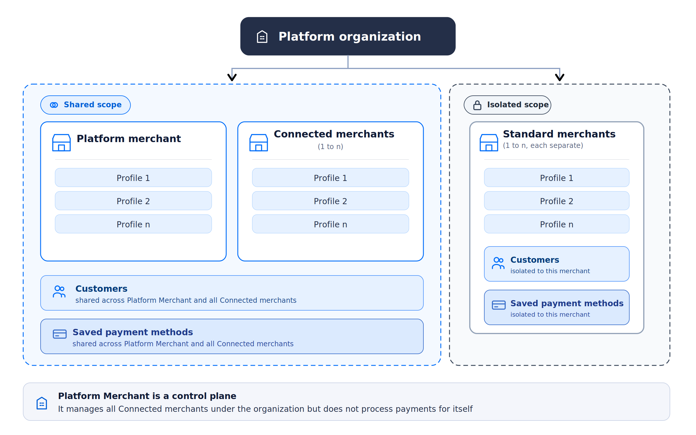

# Platform Organization

A **Platform Organization** is a special type of organization in Hyperswitch designed for businesses that onboard and manage multiple merchants programmatically. Think of it as a meta-organization that:

* Creates and manages other Merchant Accounts under its umbrella.
* Generates API keys not just for itself, but for the merchants it creates.
* Hosts exactly one Platform Merchant Account that creates and manages multiple sub-merchants, classified as either **Connected** or **Standard**.

This model is useful for:

* SaaS platforms offering payments to their merchants.
* Marketplaces or aggregators that onboard vendors as sub-merchants.
* Franchises or white-label operators that need central control of multiple merchants.

If you're not sure whether to use a Platform Organization or a Standard Organization, see [Pick the Right Setup for Your Business](pick-the-right-setup.md).

<figure><figcaption>
Platform Organization - shared scope for Platform and Connected merchants, isolated scope for Standard merchants
</figcaption></figure>

***

### Merchants in a Platform Organization

A Platform Organization always consists of:

* Exactly one **Platform Merchant**, the privileged parent merchant.
* One or more sub-merchants, each classified as **Connected** or **Standard** at creation time.

The classification controls how customers and payment methods behave across the org and what the Platform Merchant can do on the merchant's behalf.

> Once a merchant is created as Connected or Standard, classification changes must be requested through your Admins.

#### Platform Merchant

The Platform Merchant is the managing entity within a Platform Organization. It:

* Owns the shared resource scope for Customers and Payment Methods.
* Performs management operations across the platform: merchant creation, governance, and administration.
* Can act on behalf of Connected merchants for operational capabilities.
* Is a control-plane entity with optional operational capabilities. It cannot process payments for itself.

#### Connected Merchants

Connected Merchants participate in the **shared resource model** of the Platform Organization:

* Share Customers and Payment Methods with the Platform Merchant and other Connected merchants.
* Execute payments using their own merchant context for clear merchant attribution.
* Can be operated in two modes:
  * **Direct (self-initiated)**: the Connected merchant performs operations using its own credentials.
  * **On behalf (platform-initiated)**: the Platform Merchant performs operations on behalf of the Connected merchant using the Platform API Key.

This enables a unified saved-payment-method experience across the connected group, plus centralised orchestration with clear ownership and attribution.

#### Standard Merchants

Standard Merchants are fully isolated merchant accounts within the same Platform Organization, **outside the shared resource group**:

* Maintain isolated Customers and Payment Methods.
* Do not participate in platform-level sharing.
* The Platform Merchant cannot act operationally on their behalf beyond standard org-level management permissions.
* Best suited when contractual, regulatory, or data-boundary isolation is required.

***

### Resource Behaviour Summary

| Merchant Type | Customers                     | Payment Methods               | Platform can act on behalf?                                            |
| ------------- | ----------------------------- | ----------------------------- | ---------------------------------------------------------------------- |
| **Connected** | Shared across Connected group | Shared across Connected group | **Yes**                                                                |
| **Standard**  | Isolated per merchant         | Isolated per merchant         | No (but it can create the merchant and generate / manage its API keys) |

Within a Platform Organization:

* Customers are shared across Connected merchants.
* Payment Methods are shared across Connected merchants.
* Standard merchants maintain isolated Customers and Payment Methods.

All operational flows continue to use the respective Merchant API Keys. Resource sharing affects visibility and ownership within the Connected group but does not change transaction scoping.

***

### The Platform API Key

The Platform API Key is a privileged credential owned by the Platform Merchant. It is what unlocks programmatic management of sub-merchants.

* It performs **management operations**: creating merchant accounts (Standard or Connected), generating API keys, and managing platform-level configuration.
* In a Connected merchant setup, it can **initiate and execute operations on behalf of** Connected merchants, including processing payments, configuring connectors, creating profiles, and other merchant-scoped operations.
* It **cannot** perform payment or connector operations on behalf of Standard merchants. This boundary preserves correct isolation and ownership.

For how to generate a Platform API Key, see [Setting Up a Platform Organization](setting-up-platform-organization.md).

***

### The Platform Organization Workflow

The end-to-end API workflow for spinning up and operating a Platform Organization:

#### 1. Request Platform Organization Setup

* A merchant who wants to operate as a platform must contact Hyperswitch.
* Hyperswitch enables Platform Organization mode for that merchant.
* Once enabled, the merchant is now a Platform Org with one Platform Merchant associated to it.

#### 2. Generate a Platform API Key

* From the Hyperswitch Dashboard, the Platform Merchant generates a Platform API Key.
  * Sandbox URL for the API Key page: [https://app.hyperswitch.io/dashboard/developer-api-keys](https://app.hyperswitch.io/dashboard/developer-api-keys)
* The Platform API Key is privileged:
  * It authorises creating and managing new merchant accounts.
  * It does not perform payment operations for Standard merchants. Treat it as the key for managing merchant accounts, not for running their payments.
  * It can perform payment operations on behalf of Connected merchants.

#### 3. Create New Merchants (Sibling-Merchants)

* Using the Platform API Key, the platform calls the Merchant Account Create API.
  * API: [Merchant Account Create](https://api-reference.hyperswitch.io/v1/merchant-account/merchant-account--create)
* Each call provisions a new Merchant Account under the platform's umbrella, classified as Connected or Standard at creation time.
* Newly created merchants behave like regular merchants in terms of profiles, transactions, and routing.
* Example: a SaaS platform might create one merchant for each of its customers.

#### 4. Generate API Keys for New Merchants

* Once a new merchant is created, the Platform API Key can generate merchant-specific API keys via the API Key Create endpoint.
  * API: [API Key Create](https://api-reference.hyperswitch.io/v1/api-key/api-key--create)
* These keys are scoped to that merchant only and behave identically to regular merchant API keys.
* The platform can hand these keys to the merchant or use them internally on behalf of the merchant.

#### 5. Perform Payment Operations Using Merchant Keys

Once merchant accounts are created and their API keys are generated, those keys become the operational keys for that merchant account.

* **Standard merchant accounts**: all payment operations (payments, refunds) and connector actions must be performed using the Standard merchant's own API key. The Platform API Key is limited to management (creating Standard merchants and generating / managing their API keys).
* **Connected merchant accounts**: operations can be performed either using the Connected merchant's own API key, or using the Platform API Key acting on behalf of the Connected merchant (including payments / refunds and connector configuration).

##### 5.1 Connector Setup

With the Merchant API Key of a sibling merchant, the platform can connect payment processors on behalf of that merchant:

* API: [Merchant Connector Account Create](https://api-reference.hyperswitch.io/v1/merchant-connector-account/merchant-connector--create)
* A Connected merchant can connect or configure connectors in any of these ways:
  * Using the Connected merchant's own API key.
  * Via the Dashboard (with Org Admin or Merchant Admin permissions).
  * Via the Platform Merchant, where the platform uses the Platform API Key to configure connectors on behalf of the Connected merchant.
* A Standard merchant can connect or configure connectors only in these ways:
  * Using the Standard merchant's own API key.
  * Via the Dashboard (with Org Admin or Merchant Admin permissions).

> The Platform API Key cannot be used to configure connectors on behalf of Standard merchants.

##### 5.2 Payments and Other Operations

For payment operations (payments, refunds, captures, etc.), the allowed key depends on the merchant type:

* API: [Payments Create](https://api-reference.hyperswitch.io/v1/payments/payments--create)
* Other Payment APIs work identically to a regular merchant account.
* **Standard merchants**:
  * Must use their own merchant API key. The Platform API Key cannot run payments / refunds on behalf of a Standard merchant.
* **Connected merchants**:
  * Either the Connected merchant's own API key, or the Platform API Key on behalf of the Connected merchant.
  * The platform identifies which merchant account the operation is for and uses the correct credential:
    * Standard → Standard merchant API key.
    * Connected → Connected merchant API key OR Platform API Key (on behalf).
  * Every operation is scoped to the correct merchant account context, even when initiated by the platform.

***

### Supported Features (Platform-Connected Setup)

The Platform-Connected setup supports the following features end-to-end for Connected merchants:

* **Payments**: 3DS payments, both platform-on-behalf and connected-self flows.
* **Refunds**: platform can initiate refunds on behalf of Connected merchants.
* **Disputes**: platform can view, accept, or contest disputes on behalf of Connected merchants.
* **Webhooks**: dual-dispatch to both Platform and Connected Merchant webhook endpoints.
* **Shared Customers and Payment Methods**: shared across Connected merchants via a platform-scoped pool.
* **Analytics and Reporting**: scoped per Connected Merchant, queryable by the Platform.
* **SDK Integration**: supported via `sdk_authorization` token for platform-connected flows.
* **Audit Trail**: full traceability of which merchant processed a transaction and who initiated it.

For Standard merchants in a Platform Organization, all capabilities available to a Standard merchant in a Standard (non-platform) Organization are supported.

***

### Standard Organization vs Platform Organization

| Feature                 | Standard Organization                                                  | Platform Organization                                                                                                                                                            |
| ----------------------- | ---------------------------------------------------------------------- | -------------------------------------------------------------------------------------------------------------------------------------------------------------------------------- |
| Organization Structure  | Organization contains Standard Merchants that operate independently.   | Organization contains one Platform Merchant and one or more child merchants (Connected or Standard).                                                                             |
| Merchant Creation       | Org Admin creates merchants manually via Dashboard.                    | Platform Merchant uses the Platform API Key to programmatically create child merchants via API.                                                                                  |
| Merchant Classification | All merchants operate independently.                                   | Each child merchant is configured as Connected or Standard at creation time.                                                                                                     |
| Customer Scope          | Customers are scoped to a single merchant.                             | Customers are shared across Connected merchants. Standard merchants maintain isolated Customers.                                                                                 |
| Payment Method Scope    | Payment Methods are scoped to a single merchant.                       | Payment Methods are shared across Connected merchants. Standard merchants maintain isolated Payment Methods.                                                                     |
| API Key Generation      | Org Admin generates API keys manually.                                 | Platform Merchant generates Merchant API Keys programmatically for child merchants.                                                                                              |
| Connector Setup         | Merchant configures connectors via Dashboard or using its own API key. | Merchants can configure their own connectors using their API key, and the platform can configure connectors on behalf of **Connected** merchants using the **Platform API Key**. |
| Payment Processing      | Merchant uses its own API key.                                         | Merchants can process payments using their API key, and the platform can process payments on behalf of **Connected** merchants using the **Platform API Key**.                   |
| Merchant Type Changes   | Not applicable.                                                        | Merchant classification is set at creation. For changes, contact your **Admins**.                                                                                                |

***

### Next Steps

* [Setting Up a Platform Organization](setting-up-platform-organization.md): create your Platform Org and add Connected Merchants from the dashboard.
* [Customers, Payment Methods, and Payments](customer-payment-methods-and-payments-for-platform.md): walkthrough of shared customer pool, saved card reuse, and operating on behalf of a Connected Merchant.
