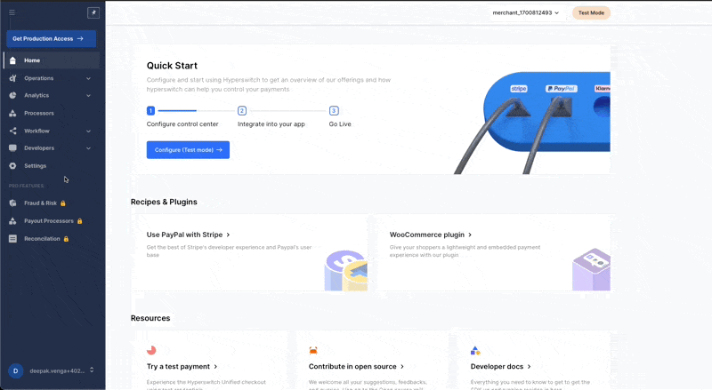

# Quick Start: Create Your Hyperswitch Account

Hyperswitch's Control Centre is the dashboard you and your team use to manage payments end to end: connecting payment processors, configuring routing, viewing analytics, handling refunds and disputes, managing your team and access roles, and exposing programmatic access through API keys. This page walks you through the first-time setup.

***

### 1. Sign Up to the Control Centre

Navigate to [app.hyperswitch.io](https://app.hyperswitch.io) and click **Sign Up**. Enter your email and set a strong password, then submit.

Sign-up creates a user with the email you provided. By default, an Organization is created for you with one Merchant Account and one Profile already in place. Your user is assigned the **Organization Admin** role, so you can invite teammates and grant them roles as needed.

[ASSET: `quick-start-signup.png` : Hyperswitch Control Centre sign-up screen with the email and password fields visible]

To open your profile details later, click your email at the bottom of the left navigation bar.

***

### 2. Tour the Dashboard

After sign-up, you land on the dashboard home. Familiarise yourself with these areas in the left navigation:

* **Payments**, **Refunds**, **Disputes**: list and manage transactions.
* **Connectors**: add and configure payment processors.
* **Workflow**: configure routing, retries, and surcharge.
* **Developers**: API keys, webhooks, events.
* **Settings**: organization, merchant, and profile configuration.
* **Analytics**: real-time dashboards for payments, refunds, and smart retries.

[ASSET: `quick-start-dashboard-tour.png` : annotated dashboard home screen highlighting the main left-navigation sections]

***

### 3. Create Your First API Key


Before creating an API key, ensure you have access to the credentials of the payment processor you plan to connect (API key, secret, webhook configuration).


From the left navigation bar, go to **Developers** then **Keys**, and click **Create API Key**.

<figure><figcaption></figcaption></figure>

Fill in:

* **Description**: a short label for the key (e.g. "Server-side payments").
* **Validity**: how long the key remains active.

Click **Next**. The key is generated, shown once, and offered for download.


The API key is shown **only once** for security reasons. Download or copy it before closing the dialog. If you lose it, create a new one.


You can use the dashboard later to reveal the publishable key, revoke keys, or create new secret keys at any time. If you're integrating Hyperswitch through a third-party platform, switch to live mode to get production-ready API keys before processing real payments.

***

### 4. Connect a Payment Processor

From the left navigation, go to **Connectors**. You'll see all processors integrated with Hyperswitch. Click the one you want to connect.

<figure><figcaption></figcaption></figure>

To connect a processor:

1. Provide the processor's API key, secret, and any other credentials it requires (these vary by processor).
2. In the processor's own dashboard, configure the Hyperswitch endpoint to receive webhooks.
3. Choose which payment methods (cards, wallets, BNPL, etc.) to enable for this processor.
4. Review the configuration and confirm.

[ASSET: `quick-start-connector-config.png` : connector configuration screen with credential fields and payment method toggles]

***

### 5. Make a Payment

With your API key in hand and a processor connected, run your first payment using the Payments Create API.

* API: [Payments Create](https://api-reference.hyperswitch.io/v1/payments/payments--create) (`POST /v1/payments`)

Pass your merchant API key in the request and Hyperswitch will route the payment based on the routing configuration of the matching profile. By default, priority-based routing is enabled, ordered by the time each processor was connected, and acts as your fallback if no other rule matches. You can configure volume-based or rule-based routing later from **Workflow** then **Routing**.

<figure><figcaption></figcaption></figure>

For deeper routing options, see the [Smart Router](../../../other-features/payment-orchestration/smart-router.md) docs.

***

### What's Next

* Decide on the right account structure for your business: [Pick the Right Setup for Your Business](pick-the-right-setup.md).
* Understand the three-level hierarchy: [Organization, Merchant, and Profile](hyperswitch-account-structure.md).
* If you're operating a marketplace, VSaaS, or onboarding sub-merchants: [Platform Organization](platform-organization-concepts.md).
