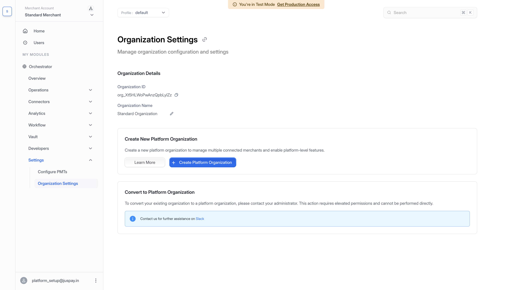
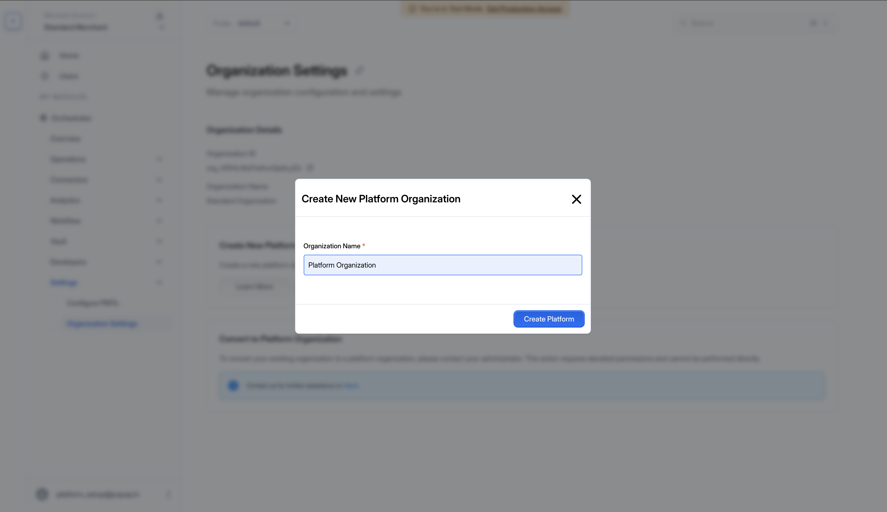
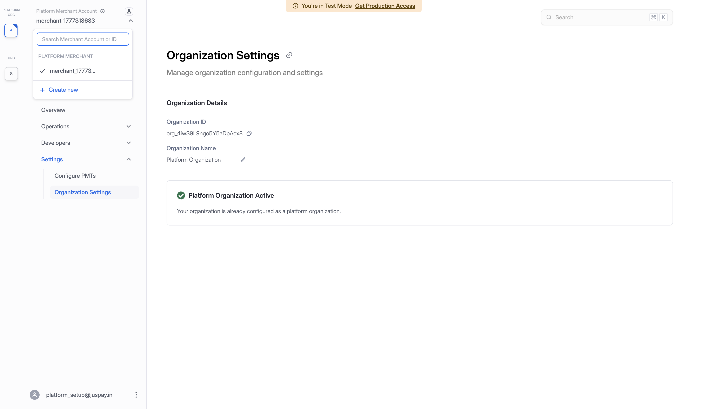
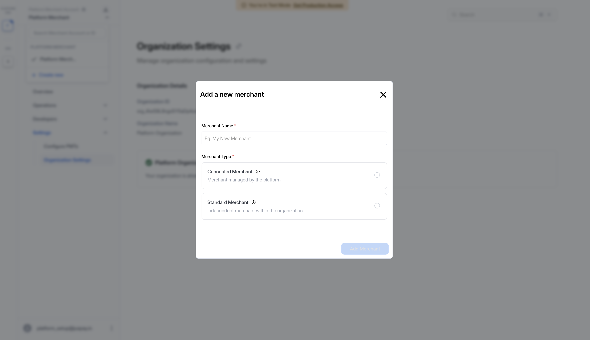
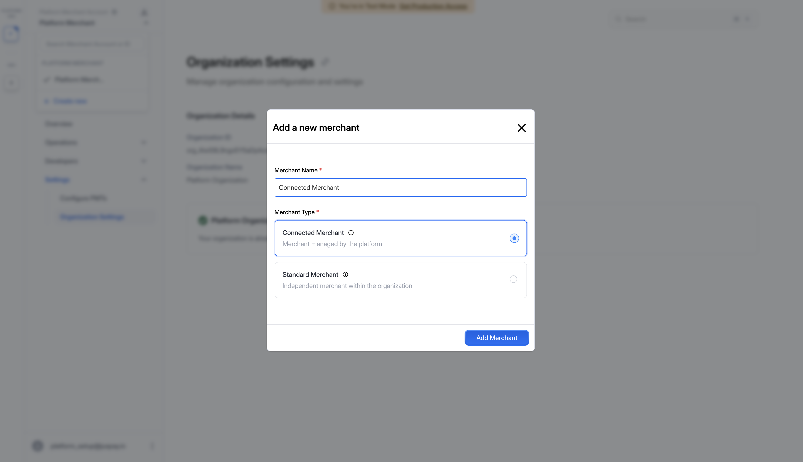
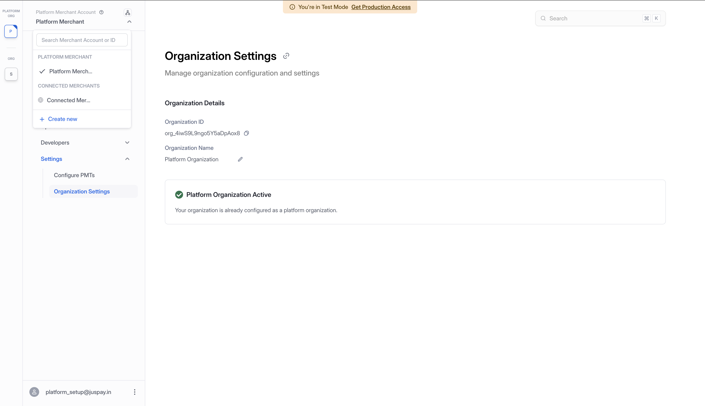

# Setting Up Your Platform Organization

A Platform Organization allows you to manage multiple connected merchants and enable platform-level features. This guide walks you through creating a Platform Organization and adding Connected Merchants using the Payments Control Centre dashboard.

### Create a Platform Organization

#### 1. Navigate to Organization Settings

From the sidebar, expand **Settings** and click **Organization Settings**. The page displays your current **Organization Details** — including your Organization ID and Organization Name (e.g., "Standard Organization"). Below that, the **Create New Platform Organization** section provides two options: **Learn More** and **+ Create Platform Organization**. At the bottom, the **Convert to Platform Organization** section notes that converting an existing organization requires contacting your administrator.

Click the **+ Create Platform Organization** button to begin.

<figure><figcaption>
Organization Settings page — click "+ Create Platform Organization" to begin
</figcaption></figure>

#### 2. Name Your Platform Organization

A modal titled **"Create New Platform Organization"** appears with a single required field. Enter your desired name in the **Organization Name** field (e.g., *"Platform Organization"*) and click the **Create Platform** button.

<figure><figcaption>
Enter a name for your Platform Organization and click "Create Platform"
</figcaption></figure>

#### 3. Verify the Platform Organization

After creation, the dashboard automatically switches to your new Platform Organization. The **Organization Name** now reflects the name you entered. A green checkmark with **"Platform Organization Active"** and the message *"Your organization is already configured as a platform organization."* confirms the setup is complete. The sidebar updates to show **"Platform Merchant Account"** at the top with the merchant ID, and the merchant dropdown lists your **Platform Merchant** under the **PLATFORM MERCHANT** section along with a **+ Create new** option to add merchants.

<figure><figcaption>
Platform Organization is now active — sidebar shows the Platform Merchant and "+ Create new" option
</figcaption></figure>

***


To convert your existing organization to a platform organization, please contact your administrator. This action requires elevated permissions and cannot be performed directly. Contact us for further assistance on [Slack](https://join.slack.com/t/hyperswitch-io/shared_invite/zt-2jqxe307y-UkEVSiSMHgoXsBhu4eLlzQ).


***

### Creating a Connected Merchant

Once your Platform Organization is active, you can create Connected Merchants that are managed by the platform and share Customers and Payment Methods across the connected group.

#### 1. Open the Add Merchant Modal

From the sidebar, click on the merchant dropdown in the top-left corner and select **+ Create new**. A modal titled **"Add a new merchant"** will appear with two fields:

* **Merchant Name** — Enter the name for your new merchant.
* **Merchant Type** — Choose between:
  * **Connected Merchant** — Merchant managed by the platform (shares Customers and Payment Methods).
  * **Standard Merchant** — Independent merchant within the organization (isolated resources).

<figure><figcaption>
"Add a new merchant" modal with Merchant Type selection
</figcaption></figure>

#### 2. Fill in Merchant Details

* Enter the merchant name in the **Merchant Name** field (e.g., *"Connected Merchant"*).
* Select **Connected Merchant** as the Merchant Type.
* Click the **Add Merchant** button to create the merchant.

<figure><figcaption>
Merchant name entered and Connected Merchant type selected
</figcaption></figure>

#### 3. Verify the Connected Merchant

After creation, the new Connected Merchant will appear in the sidebar under the **CONNECTED MERCHANTS** section. You can:

* Switch to the Connected Merchant context using the sidebar dropdown.
* View it listed separately from the Platform Merchant.

<figure><figcaption>
Connected Merchant visible in the sidebar under the Platform Organization
</figcaption></figure>

***

### What's Next?

Once your Platform Organization is set up, you can proceed with:

* [Generating a Platform API Key](platform-org-and-merchant-setup.md#2.-generate-a-platform-api-key)
* [Creating Merchant Accounts under your platform](platform-org-and-merchant-setup.md#3.-create-new-merchants-sibling-merchants)
* [Setting up connectors and processing payments](platform-org-and-merchant-setup.md#5.-perform-payment-operations-using-merchant-keys)

For the full Platform Organization workflow and API details, refer to:


[platform-org-and-merchant-setup.md](platform-org-and-merchant-setup.md)

