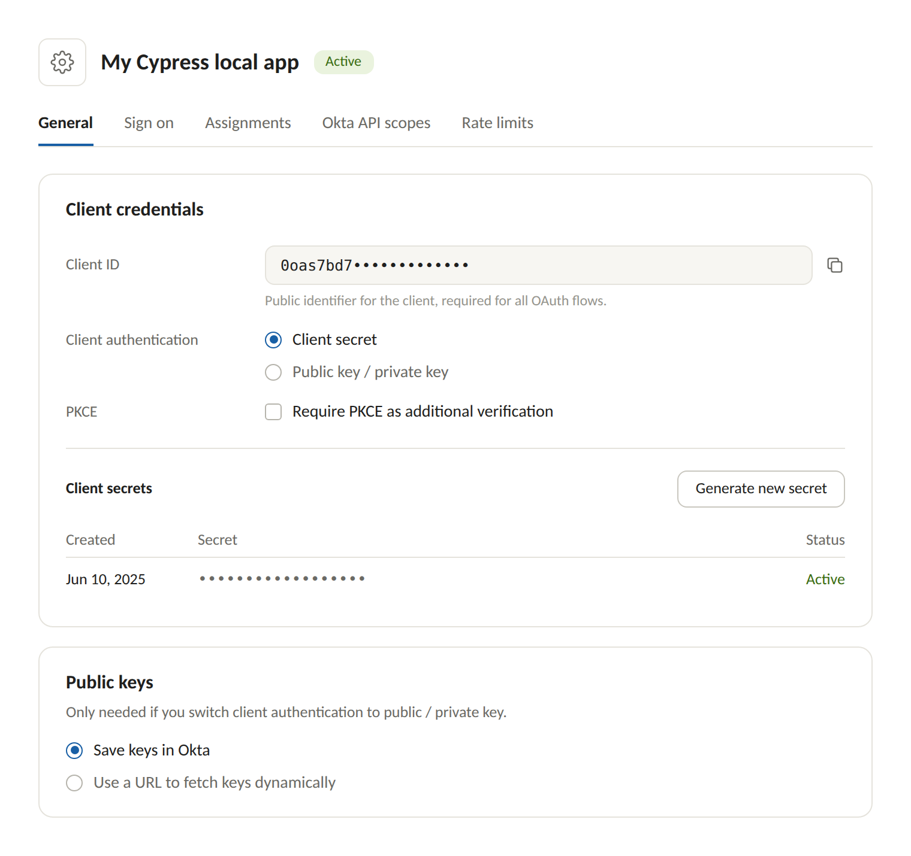

# Configure SSO for the Hyperswitch Control Center

## Set up Single Sign-On (SSO)

Enable SSO for your team to access the Hyperswitch Control Center using your organization's identity provider.

Hyperswitch supports Single Sign-On (SSO) for the Control Center using **OpenID Connect (OIDC)**, so your team can sign in with your organization's identity provider (IdP) — such as Okta — instead of managing separate Hyperswitch passwords.

> **Note:** SSO is enabled per organization by the Hyperswitch team. To get started, reach out to your Hyperswitch point of contact or write to us at [biz@hyperswitch.io](mailto:biz@hyperswitch.io).

### How it works

* SSO is keyed to your **email domain** (for example, `acme.com`). Once enabled, users signing in with an email on that domain are authenticated through your IdP.
* Authentication uses the standard **OIDC authorization code flow**. Hyperswitch redirects your users to your IdP, and after a successful login they land directly on the dashboard.
* Multi-factor authentication and password policies are handled by your IdP — users signing in via SSO are not asked to set up a separate Hyperswitch password or two-factor authentication.

### Prerequisites

* An identity provider that supports OpenID Connect with discovery (Okta is fully supported).
* Admin access to your IdP to create an OIDC application.
* The list of team members who need dashboard access. Users must be **invited to Hyperswitch before they can sign in via SSO** — SSO does not auto-create accounts.

### Setting up SSO

#### Step 1: Create an OIDC application in your IdP

In your IdP admin console (the Okta Admin Console), create a new **OIDC Web application** with the following settings:

| Setting               | Value                                                                                               |
| --------------------- | --------------------------------------------------------------------------------------------------- |
| Application type      | Web application                                                                                     |
| Client authentication | Client secret                                                                                       |
| Sign-out redirect URI | Provided by the Hyperswitch team. For sandbox it is `https://app.hyperswitch.io/dashboard`          |
| Sign-in redirect URI  | Provided by the Hyperswitch team. For sandbox it is `https://app.hyperswitch.io/redirect/oidc/okta` |
| Scopes / claims       | The `email` scope must be granted, and the ID token must include the user's `email` claim           |

> **Important:** The `email` claim is mandatory — sign-in is matched to the user's Hyperswitch account by email address. If your IdP does not return an email claim, SSO sign-in will fail.

<figure><figcaption><p>Sample Okta configuration</p></figcaption></figure>

#### Step 2: Share your configuration with Hyperswitch

Send the following details to the Hyperswitch team through a secure channel:

| Detail                        | Example                                |
| ----------------------------- | -------------------------------------- |
| Email domain                  | `acme.com`                             |
| Issuer / base URL of your IdP | `https://acme.okta.com/oauth2/default` |
| Client ID                     | From the OIDC application you created  |
| Client Secret                 | From the OIDC application you created  |

Let hyperswitch team know your preferred sign-in policy that should be visible on the login page of control center.&#x20;

* **SSO only** — all users on your email domain only see sign in through your IdP. Password login is not visible.
* **SSO or password** — users can choose either method on the login page.

#### Step 3: Invite your team members

Ensure every user who will sign in via SSO already has a Hyperswitch account. Invite them from the Control Center under **Settings → Team**, or ask the Hyperswitch team for help with bulk invitations.

> **Note:** SSO does not provision new accounts automatically. A user who authenticates successfully with your IdP but has no Hyperswitch account will see a "user not found" error. Roles and permissions are managed within Hyperswitch, not inherited from your IdP.


<figure><figcaption></figcaption></figure>


<figure><figcaption></figcaption></figure>


#### Step 4: Sign in with your dedicated login URL

Once configured, the Hyperswitch team shares a dedicated login URL for your organization, of the form:

```
https://app.hyperswitch.io/dashboard/login?auth_id=<your-auth-id>
```

Bookmark and share this URL with your team. Opening it shows a **Continue with Okta** button — clicking it redirects to your IdP for authentication and then straight into the dashboard.


### Verifying the setup

1. Open your dedicated login URL — the SSO sign-in button should appear.
2. Click it and complete authentication with your IdP.
3. You should be redirected back to the Control Center and land on your dashboard.

### Troubleshooting

| Issue                                         | What to check                                                                                                   |
| --------------------------------------------- | --------------------------------------------------------------------------------------------------------------- |
| SSO button doesn't appear on the login page   | Make sure you're using the dedicated login URL shared by the Hyperswitch team (it must include your `auth_id`). |
| "User not found" after a successful IdP login | The user hasn't been invited to Hyperswitch yet. Invite them first, then retry.                                 |

### Current limitations

* **OIDC only** — SAML is not supported.
* **No automatic user provisioning (JIT/SCIM)** — users must be invited in Hyperswitch before their first SSO sign-in.
* **Roles are managed in Hyperswitch** — group or role mappings from your IdP are not imported.
* **One email domain per organization** — if your team uses multiple email domains, contact the Hyperswitch team to discuss options.
* **Configuration changes** (rotating the client secret, changing the email domain, switching sign-in policy) are handled by the Hyperswitch team — reach out with the updated details.
