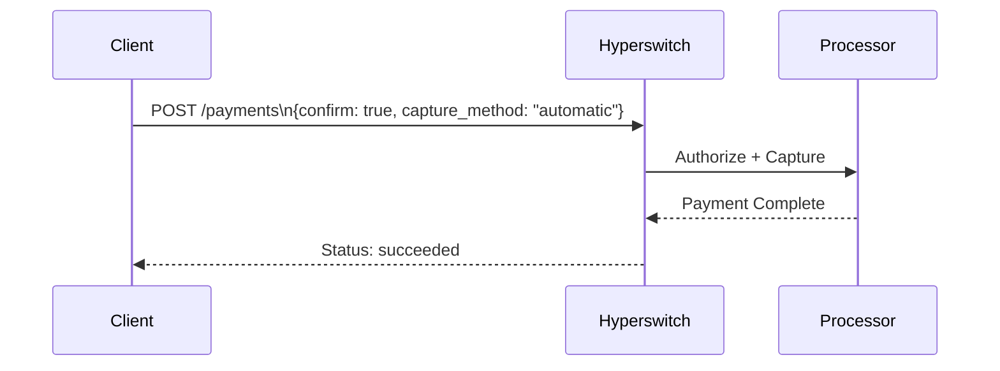

# Instant Payment (Auto Capture)

### Overview

An instant payment charges the customer's card immediately upon confirmation. There is no separate capture step — authorization and capture happen together, and funds are settled without any additional action from your backend.

This is the right pattern for most standard checkout flows.

### How It Works



1. Your backend calls `POST /payments` with `capture_method: "automatic"`
2. Hyperswitch returns a `client_secret`
3. You pass the `client_secret` to the frontend SDK and render Hyperswitch SDK.
4. The Hyperswitch SDK renders the payment form, collects card details, and calls `confirmPayment()` once the use clicks on the make payment button.
5. Hyperswitch sends request to payment process to authorizes and captures the payment in one step.
6. Processor sends the payment response to Juspay Hyperswitch, which is relayed back to merchant.

### SDK Integration

<details>

<summary>SDK Integration Steps</summary>

#### Step 1 — Create the Payment (Backend)

```bash
curl --location 'https://sandbox.hyperswitch.io/payments' \
--header 'Content-Type: application/json' \
--header 'Accept: application/json' \
--header 'api-key: <enter your Hyperswitch API key here>' \
--data-raw '{
    "amount": 6540,
    "currency": "USD",
    "profile_id": <enter the relevant profile id>,
    "customer_id": "customer123",
    "description": "Its my first payment request",
    "return_url": "https://example.com", // 
}'
```

#### Step 2 — **Initialize SDK (Client-Side)**

The merchant client initializes the Hyperswitch SDK using the `client_secret` and `publishable_key`. The SDK fetches eligible payment methods from Hyperswitch and renders a secure payment UI.

```js
// Fetches a payment intent and captures the client secret
async function initialize() {
  const response = await fetch("/create-payment", {
    method: "POST",
    headers: { "Content-Type": "application/json" },
    body: JSON.stringify({currency: "USD",amount: 100}),
  });
  const { clientSecret } = await response.json();
  
  // Initialise Hyperloader.js
  var script = document.createElement('script');
  script.type = 'text/javascript';
  script.src = "https://beta.hyperswitch.io/v1/HyperLoader.js";
 
  let hyper; 
  script.onload = () => {
      hyper = window.Hyper("YOUR_PUBLISHABLE_KEY",{
      customBackendUrl: "YOUR_BACKEND_URL",
      //You can configure this as an endpoint for all the api calls such as session, payments, confirm call.
      })
      const appearance = {
          theme: "midnight",
      };
      const widgets = hyper.widgets({ appearance, clientSecret });
      const unifiedCheckoutOptions = {
          layout: "tabs",
          wallets: {
              walletReturnUrl: "https://example.com/complete",
              //Mandatory parameter for Wallet Flows such as Googlepay, Paypal and Applepay
          },
      };
      const unifiedCheckout = widgets.create("payment", unifiedCheckoutOptions);
      unifiedCheckout.mount("#unified-checkout");
  };
  document.body.appendChild(script);
}
```

#### Step 3 — **Collect Card Details**

The customer selects a card payment method and enters their card details directly within the Hyperswitch SDK-managed interface, ensuring sensitive data never passes through merchant systems.

#### Step 4 —**Authorize and Store Card**

The SDK submits a [`payments/confirm`](https://api-reference.hyperswitch.io/v1/payments/payments--confirm) request to Hyperswitch. Hyperswitch authorizes the payment with the processor.

#### Step 5 — **Return Status**

The final payment and vaulting status is returned to the SDK, which redirects the customer to the merchant's configured `return_url`.

</details>

### API Integration&#x20;

<details>

<summary>API Integration Steps</summary>

#### Step 1 — Create the Payment (Backend)

```bash
curl --location 'https://sandbox.hyperswitch.io/payments' \
--header 'Content-Type: application/json' \
--header 'Accept: application/json' \
--header 'api-key: <enter your Hyperswitch API key here>' \
--data-raw '{
    "amount": 6540,
    "currency": "USD",
    "profile_id": <enter the relevant profile id>,
    "customer_id": "customer123",
    "description": "Its my first payment request",
    "return_url": "https://example.com", // 
}'
```

#### Step 2 — **Confirm Payment**&#x20;

The merchant client initializes the Hyperswitch SDK using the `client_secret` and `publishable_key`. The SDK fetches eligible payment methods from Hyperswitch and renders a secure payment UI.

```js
// Fetches a payment intent and captures the client secret
async function initialize() {
  const response = await fetch("/create-payment", {
    method: "POST",
    headers: { "Content-Type": "application/json" },
    body: JSON.stringify({currency: "USD",amount: 100}),
  });
  const { clientSecret } = await response.json();
  
  // Initialise Hyperloader.js
  var script = document.createElement('script');
  script.type = 'text/javascript';
  script.src = "https://beta.hyperswitch.io/v1/HyperLoader.js";
 
  let hyper; 
  script.onload = () => {
      hyper = window.Hyper("YOUR_PUBLISHABLE_KEY",{
      customBackendUrl: "YOUR_BACKEND_URL",
      //You can configure this as an endpoint for all the api calls such as session, payments, confirm call.
      })
      const appearance = {
          theme: "midnight",
      };
      const widgets = hyper.widgets({ appearance, clientSecret });
      const unifiedCheckoutOptions = {
          layout: "tabs",
          wallets: {
              walletReturnUrl: "https://example.com/complete",
              //Mandatory parameter for Wallet Flows such as Googlepay, Paypal and Applepay
          },
      };
      const unifiedCheckout = widgets.create("payment", unifiedCheckoutOptions);
      unifiedCheckout.mount("#unified-checkout");
  };
  document.body.appendChild(script);
}
```

#### Step 3 — **Collect Card Details**

The customer selects a card payment method and enters their card details directly within the SDK-managed interface, ensuring sensitive data never passes through merchant systems.

#### Step 4 —**Authorize and Store Card**

The SDK submits a [`payments/confirm`](https://api-reference.hyperswitch.io/v1/payments/payments--confirm) request to Hyperswitch. Hyperswitch authorizes the payment with the processor and securely stores the card in the Hyperswitch Vault, generating a reusable `payment_method_id`.

#### Step 5 — **Return Status**

The final payment status is returned to the SDK, which redirects the customer to the merchant's configured `return_url`.

</details>

