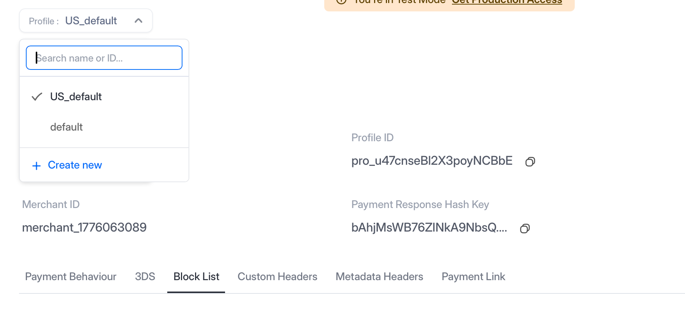
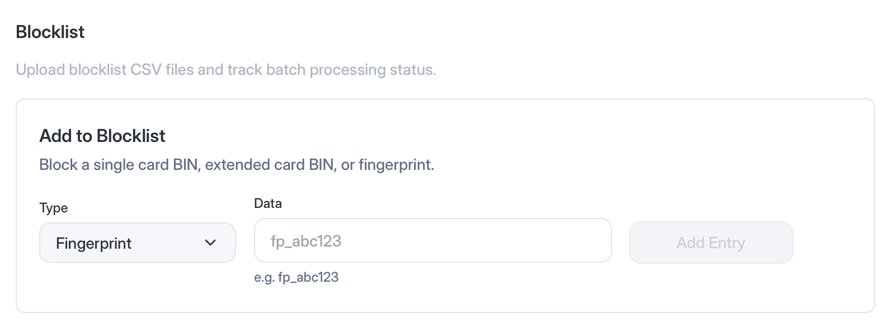
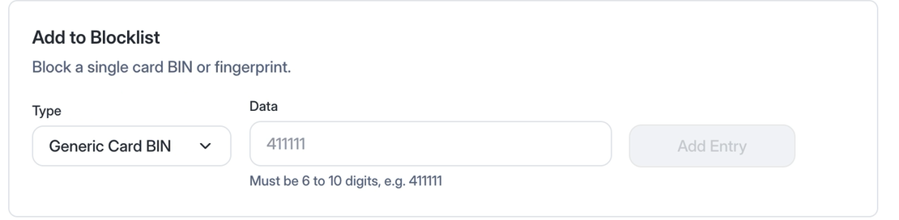
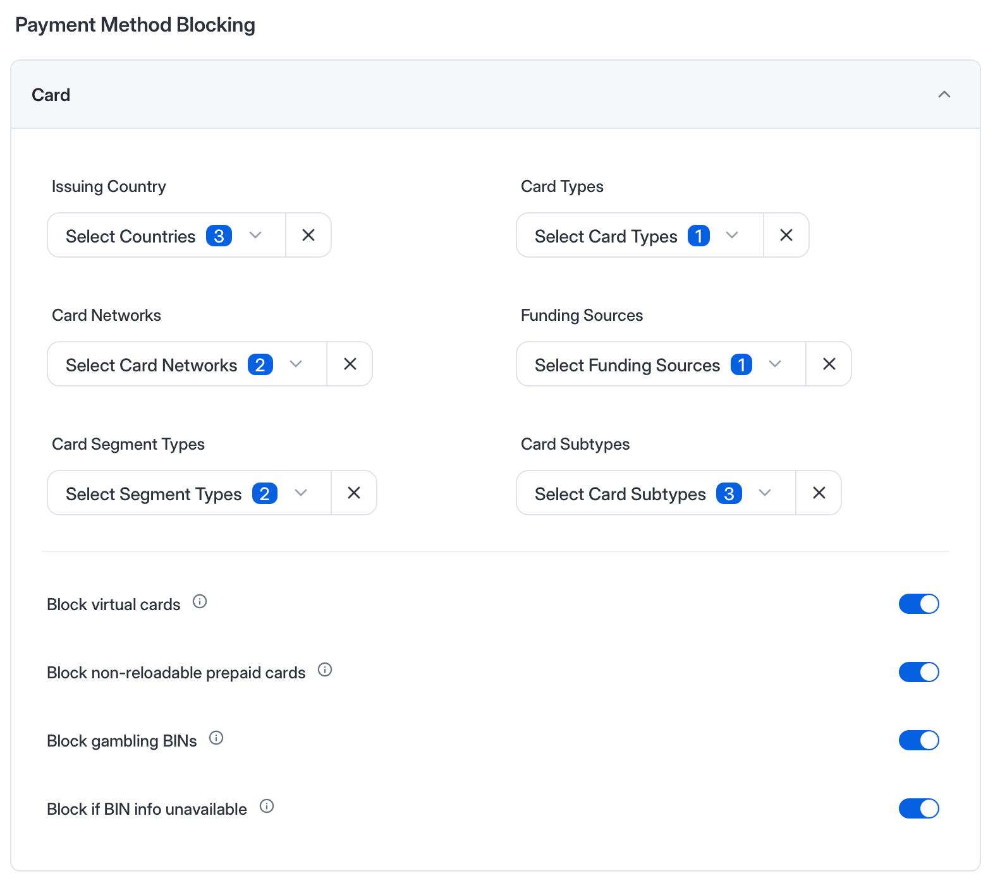
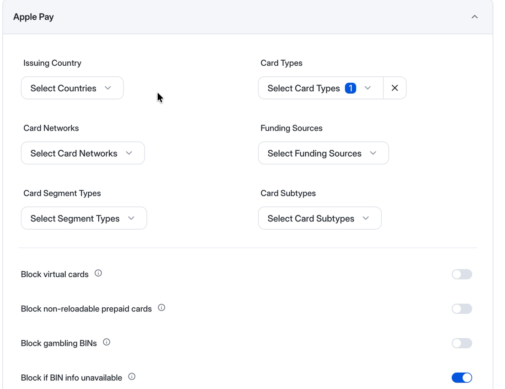
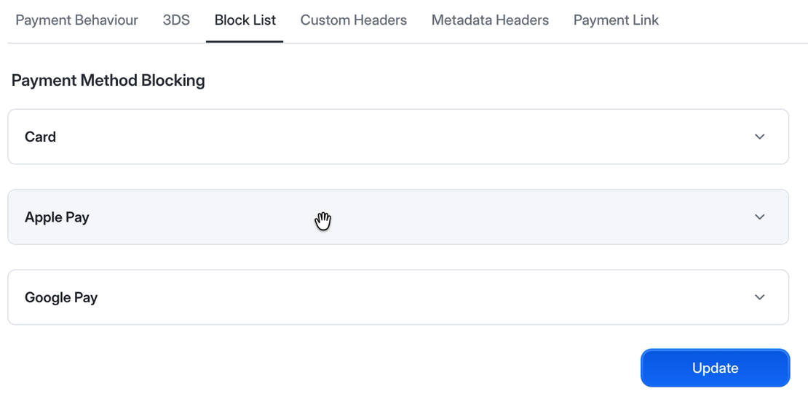
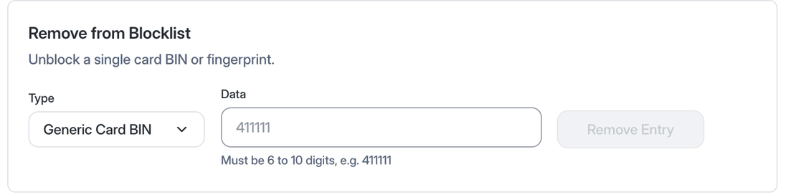
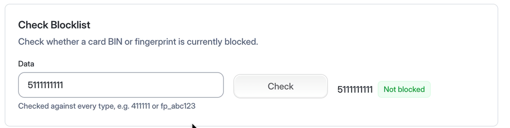
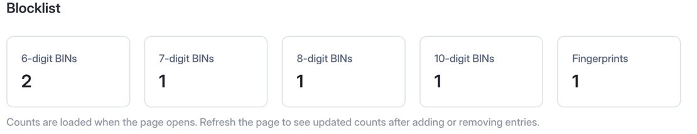
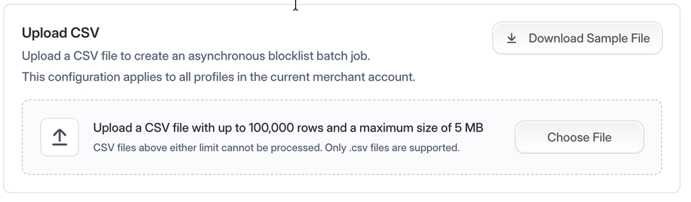

# Fraud Blocklist

Juspay Hyperswitch lets you block risky payments before they are sent to a payment processor. You can block one specific card, a range of cards sharing a BIN prefix, or any card whose attributes fall outside your risk policy.

### What can you block?

| Blocking option | Use it to | Example |
| --- | --- | --- |
| **Card fingerprint** | Block one specific card | Block a card linked to repeated fraudulent payments |
| **Generic card BIN** | Block cards that share the same 6 to 10-digit BIN prefix, including a wallet's DPAN BIN | Block a risky issuer range while keeping the rule as narrow as possible |
| **Card attributes** | Block cards that share a property you choose, such as issuing country, card type, network, or funding source | Refuse every prepaid card, or every card issued outside the markets you sell to |

The first two options identify a card you have already seen.

Card attributes work the other way round. Instead of naming a card, you describe the kind of card you never want to accept. Hyperswitch reads those properties from the card's BIN on every payment, so the rule catches cards you have never seen before and cards issued after you wrote the rule.

That makes it standing policy rather than a reaction to fraud. A prepaid-card rule is a decision about what your business accepts; a blocked fingerprint is a response to something that already happened.

Use `generic_card_bin` to block a BIN prefix. `card_bin` and `extended_card_bin` are deprecated.

A BIN entry is also matched against the DPAN BIN of an Apple Pay or Google Pay token, on the Hyperswitch decryption flow.

The **blocklist guard** must be enabled before Hyperswitch enforces any blocklist entry or card-attribute rule. It is disabled by default.

### Pick your business profile first

Everything in this guide is configured per business profile. Use the profile selector at the top of **Payment Settings** to choose the profile you are working on, then open the **Block List** tab. Every entry you add and every rule you set applies to the profile selected here.

<figure><figcaption><p>The profile selector decides which profile your blocklist changes apply to</p></figcaption></figure>

### How blocking works

When the blocklist guard is enabled, Hyperswitch evaluates the card before sending the payment to the processor:

1. Hyperswitch checks the card fingerprint and BIN prefixes against the blocklist.
2. If the card isn't on the blocklist, Hyperswitch checks the card against the attribute rules configured for the business profile.
3. If a blocklist entry or attribute rule matches, the payment is rejected.
4. If there is no match, the payment continues to the configured processor.

### Step 1: Enable the blocklist guard

```bash
curl --location --request POST 'https://sandbox.hyperswitch.io/blocklist/toggle?status=true' \
--header 'api-key: YOUR_API_KEY'
```

The guard applies to the merchant account. The entries and attribute rules evaluated by the guard are configured for individual business profiles.

### Step 2: Choose what you want to block

You can configure one or more of the following options.

#### Option 1: Block a specific card

Use a card fingerprint when you want to block one card without blocking other cards from the same BIN range.

After you confirm a card payment, note the `fingerprint` returned in the payment response:

```json
{
   "payment_id": "pay_Gbc5vC0SF4UMGXUm3yvl",
   "merchant_id": "merchant_1705052192",
   "status": "succeeded",
   "amount": 150,
   "net_amount": 150,
   "currency": "USD",
   "amount_received": 150,
   "connector": "stripe",
   "payment_method": "card",
   "payment_method_data": {
       "card": {
           "last4": "4242",
           "card_type": null,
           "card_network": null,
           "card_issuer": null,
           "card_issuing_country": null,
           "card_isin": "424242",
           "card_extended_bin": "42424242",
           "card_exp_month": "03",
           "card_exp_year": "2030",
           "card_holder_name": "joseph Doe"
       }
   },
  
  ...
  
  
   "fingerprint": "CKz5s9W4FX03eydwgGun"
}
```

Now block that fingerprint. Open [Payment Settings → Block List](https://app.hyperswitch.io/dashboard/payment-settings), select **Fingerprint** as the type, paste the fingerprint into **Data**, and click **Add Entry**.

<figure><figcaption><p>Blocking a single card by its fingerprint</p></figcaption></figure>

The card is rejected the next time it is used for a payment under that business profile.

To block the same card on more than one profile, switch profiles and add it again. Entries are not shared between profiles.

#### Option 2: Block a card BIN range

Use a BIN block when you want to reject several cards that share the same prefix.

Block the prefix from **Payment Settings → Block List**. Select **Generic Card BIN** as the type, enter a prefix of 6 to 10 digits, and click **Add Entry**.

<figure><figcaption><p>Blocking every card that starts with a BIN prefix</p></figcaption></figure>

A BIN prefix can match many cards. Use the longest prefix that covers the risky range so legitimate cards aren't blocked unnecessarily.

#### Option 3: Block cards by attribute

Use payment method blocking when you want to enforce an ongoing rule for a category of cards.

Hyperswitch supports the following card attributes:

| API field | What it blocks | Example values |
| --- | --- | --- |
| `issuing_country` | Cards issued in selected countries | `IN`, `US` |
| `card_types` | Credit or debit cards | `credit`, `debit` |
| `card_networks` | Selected card networks | `Visa`, `Mastercard`, `AmericanExpress` |
| `funding_sources` | Cards with selected funding sources | `CREDIT`, `DEBIT`, `PREPAID`, `DEFERRED DEBIT`, `CHARGE CARD` |
| `card_segment_types` | Cards in selected customer or business segments | `business`, `commercial`, `consumer`, `government` |
| `card_subtypes` | Selected card subtypes | A supported card subtype |
| `block_virtual_cards` | Virtual cards | `true` or `false` |
| `block_non_reloadable_prepaid_cards` | Prepaid cards that cannot be reloaded | `true` or `false` |
| `gambling_blocked` | BINs marked for gambling restrictions | `true` or `false` |
| `block_if_bin_info_unavailable` | Cards whose BIN is not available in the card information database | `true` or `false` |

You can block on these from the Control Center, under **Payment Settings → Block List → Payment Method Blocking**. Open the **Card** section, choose the values you want to block, and turn on the switches you need.

<figure><figcaption><p>Card-attribute rules for direct card payments</p></figcaption></figure>

The **Apple Pay** and **Google Pay** sections take the same fields, so you can apply these rules to wallet payments too. They work on the Hyperswitch decryption flow.

<figure><figcaption><p>The Apple Pay section, with its own attribute rules and switches</p></figcaption></figure>

A rule set under **Card** does not carry over to the wallets, so set each section you care about, then click **Update**.

<figure><figcaption><p>Card, Apple Pay, and Google Pay each carry their own rules</p></figcaption></figure>

Every field is optional. Set only the rules you need.

Card-attribute rules depend on BIN information. If Hyperswitch has no record for a BIN, the card is allowed by default. Set `block_if_bin_info_unavailable` to `true` if you want to reject cards with an unknown BIN, but test it in the sandbox first: it also rejects legitimate cards whose BIN information isn't catalogued yet.

### Step 3: Test the block

Test the complete flow in the sandbox:

1. Make a payment with a test card and confirm that it succeeds.
2. Add the card fingerprint or BIN to the blocklist, or add an attribute rule that matches the card.
3. Confirm that the blocklist guard is enabled.
4. Retry the payment with the same card.

The second payment should fail before it reaches the processor. A blocked payment has:

* Payment status `failed`
* `merchant_decision` set to `Rejected`
* Error code `HE-03`
* An error message that explains why the card was rejected

Example error response:

```json
{
  "error": {
    "type": "invalid_request",
    "message": "We're unable to accept this card, please try another card or a different payment method",
    "code": "HE-03"
  }
}
```

If your checkout runs the Payments Eligibility API before confirmation, a blocked card returns `sdk_next_action: deny`. The deny action includes a reason code for the rule that matched.

| Reason code | Rule that matched |
| --- | --- |
| `blocked_bin` | A fingerprint or BIN blocklist entry |
| `blocked_card_info_unavailable` | BIN information was not found |
| `blocked_card_type` | Card type |
| `blocked_card_network` | Card network |
| `blocked_funding_source` | Funding source |
| `blocked_card_subtype` | Card subtype |
| `blocked_card_segment_type` | Card segment |
| `blocked_virtual_card` | Virtual card |
| `blocked_non_reloadable_prepaid_card` | Non-reloadable prepaid card |
| `blocked_gambling_card` | Gambling-restricted BIN |
| `blocked_issuer_country` | Issuing country |
| `blocked_issuer` | Card issuer |

## Review and unblock

These are all on the same **Payment Settings → Block List** tab, for the business profile you have selected.

### Remove a fingerprint or BIN

Use **Remove from Blocklist** on the same page. Select the same type you used when you added the entry, enter the value, and click **Remove Entry**.

<figure><figcaption><p>Unblocking a single entry</p></figcaption></figure>

### Check whether a value is blocked

**Check Blocklist** answers the question you get from support tickets: is this card blocked right now, and by what?

Enter a BIN or fingerprint and click **Check**. The value is checked against every type at once, so you do not need to know whether it was added as a BIN or a fingerprint.

<figure><figcaption><p>Checking a value against every blocklist type</p></figcaption></figure>

The same check is available through the blocklist lookup endpoint.

### See how many entries you have

The **Blocklist** section opens with a count of entries by BIN length, plus a count of blocked fingerprints. You get one card per BIN length you actually have entries for, so the lengths on screen change as your list changes.

<figure><figcaption><p>Entry counts for the selected business profile</p></figcaption></figure>

Counts load when the page opens. Refresh the page to see them change after you add or remove an entry.

The same counts are available through the blocklist count endpoint.

For `generic_card_bin`, the count includes entries that were originally added as `card_bin` or `extended_card_bin`.

## Upload a blocklist in bulk

Use a CSV upload when you need to add several fingerprints or BINs.

### Prepare the CSV

Create a UTF-8 CSV with the following columns:

```csv
type,data,metadata
generic_card_bin,411111,source=fraud_team;reason=chargeback
generic_card_bin,42424242,reason=high_dispute_rate
fingerprint,CKz5s9W4FX03eydwgGun,reason=repeated_fraud
```

| Column | Required | Description |
| --- | --- | --- |
| `type` | Yes | `generic_card_bin`, `fingerprint`, `card_bin`, or `extended_card_bin` |
| `data` | Yes | The fingerprint or BIN prefix to block |
| `metadata` | No | Notes in `key=value` format, separated by semicolons |

The file can contain up to **100,000 data rows** and must be no larger than **5 MB**.

### Upload from the Control Center

1. Go to **Payment Settings**, open the **Block List** tab, and scroll to **Blocklist**.
2. Click **Download Sample File** if you need a template.
3. Click **Choose File** and select the CSV.
4. Click **Upload**.
5. Check the jobs table for the number of succeeded and failed rows. Use **Refresh** on a row while the job is still running.

<figure><figcaption><p>Uploading a blocklist CSV from the Control Center</p></figcaption></figure>


## Turn blocking off

To drop a card-attribute rule, open its section under **Payment Method Blocking**, clear the value or switch it off, and click **Update**.

### Disable all blocking

To stop enforcing every blocklist entry and card-attribute rule without deleting them:

```bash
curl --request POST \
  'https://sandbox.hyperswitch.io/blocklist/toggle?status=false' \
  --header 'api-key: YOUR_API_KEY'
```

## Coming soon

Two additions to the blocklist are in progress:

* **Download your blocklist.** Export every entry for a profile as a CSV, for an audit or to move a list somewhere else.
* **Copy a blocklist between profiles.** Take the entries from one profile and apply them to others, so a new profile starts from a list you already trust.
