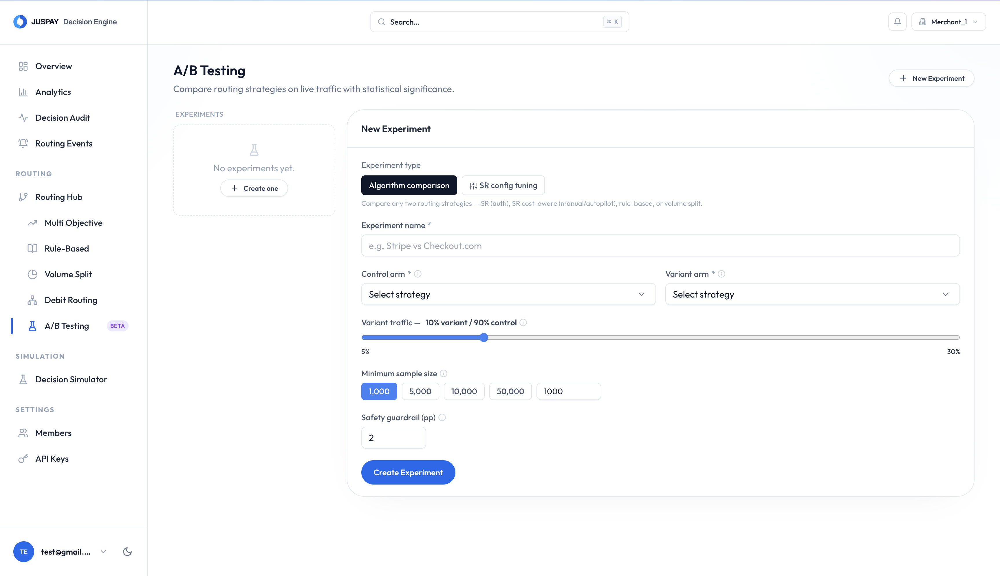

# A/B Testing

A/B Testing lets you compare two routing strategies, or two configurations of the same strategy, on a controlled percentage of traffic before making a full rollout decision.

## Common Tests

| Test | Why run it |
| --- | --- |
| Auth-Rate Routing vs Cost-Aware Routing | Check whether cost savings are worth any auth-rate movement. |
| Manual auth-rate settings vs Autopilot | Validate automatic tuning before full rollout. |
| Existing rule setup vs new rule setup | Measure impact before replacing a production rule. |
| Current processor mix vs new processor mix | Ramp a new connector with lower risk. |

## How It Works

An A/B test is created and activated like a routing configuration. It has a control arm and a variant arm.

1. Choose the control strategy.
2. Choose the variant strategy.
3. Set the percentage of traffic sent to the variant. Keep the variant below half of traffic during validation.
4. Define the minimum sample size required per arm.
5. Set an authorization-rate guardrail, such as the maximum percentage-point drop allowed for the variant.
6. Activate the experiment.
7. Review results before promoting the variant.

Traffic assignment is deterministic per payment, so retries for the same payment stay in the same experiment arm.

<figure><figcaption></figcaption></figure>

## Strategy Overrides

When an A/B test uses Auth-Rate Routing, each arm can override selected auth-rate settings for that experiment. Common overrides include:

* Hedging percentage.
* Elimination threshold.
* Cost-Aware Routing on or off.
* Margin used for cost-aware ranking.
* Autopilot on or off.

Use these overrides when you want to compare two settings without changing the merchant's live default configuration.

## Results And Verdicts

A/B test results compare control and variant performance after the configured sample size is reached. If the variant breaches the authorization-rate guardrail, the result should be treated as failed even before statistical significance is checked.

| Verdict | Meaning |
| --- | --- |
| Collecting data | One or both arms have not reached the required sample size. |
| Not significant | Enough traffic has been collected, but the result is not statistically conclusive. |
| Variant wins | The variant outperforms control on the selected metric. |
| Variant loses | The variant underperforms control. |
| Guardrail breached | Variant auth rate dropped beyond the configured threshold. |

## What To Monitor

* Control auth rate.
* Variant auth rate.
* First-attempt auth rate.
* Cost saved, average chosen cost, and expected value if one arm uses Cost-Aware Routing.
* Sample size per arm.
* Latency.
* Guardrail status.
* Per-payment transaction logs for unexpected arm assignment or processor choice.

## Rollout Guidance

Keep the variant below full traffic until it has enough sample size and passes guardrails. If the variant wins, promote it to the active routing configuration. If it loses or breaches a guardrail, deactivate the experiment and keep the control strategy.
