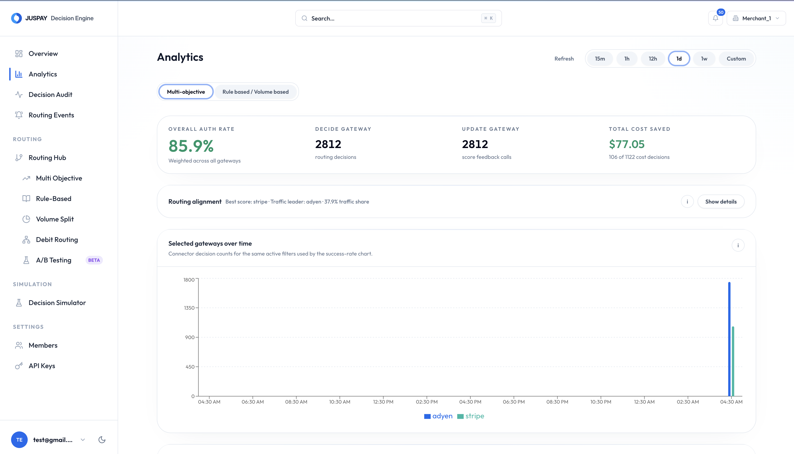
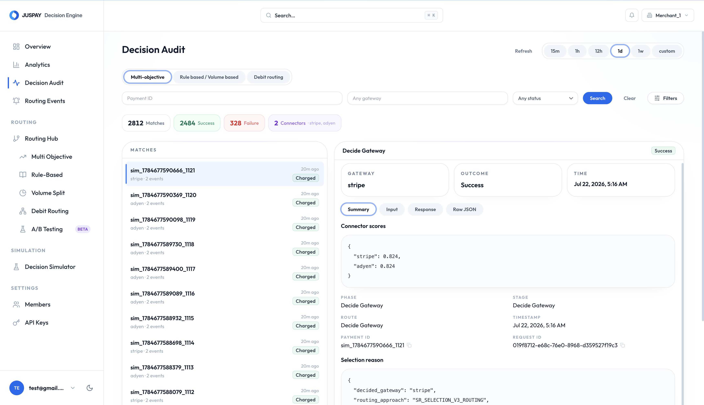

# Analytics And Decision Logs

Analytics and decision logs help merchants verify that routing is working as expected. Use them to understand processor performance, investigate individual payments, and measure the impact of routing changes before expanding rollout.

## Key Views

| View | Use it for |
| --- | --- |
| Overview | Track request count, top processor, and processor share for the selected time window. |
| Gateway scores | See recent processor authorization scores and score trends. |
| Decisions | Track selected processors and routing approaches. |
| Routing stats | Review connector share, rule hits, and routing filters. |
| Log summaries | Investigate recent failures and error patterns. |
| Payment audit | Inspect the routing trail for a specific payment. |
| Preview trace | Review simulated rule or volume decisions from routing evaluation. |
| Cost savings | Measure savings from Cost-Aware Routing. |
| Routing events | Review leader changes, processors entering or leaving the cost-aware auth band, and Autopilot calibration. |
| A/B test results | Compare control and variant performance and inspect per-payment experiment logs. |

<figure><figcaption></figcaption></figure>

## Investigate A Payment

Use Payment Audit when a payment went through an unexpected processor.

Check:

* The eligible processor list for the payment.
* The active routing configuration.
* The routing approach used.
* Whether the selected processor failed eligibility.
* Whether fallback was applied.
* Whether cost-aware ranking promoted a different processor.
* Whether the payment was part of an A/B test.
* The final payment outcome used for scoring.

<figure><figcaption></figcaption></figure>

## Metrics To Review Before Rollout

Before increasing traffic for a routing strategy, review:

* First-attempt authorization rate.
* Overall authorization rate.
* Processor share.
* Fallback rate.
* Cost saved.
* Cost coverage for cost-aware routing.
* Failed or missing score updates.
* A/B test guardrails and verdicts.
* Autopilot calibration events, if Autopilot is enabled.
