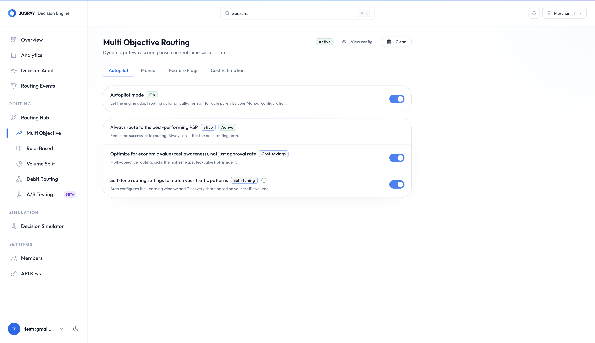

# Autopilot

Autopilot automatically tunes Auth-Rate Routing settings using observed payment traffic. It is useful when processor performance and traffic mix change over time and manual tuning becomes hard to maintain.

## What Autopilot Tunes

Autopilot tunes two Auth-Rate Routing controls:

* Bucket size, which controls how much recent traffic is used for scoring.
* Hedging percentage, which controls exploration traffic.

Autopilot does not change connector credentials, payment method setup, rule-based routing conditions, volume splits, cost data, or default fallback order.

## How It Works

Autopilot runs as a background calibration job. It reads recent routing traffic and calibrates each eligible payment segment, such as payment method type, payment method, card network, currency, country, and auth type.

For each segment, Autopilot checks that there is enough traffic and at least two processors. It then updates the bucket size and hedging percentage for that segment. Autopilot-written values are marked as `autopilot` so they can be distinguished from manual overrides.

Human-authored overrides are preserved. If your team manually sets a segment-level bucket size or hedging percentage, Autopilot does not overwrite that manual setting.

## When To Use It

Use Autopilot when:

* You have enough transaction volume for reliable scoring.
* You use Auth-Rate Routing across multiple processors.
* You want routing to adapt without frequent manual retuning.
* You can monitor the changes through analytics and decision logs.

Do not use it as the first step for a new merchant profile with very low traffic. Start with Default Fallback, Rule-Based, or Volume-Based Routing until enough payment outcomes are available.

<figure><figcaption></figcaption></figure>

## Recommended Rollout

1. Enable Auth-Rate Routing first.
2. Confirm payment outcomes are being reported correctly.
3. Enable Autopilot for a limited scope or compare it with manual settings using [A/B Testing](ab-testing.md).
4. Monitor auth rate, processor share, calibration events, and fallback usage.
5. Expand rollout after the results are stable.

## What To Monitor

* Auth-rate trend after calibration.
* Changes in processor share.
* Calibration events, including bucket size and hedging changes.
* Any increase in fallback usage.
* Experiment results if Autopilot is being tested against manual settings.
