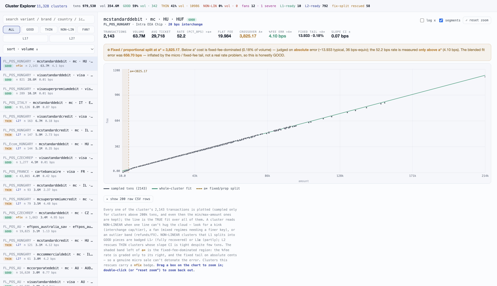
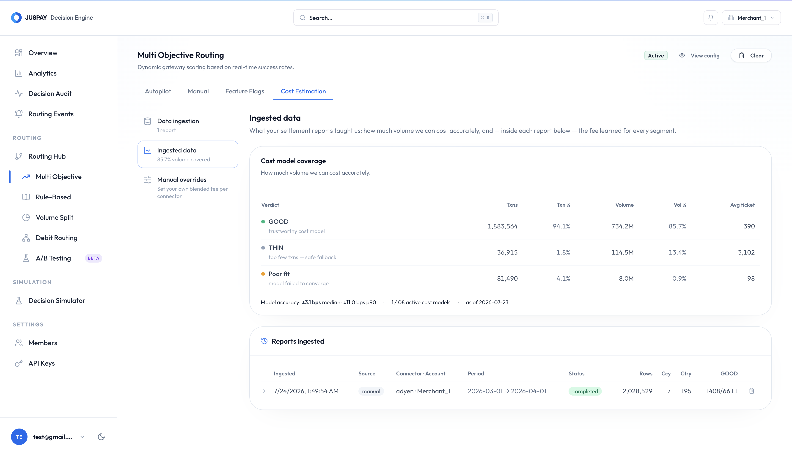

# Cost Estimation

## Overview

When Intelligent Routing routes a payment, it wants to pick the processor that leaves you with the **most money after fees** - but only from among processors that approve the payment just as reliably as your best one. To do that, it needs to know what each processor *actually* charges you for that exact kind of card.

Published rate cards are not enough. Your real cost depends on the card network, whether it is debit or credit, the card's program (standard, premium, commercial), the issuing country, the currency, and the interchange category. Two Visa payments through the same processor can cost very differently.

**Cost estimation** solves this by learning your true per-transaction fee directly from your own **settlement reports** - the files your processor already produces that list, transaction by transaction, exactly what it charged you. Intelligent Routing fits a cost model to that data and uses it to price every routing decision.


Getting settlement data *into* Intelligent Routing is covered in [Cost Ingestion](cost-ingestion.md). This page explains what happens to that data once it arrives - how it becomes the cost model that routing uses.


## Fitting A Fee Line To Your Transactions

Inside a processor's settlement report, every settled transaction is one point: **the amount you charged the customer** (`amount`) and **the fee the processor took** (`fee`). Plot fee against amount for a group of similar cards and the points fall along a straight line:

```
fee  =  pct_bps × amount  +  fixed
```

- **`pct_bps`** - the percentage fee, in **basis points** (1 bp = 0.01%). This is the slope of the line, how much the fee grows per unit of amount.
- **`fixed`** - the flat fee charged on every transaction regardless of size. This is where the line crosses zero.

Intelligent Routing finds this line with **OLS regression** (Ordinary Least Squares), the standard "line of best fit" that minimises the total squared distance between the line and every real transaction. The fitted `pct_bps` and `fixed` become the fee used for that group of cards.


The fit runs over **every** transaction in the report, not a sample. Intelligent Routing aggregates the report into compact statistics as it streams through, so even a multi-gigabyte monthly file is fitted exactly and cheaply.


<figure><figcaption></figcaption></figure>

## Clusters

One fee line for an entire processor would be meaningless - a US debit card and a European commercial credit card cost wildly different amounts. So before fitting, Intelligent Routing splits your traffic into **clusters**: the finest groups within which the fee genuinely behaves as one line.

A cluster is one unique combination of:

| Dimension | Values |
| --- | --- |
| **Processor** | `adyen` |
| **Card network** | `visa`, `mastercard`, `amex` |
| **Program / variant** | `standard`, `superpremium`, `commercial` |
| **Funding type** | `debit`, `credit` |
| **Issuer country** | `US`, `HU`, `FR` |
| **Currency** | `USD`, `EUR`, `HUF` |
| **Interchange category** | `Intra EEA Consumer EMV Debit` |

Each cluster gets its **own** fit, its own `pct_bps + fixed`, and its own trust grade. In the dashboard these appear as rows under each processor.

## Separating Flat And Percentage Fees

Small transactions are dominated by the **flat fee**, not the percentage. On a €2 sale a €0.10 flat fee is 50% of the amount, an enormous "percentage" that says nothing about the real rate. Judging a cluster's percentage accuracy on those tiny sales would wrongly condemn a perfectly good fee.

Intelligent Routing handles this with a per-cluster **crossover point called `a*`** (read "a-star"):

```
a*  =  fixed / pct_rate
```

`a*` is the amount at which the flat fee and the percentage fee are **equal**. It splits every cluster into two regions:

- **Below `a*`, the flat fee dominates.** Accuracy is measured in **absolute terms** (cents) rather than as a percentage, so a genuine micro-sale can never blow up the error.
- **Above `a*`, the percentage fee dominates** and is the real rate, so the `pct_bps` rate is graded only in this region.

No transaction is ever dropped. The small-ticket region is simply judged on cents instead of ratios.


If a cluster has no flat fee (a pure-percentage fee), `a*` is 0 and the whole cluster is graded as the proportional region.


## Trust Grades

Every cluster is graded so routing knows whether it can trust the fee. There are three grades:

- **GOOD** - enough consistent data that the fitted fee is trustworthy. Routing uses it.
- **THIN** - the fit looks fine but there is too little volume to be sure. Routing does **not** price on it, so it stays a safe fallback.
- **NON-LINEAR** - a single straight line can't describe this cluster's cost, and there is enough data to be sure. Not used for pricing as it stands.

A cluster is **GOOD** when its percentage error above `a*` is within **15 bps** **and** it has at least **200 transactions**:

| Grade | Condition |
| --- | --- |
| **GOOD** | error ≤ 15 bps **and** ≥ 200 transactions |
| **GOOD** (via L2) | error ≤ 15 bps **and** 30-199 transactions **and** a tightly-pinned rate |
| **NON-LINEAR** | error > 15 bps **and** ≥ 200 transactions |
| **THIN** | anything else (a weak fit with little data, or a good fit that is still too thin) |

Two automatic rescues widen how much of your traffic reaches GOOD. You do not configure either. They run on every fit.

### L2 - Trusting A Consistent Low-Volume Cluster

Some clusters are low-volume but extremely consistent, with every transaction sitting tightly on the same line. Requiring 200 transactions would waste a fee that is already clear. **L2** promotes such a cluster to GOOD with as few as **30 transactions**, provided its rate is well-pinned (a tight slope confidence interval, within 15 bps). Clusters eligible for this are flagged **L2-ready** in the dashboard.

### L1 - Splitting A Cluster Into Amount Tiers

Sometimes one line can't fit a cluster because the fee has a **kink**, a real tier boundary such as an interchange cap above a certain amount. The cloud of points bends, so a single line misses. **L1** breaks such a cluster into a small number of amount ranges and fits each range on its own, using the fewest cuts that turn the most volume into trustworthy GOOD pieces. A genuinely GOOD cluster is left uncut.

## Overlapping Fee Rates (Fans)

An average-error check can be fooled by a **fan**: a dominant fee line plus a small minority of transactions riding a *different* rate, for example a card type with a much higher interchange rate. The average still looks fine, but the fee is really two overlapping lines, not one - and L1 can't fix it, because the regimes overlap at every amount rather than splitting by amount.

Intelligent Routing detects fans by **counting** grossly mispriced transactions rather than averaging them, then weighs the fan by **how much money it misprices**:

- **Mild fan** - a small minority sits on a higher line, but the money impact is negligible. The rate is accurate for essentially all your money, so it stays GOOD.
- **Severe fan** - enough volume is mispriced to actually hurt routing. The fitted rate is a blend of lines and shouldn't be trusted. The fix is to split on a finer key (typically the interchange rate), which usually means enriching the settlement data.

A related case is a cluster that looks bad on a blended error yet is perfectly GOOD once the flat-fee tail below `a*` is separated out. The error was inflated by small-ticket sales, not a real rate problem. These clusters are honestly GOOD: the percentage is accurate where it applies, and the flat tail is priced on cents.

## Coverage

Coverage answers a simple question: how much of your money can be routed on cost? You will find it in the dashboard under **Ingested data → Cost model coverage**.

<figure><figcaption></figcaption></figure>

The headline is the **share of settled volume that has a trustworthy (GOOD) cost model**. Everything not covered falls back to plain [auth-rate routing](auth-rate-based-routing.md), so this is the number to watch. The card also breaks volume and transactions down by grade, reports the per-transaction fit accuracy of your GOOD clusters, and shows how many cost models are currently live.


GOOD usually covers most of your **transactions** but a smaller share of your **volume**, because a few big-ticket clusters can be THIN. Because routing decisions are about money, the volume figure is the honest one.


### What Accuracy To Expect

Fitting the settlement report captures roughly **90%** of a transaction's true all-in cost. The remaining gap is almost entirely fees that never appear in the per-transaction report - flat processing or risk fees and periodic charges that live only on the monthly **invoice**. Uploading that invoice recovers most of the rest (see [Cost Ingestion → Recovering invoice-only fees](cost-ingestion.md#recovering-invoice-only-fees)).

## Overriding A Fee

If you already know a fee from your contract, or you want to correct the model, you can set an override. Overrides apply immediately to every economic-value calculation, and follow a strict precedence:

1. **Cluster override (most specific).** A surgical fee on one exact cluster, such as Adyen · Visa · credit · US · USD · domestic. Wins over everything for that cluster.
2. **Processor override (blanket).** A single blended fee for a whole processor, used when no cluster override applies.
3. **Learned model (default).** The fitted per-cluster fee, used when there is no override. Invoice add-ons are layered on top of the learned model, never on top of an override.

In short, a cluster fee beats the processor fee, which beats the learned model. Set either from **Dashboard → Manual overrides**.

## How The Estimate Reaches A Routing Decision

At decision time, for the card in hand, Intelligent Routing looks up the effective cost for each candidate processor in this order:

1. Cluster override
2. Processor override
3. Learned cluster fee, plus any invoice add-on
4. A coarser regional blend, plus any invoice add-on

If nothing covers the card, cost is simply unknown for that processor and routing falls back to auth-rate scoring - it never guesses. The effective cost of an amount is:

```
effective_cost_bps  =  pct_bps  +  (fixed / amount) × 10,000
```

Only **GOOD** models are ever used to price a decision. This effective cost is what [Multi-Objective Routing](multi-objective-routing.md) uses to rank the equally-reliable processors and pick the one that leaves you with the most money.

## Glossary

| Term | Meaning |
| --- | --- |
| **OLS regression** | The line-of-best-fit that turns `(amount, fee)` points into `pct_bps + fixed`. |
| **Cluster** | The finest group of cards fitted as one line (network × program × funding × country × currency × interchange category). |
| **`pct_bps`** | Percentage fee in basis points (the slope of the line). |
| **`fixed`** | Flat per-transaction fee (the intercept of the line). |
| **`a*` (crossover)** | The amount where flat fee = percentage fee. Splits the fixed-dominated region from the proportional one. |
| **GOOD / THIN / NON-LINEAR** | Trust grades: usable / too little data / can't be described by one line. |
| **L1** | Split a cluster into amount tiers to rescue a kink. |
| **L2** | Promote a thin-but-tight cluster to GOOD. |
| **Fan** | Overlapping rate regimes under one key. Needs a finer split, not L1. |
| **Coverage** | Share of settled volume with a trustworthy cost model. |

## Related

- [Cost Ingestion](cost-ingestion.md) - getting settlement data and invoices in.
- [Multi-Objective Routing](multi-objective-routing.md) - how cost is used to route.
