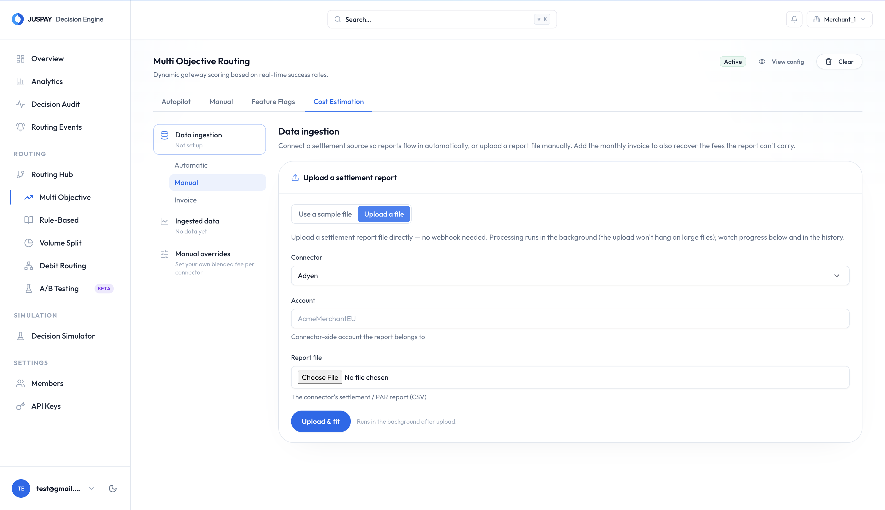
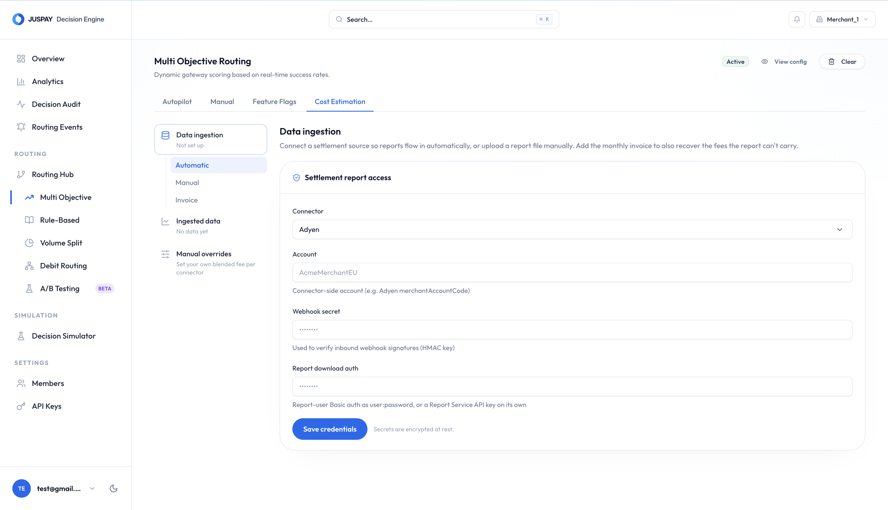
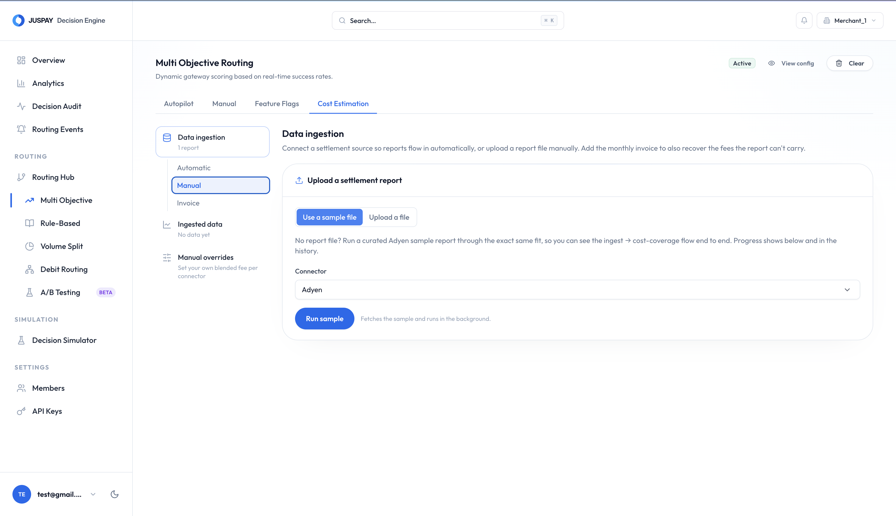
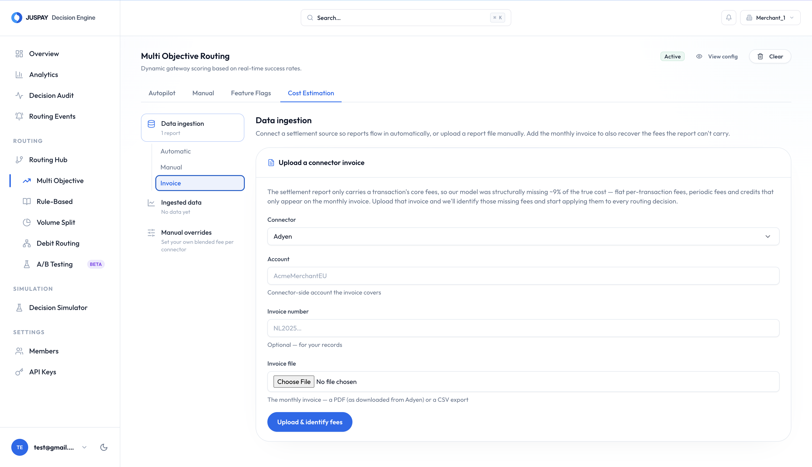

# Cost Ingestion

Cost ingestion is how your real fee data reaches Intelligent Routing. It takes the **settlement reports** your processor already produces - the files that list, transaction by transaction, exactly what you were charged - parses them, and builds a per-cluster cost model. That model is what [Multi-Objective Routing](multi-objective-routing.md) uses to price each decision, and what you see in [Cost Estimation](cost-estimation.md).


This page is about getting cost data **in**. What Intelligent Routing does with it afterwards - how it becomes the cost model routing relies on - is covered in [Cost Estimation](cost-estimation.md).


## Ways To Provide Cost Data

There are two ways settlement reports can reach Intelligent Routing, plus a sample runner for testing and an invoice path for the fees a settlement report cannot carry. All of them feed the **same** ingestion pipeline and appear in the **same** ingestion history.

| Method | How it works |
| --- | --- |
| **Manual upload** | Upload a report file directly in the dashboard. Processed in the background. |
| **Automatic (webhook)** | Your processor notifies Intelligent Routing when a report is ready, and Intelligent Routing verifies, downloads, and fits it - hands-free. |
| **Sample file** | Runs a curated demo report through the real pipeline so you can see the full flow without your own file. |
| **Invoice** | Upload the monthly invoice to recover flat and periodic fees that never appear per transaction. |


Manual and automatic are just different front doors to the same room. Once a report is queued, it is downloaded (if needed), parsed, and fitted identically, and shows up in the same history labelled by its source.


## Method 1 - Manual Upload

Use manual upload when automatic delivery is not set up yet, to backfill historical months, or for testing. Reports can be several gigabytes, so the file uploads and processes in the background - you get a job you can watch rather than a frozen screen.

1. **Open the upload screen.** Go to **Cost estimation → Data ingestion → Manual**, and choose **Upload a file**.
2. **Pick the processor and account.** Select the processor and enter the processor-side account the report belongs to.
3. **Choose the report file.** Select the processor's settlement report (CSV). Intelligent Routing reads the header row and checks that every required column is present before the full upload begins.
4. **Map columns if prompted.** If your file's column names do not match the expected ones, a column-mapping panel appears. Map each of your columns to the expected field, preview the result to confirm the amounts and fees look right, then save. The mapping is remembered for every future report on this processor and account, so it is a one-time step.
5. **Upload and fit.** Start the upload. When it finishes you will see how many rows were ingested, the period covered, and how many clusters were graded trustworthy.


A file that is missing required columns is blocked before the large upload starts, so you are not left waiting on a multi-GB upload only for it to fail parsing.


<figure><figcaption></figcaption></figure>

## Method 2 - Automatic (Webhook)

With automatic ingestion, your processor notifies Intelligent Routing every time a settlement report is ready. Intelligent Routing verifies the notification's signature, downloads the report, and fits it - no manual step, ever. This is the recommended setup wherever your processor supports automatic report delivery.

There are three pieces to wire up, once:

1. Your processor produces settlement reports on a schedule (for example, a daily report).
2. Your processor calls the Intelligent Routing settlement webhook when each report is ready, signing the call so Intelligent Routing can trust it.
3. You register the processor's credentials in Intelligent Routing - the signing secret (to verify the webhook) and the download credential (to fetch the report).

Intelligent Routing verifies each notification's signature against the secret you stored, so only genuine, unmodified notifications are accepted. Any that fail the check are ignored, and a valid one is acknowledged instantly and processed in the background. Copy the exact settlement webhook URL to configure at your processor from the dashboard.

<figure><figcaption></figcaption></figure>

### Register Credentials In Intelligent Routing

From the automatic ingestion form, provide:

1. **Processor** - Adyen or Checkout.
2. **Account** - the processor-side account the report relates to (Adyen's `merchantAccountCode`, or Checkout's entity id, `ent_…`).
3. **Webhook secret** - the HMAC signing key your processor uses to sign every report notification (Adyen's generated HMAC key, or Checkout's signature key). Use the **live** key for production, not the test one.
4. **Report download credential** - the credential Intelligent Routing uses to download the report file once notified (see the processor steps below).

Secrets are encrypted at rest and never shown again - only masked hints.


The steps below reference the Adyen and Checkout dashboards. Exact menu labels can change over time - the linked provider docs are the source of truth.


### Adyen Setup

Intelligent Routing consumes Adyen's **Payment Accounting Report**, notified by a **Report** webhook (`REPORT_AVAILABLE`).

1. **Schedule the Payment Accounting Report.** In the Adyen Customer Area, go to **Reports → Report overview**, select **Payment accounting report → Manage report**, choose **Automatic (generate on a schedule)**, set the format to **CSV**, and add a schedule (Daily is typical). This requires the **Merchant Report** user role.
2. **Create report-download credentials.** Under **Developers → API credentials**, create a **Report user** with the **Merchant Report Download** role. You can authenticate downloads with either Basic auth (`user:password`) or a Report Service API key.
3. **Add the report webhook and generate an HMAC key.** Under **Developers → Webhooks → Create new webhook**, add a **Report** webhook and set its URL to:

   ```
   https://app.hyperswitch.io/decision-engine/api/webhooks/settlement/adyen
   ```

   Subscribe it to the **`REPORT_AVAILABLE`** event so each generated report is delivered, then under **Security** generate a new HMAC key and copy it. Use the HMAC key from your **live** Customer Area for production.
4. **Register the credentials in Intelligent Routing.** Enter the `merchantAccountCode` as the account, the HMAC key as the webhook secret, and the report-user credential as the report download credential.

**Reference:** [Adyen - Automatically get reports](https://docs.adyen.com/reporting/automatically-get-reports/) · [Configure and manage webhooks](https://docs.adyen.com/development-resources/webhooks/configure-and-manage)

### Checkout Setup

Intelligent Routing consumes Checkout's **Financial Actions** report, notified by a **`report_generated`** event.

1. **Schedule the Financial Actions report.** In the Checkout Dashboard, open **Reporting** and create a schedule for the **Financial Actions** report. Pick a frequency (Daily, Weekly, or Monthly) and enable delivery by webhook so a `report_generated` event fires when each report is ready.
2. **Create a secret key for downloads.** Under **Developers → Keys**, use or create a **secret key** (`sk_…`). Intelligent Routing uses it to fetch the report through the Reports API.
3. **Create the webhook and generate a signature key.** Under **Developers → Webhooks → New webhook**, set the endpoint URL to:

   ```
   https://app.hyperswitch.io/decision-engine/api/webhooks/settlement/checkout
   ```

   Subscribe it to the **`report_generated`** event, and generate a signature key.
4. **Register the credentials in Intelligent Routing.** Enter the Checkout entity id (`ent_…`) as the account, the signature key as the webhook secret, and the secret key (`sk_…`) as the report download credential.

**Reference:** [Financial Actions reports](https://www.checkout.com/docs/business-operations/retrieve-reports/reconciliation-reports/financial-actions-reports) · [Manage webhooks in the Dashboard](https://www.checkout.com/docs/developer-resources/event-notifications/receive-webhooks/manage-webhooks-in-the-dashboard)

## Try It With A Sample File

If you do not have a report file handy, run a curated **sample** through the exact same pipeline to see ingest → fit → coverage end to end. From **Cost estimation → Data ingestion → Manual**, choose **Use a sample file**, pick a processor, and run it. It is filed under a demo account and appears in your history like any other ingestion, so you can watch it process and inspect the resulting coverage and clusters.

<figure><figcaption></figcaption></figure>

## Recovering Invoice-Only Fees

A settlement report carries a transaction's **core** fees (interchange, scheme, markup, commission). But your processor also charges flat per-transaction fees (such as a processing fee or a risk fee) and periodic fees that appear **only on the monthly invoice**. These are invisible to the settlement report and account for roughly the last **~10%** of your true cost.

Uploading the invoice recovers them. From **Cost estimation → Data ingestion → Invoice**:

1. **Upload the monthly invoice.** Select the processor, enter the account it covers, optionally add the invoice number, and upload the invoice PDF (as downloaded) or a CSV export.
2. **Review what was found.** Invoices are small and processed immediately, so the result comes straight back: a per-transaction add-on, split into a flat part and a percentage part, with a line-by-line breakdown of which fees were identified.

<figure><figcaption></figcaption></figure>

Intelligent Routing classifies each invoice line so nothing is mispriced or double-counted:

| Category | Treatment |
| --- | --- |
| **Flat per transaction** (processing, risk) | Added to every cluster's flat fee - the bulk of the gap. |
| **Periodic / non-transactional** (scheme, chargeback, management) | Spread across volume as a small percentage add-on. |
| **Credits** (rebates, corrections, refunds) | Subtracted - reduces net cost. |
| **Already in the report** (interchange, scheme, markup, commission) | Ignored - already modelled by the fit, so never counted twice. |

The add-on is layered on top of the learned model for that processor in every routing decision. You can review active add-ons, remove one (which reverts to the report-only model), and check invoice reconciliation to see how much of the invoice the model now explains.

## After Ingestion

Every ingestion - however it arrived - lands in the same three places.

* **Ingestion history.** Every report is listed newest first, with live progress for in-flight jobs. Each row shows when it was ingested, its source, processor and account, the period covered, status, rows staged, and how many clusters graded trustworthy. Delete a row to **undo** that ingestion - its transactions are removed, the processor is refitted from what remains, and coverage reverts accordingly.
* **Cost model coverage.** How much of your volume now has a trustworthy cost model, and the fit accuracy. This is explained in [Cost Estimation → Coverage](cost-estimation.md#coverage).
* **Price changes.** Because the model refits on every ingestion, a processor quietly changing its pricing shows up as a step in a cluster's fee between its two most recent fits - so a silent reprice does not go unnoticed.

## Related

* [Cost Estimation](cost-estimation.md) - what happens to your data once ingested.
* [Multi-Objective Routing](multi-objective-routing.md) - how cost drives routing.
