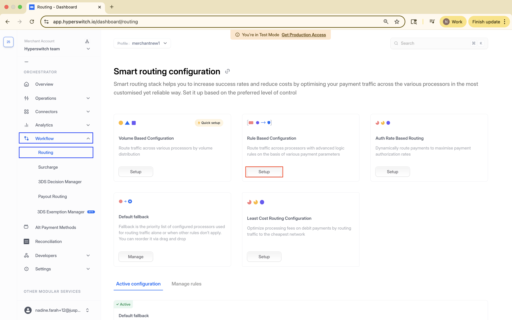

# Rule-Based Routing



Rule-Based Routing lets you configure one or more rules, where each rule has a condition and a processor preference. When a payment matches a condition, Hyperswitch uses the processor preference attached to that rule.

## How It Works

Rules are evaluated from top to bottom in the same order shown in the dashboard. The first matching rule is applied. If no rule matches, Hyperswitch uses your [Default Fallback Routing](default-fallback-routing.md).

**Condition:** A condition is built from payment dimensions and logical operators. Common dimensions include payment method, payment method type, amount, currency, country, card type, and card network. Operators include equal to, greater than, lesser than, is, is not, contains, and not contains.

**Processor preference:** The processor, split, or fallback list Hyperswitch should use when the condition matches.

## Processor Preference Types

Every rule can use one of these processor preference types:

1. **Single choice of processor:** Route matching payments to one processor, such as `Stripe`.
2. **Split payments across processors:** Distribute matching traffic across processors, such as `Stripe: 70%` and `PayPal: 30%`.
3. **Single choice with fallback:** Route to one processor first, with one or more fallback processors if the first processor cannot process the payment.

## When To Use It

Use Rule-Based Routing when you need deterministic control, for example:

* Route a country or currency to a local acquirer.
* Send high-value payments to a processor with stronger risk handling.
* Route a payment method to a processor that has better support for it.
* Keep a processor preference tied to a commercial agreement.

## Setup In Smart Router

1. Go to `Workflow` > `Routing`.
2. Click `Setup` for Rule-Based Routing.
3. Save the rule name and description.
4. Use the no-code UI to configure conditions for your business logic.
5. Select the processor preference and click `Configure Rule`.
6. In the confirmation popup, choose whether to save the rule or save and activate it for payments.
7. Review your active routing algorithm and previously configured algorithms on the [Hyperswitch Dashboard](https://app.hyperswitch.io/routing).

<figure><figcaption></figcaption></figure>

## Good Practices

Keep the most specific rules at the top and broad rules lower in the list. Always configure Default Fallback Routing so payments have a backup path when a rule output is not eligible for the payment.

## How Rule-Based Routing Works


