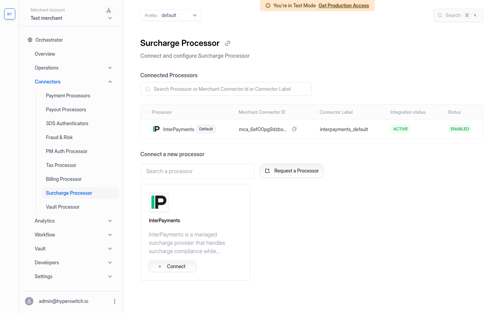
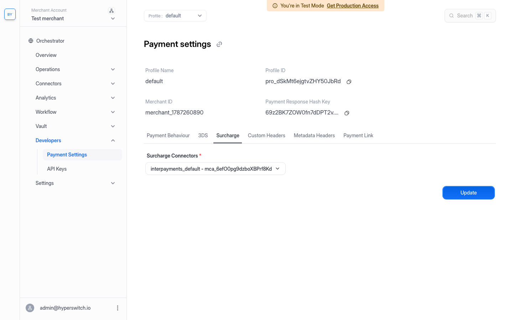
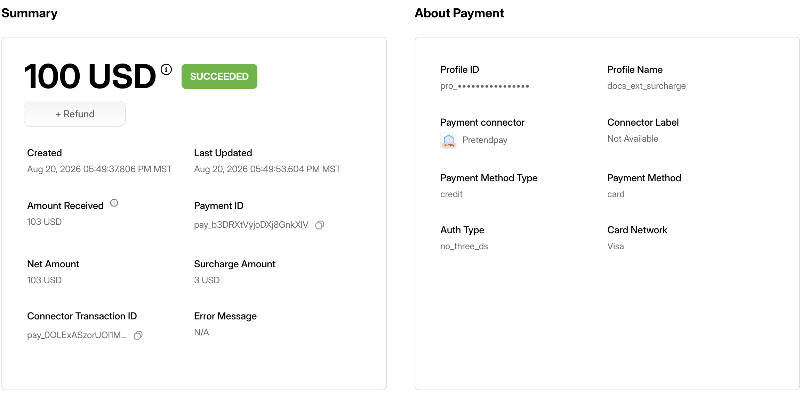
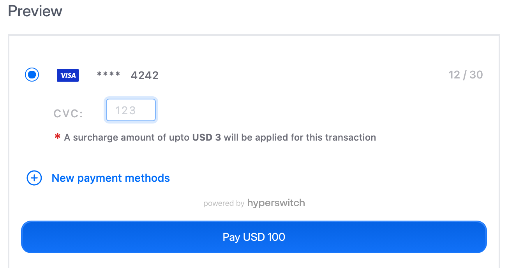
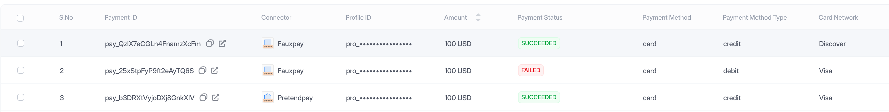

# External Surcharge


This page covers **external surcharge** — letting a third-party surcharge processor decide the surcharge for each payment. If you want to define your own surcharge rules inside Hyperswitch instead, see [Surcharge](README.md) and the [Surcharge Setup guide](surcharge-setup-guide.md).


## Overview

Card surcharging is heavily regulated. The amount you are allowed to add — and whether you are allowed to add anything at all — depends on the card brand, the card type, the issuing country, and the cardholder's state or region. Those rules change often, and getting them wrong carries real compliance risk.

**External surcharge** lets you hand that decision to a specialist. Instead of you maintaining surcharge rules in Hyperswitch, Hyperswitch calls an external surcharge processor during checkout, passes it the card the shopper has entered, and applies the surcharge that comes back.

This gives you two things:

* **Compliance is maintained for you.** The surcharge processor keeps up with card-network and jurisdictional rules. Debit cards, for example, generally cannot be surcharged in the US — the processor returns a zero surcharge for them, without you writing a rule.
* **The shopper sees the fee before they commit.** The surcharge is quoted once the card number identifies the card, so the updated total can be shown on the payment form rather than appearing as a surprise on the statement.

**InterPayments** is the surcharge processor currently supported by Hyperswitch.

### How it differs from rule-based surcharge

| | Rule-based surcharge | External surcharge |
| --- | --- | --- |
| Who decides the amount | You, via rules in the Surcharge Manager | The external surcharge processor |
| Compliance responsibility | Yours | Handled by the surcharge processor |
| Inputs | Payment parameters you choose (amount, currency, payment method, card network, …) | The card the shopper actually entered |
| Setup | Configure rules per profile | Connect the surcharge processor once |
| When it is decided | While listing payment methods | On a dedicated eligibility call, once the card is known |

You can also use the surcharge returned by the external processor as an input to routing — see [Routing to payment processors based on surcharge value](#routing-to-payment-processors-based-on-surcharge-value) below.

## Enabling external surcharge on Hyperswitch

This guide assumes you already have a Hyperswitch merchant account and a business profile. If you do not, start with [Quick Start: Create Your Hyperswitch Account](../../account-management/multiple-accounts-and-profiles/quick-start.md).

There are three things to set up, and all three are required:

1. Connect InterPayments as a surcharge processor.
2. Select it as the surcharge connector **on the profile**.
3. Have at least one payment processor connected to authorize the payment.

### Step 1: Connect InterPayments as a surcharge processor

You will need an **InterPayments API key**. Request one from InterPayments if you do not already have it.

In the Control Center, go to **Connectors → Surcharge Processor**. InterPayments appears under *Connect a new processor*. Click **Connect**.

<figure><figcaption><p>Connectors → Surcharge Processor</p></figcaption></figure>

The **Profile** field is fixed to the profile currently selected in the Control Center's profile switcher — switch profiles first if you want to configure a different one. Paste your InterPayments API key into **API Key** (shown below as `<your-interpayments-api-key>`), and give the connection a **Connector label**. The label defaults to `interpayments_default` and is how this connection is identified elsewhere in the Control Center.

<figure><figcaption><p>Configuring the InterPayments surcharge processor</p></figcaption></figure>

Click **Connect and Proceed**. The processor now shows as *Active* and *Enabled* in the connected list.

<figure><figcaption><p>InterPayments connected as a surcharge processor</p></figcaption></figure>


Surcharge processors are configured **per profile**. If you operate several profiles and want external surcharge on each of them, repeat this step for every profile.


### Step 2: Select the surcharge connector on the profile

Connecting the processor is not enough on its own — the profile has to point at it. Go to **Developers → Payment Settings**, open the **Surcharge** tab, pick your connection under **Surcharge Connectors**, and click **Update**.

<figure><figcaption><p>Developers → Payment Settings → Surcharge</p></figcaption></figure>


If you skip this step, nothing breaks and nothing happens: payments continue to go through with no surcharge, silently. If surcharge is not being applied, this setting is the first thing to check.


### Step 3: Connect a payment processor

External surcharge only changes the *amount* that gets authorized — you still need a payment processor to authorize it. If you already have one connected, skip this step.

Go to **Connectors → Payment Processors** and connect a processor. For testing you can use one of the dummy processors — the example below uses **Fauxpay**, which needs no real credentials.

<figure><figcaption><p>Connecting a payment processor</p></figcaption></figure>

Work through the **Credentials → Payment Methods → Summary** steps, making sure **Card** is enabled as a payment method, since surcharge is determined from the card the shopper enters.

Once connected, the processor shows as *Active* and *Enabled* in the list.

<figure><figcaption><p>Connected payment processors</p></figcaption></figure>

### Step 4: Make a test payment

Go to **Try a test payment** in the Control Center to open the hosted checkout playground. Pick a currency and an amount, then click **Show Preview** to render the payment form.

<figure><figcaption><p>Setting up a test checkout</p></figcaption></figure>

### Step 5: How the surcharge is fetched during checkout

Unlike rule-based surcharge — which is returned alongside the payment method list, before any card is known — an external surcharge depends on the actual card. It is therefore fetched by a dedicated call, made once the shopper has entered enough of the card number to identify it:

```http
POST /payments/{payment_id}/eligibility
```

* **Auth:** your publishable key (`pk_…`) plus the payment's `client_secret` in the body, so it can be called from the checkout front end. A server-side call with your secret API key also works — in that case omit `client_secret`.
* **Body:** the payment method (`"payment_method_type": "card"`), optionally its subtype (`"payment_method_subtype": "credit"`), and the card under `payment_method_data`. Only `card_number` is strictly required.
* **Response:** `surcharge_details` — with `display_surcharge_amount` and `display_total_surcharge_amount` for rendering — plus `sdk_next_action`, telling the checkout what to do next.

Hyperswitch caches the quote against the payment for **15 minutes**.


The surcharge call is **best-effort**. If the surcharge processor cannot be reached, or is not configured, the eligibility call still returns `200` with `surcharge_details: null` and the payment goes through unsurcharged. It never fails a payment — but it also means a missing surcharge is easy to miss.


If you have built your own checkout, make this call yourself once the card number is entered, and re-render your total from the response.

If you use the Hyperswitch checkout SDK, the SDK can make the call for you — but only when the payment tells it to. See [When the SDK makes the call for you](#when-the-sdk-makes-the-call-for-you) below.

Once a quote has been fetched, it is applied when the payment is confirmed. The confirmed payment reports the surcharge in `surcharge_details` and the surcharged total in `net_amount`:

<figure><figcaption><p>A $100 payment on a credit card, surcharged $3 by InterPayments — <code>Net Amount</code> is $103</p></figcaption></figure>


**If the eligibility call is never made, the payment is simply not surcharged.** Confirming the same card without first calling `/eligibility` produces `surcharge_details: null` and a `net_amount` equal to the original amount. Nothing fails and nothing warns you — the surcharge is just silently absent.


### Step 6: When the SDK makes the call for you

The Hyperswitch checkout SDK only issues the eligibility call when the payment intent asks it to. The payment's `sdk_next_action` field — returned by `GET /payments/{payment_id}/client` — drives this:

```json
"sdk_next_action": { "next_action": "eligibility_check", "should_block_confirm": true }
```

* `"eligibility_check"` — the SDK calls `/payments/{payment_id}/eligibility` once the card is known, then renders the surcharge on the payment form.
* `"confirm"` — the SDK goes straight to confirmation and **never fetches a surcharge**, even with a surcharge processor connected and selected on the profile.

`should_block_confirm` tells the SDK to hold the pay button until an eligibility result has come back, so the shopper cannot submit the payment before the surcharge has been quoted.

Eligibility checks are enabled per **merchant account** by Hyperswitch, and are not currently a self-serve setting in the Control Center. If the eligibility endpoint returns a surcharge when you call it directly but your payment form never shows one, check `sdk_next_action` on the payment — if it reads `confirm`, contact Hyperswitch to have eligibility checks enabled for your merchant account, or make the call yourself from your own checkout.

With eligibility checks enabled, selecting a saved card fetches a quote and the SDK renders it under the card, before the shopper submits:

<figure><figcaption><p>The surcharge quoted by InterPayments, shown on the payment form</p></figcaption></figure>

The figure shown is `display_total_surcharge_amount` from the eligibility response — `3.0` for the $100 payment above, matching the `300` minor units in `surcharge.value`.


**A newly entered card number was not quoted by the SDK build tested here (`2026.07.27.00` on the sandbox).** With `sdk_next_action` set to `eligibility_check`, selecting a *saved* card fetched and displayed the surcharge as shown above — but typing a *new* card number into the payment form issued no eligibility call and displayed no surcharge. Because `should_block_confirm` is `true`, the pay button then stayed on **Please wait…** indefinitely and the payment was never submitted.

If your checkout accepts new card entry, verify this on your own SDK build before enabling external surcharge on a live profile, or call `/eligibility` yourself from your own checkout and render the response.


### Step 7: Debit cards are not surcharged

Surcharging debit cards is prohibited in most jurisdictions, and this is exactly the kind of rule the external processor handles for you. Repeat the eligibility call with a **debit** card and the quote comes back as zero — no configuration on your side, just the surcharge processor applying the rules for the card in question.

The decision is made from the **card itself**, not from what you declare. Sending `"payment_method_subtype": "debit"` alongside a credit-card BIN still returns the credit-card surcharge; it is the card number that determines the answer.

A payment with a zero surcharge is confirmed at its original amount, with `Surcharge Amount` reported as `0`:

<figure><figcaption><p>A card the surcharge processor returns no surcharge for — <code>Net Amount</code> is unchanged</p></figcaption></figure>

## Routing to payment processors based on surcharge value

The surcharge returned by the external processor is available as a routing dimension, so you can send surcharged and non-surcharged payments to different payment processors. A common reason to do this is that the economics of a transaction change once a surcharge is applied, and you may have a processor better suited to each case.

The example below routes payments with **no surcharge to Fauxpay**, and **surcharged payments to Pretendpay**.

### Step 1: Connect and enable InterPayments

Same as [Step 1](#step-1-connect-interpayments-as-a-surcharge-processor) and [Step 2](#step-2-select-the-surcharge-connector-on-the-profile) above. Routing on surcharge needs a surcharge value to route on, so the surcharge processor must be connected *and* selected on the profile first.

### Step 2: Connect two payment processors

Go to **Connectors → Payment Processors** and connect the two processors you want to route between. In this example, **Fauxpay** and **Pretendpay** are both connected, with connector labels `fauxpay_default` and `pretendpay_default`.

<figure><figcaption><p>Both payment processors connected</p></figcaption></figure>

### Step 3: Create a rule-based routing configuration

Go to **Workflow → Routing** and choose **Setup** on the **Rule Based Configuration** card. Give the configuration a name and description.

In the rule builder, click **Select Field**. Searching for `surcharge` surfaces **`surcharge_amount`** under *PAYMENTS* — this is the surcharge returned by your surcharge processor, expressed in the smallest currency unit.

<figure><figcaption><p><code>surcharge_amount</code> as a routing dimension</p></figcaption></figure>

Build two rules:

* **Rule 1** — `surcharge_amount` **EQUAL TO** `0` → `fauxpay_default`
* **Rule 2** — `surcharge_amount` **GREATER THAN** `0` → `pretendpay_default`

<figure><figcaption><p>Routing rules based on surcharge amount</p></figcaption></figure>

Amounts are entered in the **smallest currency unit** — `100` means $1.00 for USD.


Rules are evaluated top to bottom and the first match wins. Here the two conditions are mutually exclusive and between them cover every possible value, so the order does not matter and no payment should reach your [Default Fallback](../intelligent-routing/default-fallback-routing.md) list. If payments *are* landing on your fallback processor, the rules are not matching — check the profile's surcharge connector setting.



**`surcharge_amount` is `0`, not null, when no surcharge was calculated.** The routing engine substitutes `0` whenever the payment has no external surcharge attached — whether the processor genuinely returned zero, or the surcharge was never fetched at all (no eligibility call, a failed call, or the profile's surcharge connector not set).

So `EQUAL TO 0` reliably matches the no-surcharge case — but it matches the *never-calculated* case identically. Treat the `EQUAL TO 0` branch as "no surcharge is being applied", not as proof that the processor made a zero-surcharge decision.


### Step 4: Activate the configuration

Click **Configure Rule**. Hyperswitch asks whether to activate the configuration immediately or save it for later; activating replaces whatever routing configuration is currently live on the profile.

<figure><figcaption><p>Activating the routing configuration</p></figcaption></figure>

Choose **Save and Activate Rule**. The configuration then shows as *Active* under the **Active configuration** tab on the Routing page.

<figure><figcaption><p>The surcharge-based routing configuration, active</p></figcaption></figure>

Only one routing configuration is active per profile at a time. Previous configurations remain available under **Configuration History**.

### Step 5: Verify the routing with test payments

Make two test payments, each with a surcharge quote actually fetched for it — either through the SDK, if eligibility checks are enabled on your merchant account, or by calling `/payments/{payment_id}/eligibility` yourself before confirming:

1. A card the surcharge processor returns **no surcharge** for — this should match Rule 1 and be processed by Fauxpay.
2. A card that **does attract a surcharge** — this should match Rule 2 and be processed by Pretendpay.

Then open **Operations → Payments** and check the **Connector** column for each payment to confirm which processor handled it.


Routing reads the surcharge that is attached to the payment, so the quote has to have been fetched before you confirm. A payment confirmed without an eligibility call carries no surcharge and routes down the `EQUAL TO 0` branch — see the warning below.



**Set up the test so a rule hit and a rule miss look different.** If a rule points at a processor that is also the first entry in your Default Fallback list, a payment landing on that processor tells you nothing — it could have matched the rule, or it could have fallen through.

Before testing, connect a third processor you are not routing to and move it to the top of your Default Fallback list. Then any payment landing on that third processor is unambiguously a rule miss, and anything landing on Fauxpay or Pretendpay is unambiguously a rule hit. Restore your fallback order afterwards.


The two payments land on different processors, confirming both branches of the rule:

<figure><figcaption><p>A surcharged payment on Pretendpay and unsurcharged payments on Fauxpay</p></figcaption></figure>

The middle row above is a second no-surcharge payment that Fauxpay rejected at authorization because the card was not one of its accepted test numbers. Routing still selected Fauxpay for it, which is the part being verified here — the routing decision is made before the processor ever sees the card.

## What this page was verified against

Everything on this page was verified against a live sandbox with InterPayments connected and selected on the profile, and with eligibility checks enabled on the merchant account:

* `GET /payments/{payment_id}/client` returned `"sdk_next_action": {"next_action": "eligibility_check", "should_block_confirm": true}` on freshly created payments.
* A credit-card BIN returned a `300` surcharge on a `10000` payment (`display_total_surcharge_amount: 3.0`); confirming it produced `net_amount: 10300`.
* A Visa debit BIN returned a `0` surcharge for the same payment.
* On the checkout SDK, selecting a saved card fired `POST /payments/{payment_id}/eligibility` and rendered the quoted surcharge on the payment form — the screenshot in [Step 6](#step-6-when-the-sdk-makes-the-call-for-you) is that response.
* Confirming without calling `/eligibility` produced `surcharge_details: null` and left `net_amount` at the original amount.
* `surcharge_amount` is presented to the routing engine as `0` — not null — when no external surcharge is attached, so an `EQUAL TO 0` rule matches. A payment confirmed with no eligibility call routed to the `EQUAL TO 0` branch.

**Not verified:** the payment form has not been captured for a **newly entered** card number, because the SDK build tested fetched no surcharge in that flow — see the warning in [Step 6](#step-6-when-the-sdk-makes-the-call-for-you).

## FAQs

**Which surcharge processors does Hyperswitch support?**\
InterPayments is the supported external surcharge processor.

**Can I use external surcharge and the Surcharge Manager together?**\
They answer the same question — how much surcharge to apply — so configure one or the other for a given profile. If a payment has a rule-based surcharge attached, that takes precedence and no external surcharge is fetched for it. Use the external surcharge processor when you want compliance handled for you, and the [Surcharge Manager](surcharge-setup-guide.md) when you want to define the rules yourself.

**What happens if I send `surcharge_details` in the payments/create request?**\
On a profile with external surcharge enabled, do not rely on it. Once an external surcharge has been calculated for the payment, it replaces the `surcharge_amount` you supplied in the [payments/create request](https://api-reference.hyperswitch.io/v1/payments/payments--create). If you want to set the surcharge yourself, do not enable an external surcharge processor on that profile.

**In what unit is `surcharge_amount` expressed?**\
The smallest unit of the payment currency — cents for USD, yen for JPY. This is the same convention used everywhere in the routing rule builder.

**Is the surcharge shown to the shopper before they pay?**\
It can be. The quote is fetched once the card is known, so the payment form can show the surcharge before the payment is submitted. With the Hyperswitch SDK this requires eligibility checks to be enabled on your merchant account, and on the build tested it rendered for saved cards but not for newly entered card numbers — see [Step 6](#step-6-when-the-sdk-makes-the-call-for-you) and the warning there. On your own checkout, call `/eligibility` yourself and render the response.

**Can I run external surcharge on a self-hosted Hyperswitch?**\
Only with the Universal Connector Service (UCS) deployed. The surcharge is computed through UCS rather than in the router process, so a self-hosted stack without a UCS `connector-service` that includes the surcharge service cannot complete a surcharge calculation at all — the eligibility call returns `surcharge_details: null` and payments go through unsurcharged. You also need a checkout SDK build recent enough to contain the external-surcharge UI; older pinned SDK bundles have no such component.

**What happens if the surcharge processor is unreachable?**\
The payment still goes through, unsurcharged. The eligibility call returns `surcharge_details: null` rather than an error, so a surcharge outage degrades your revenue rather than your conversion — but it will not be obvious from the payment itself.
