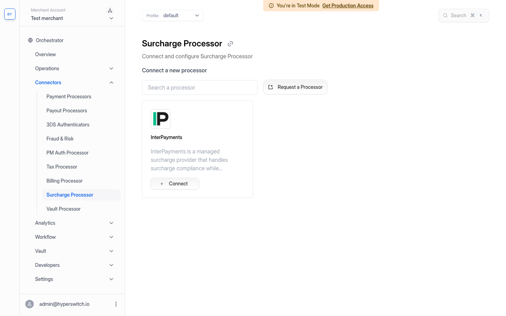
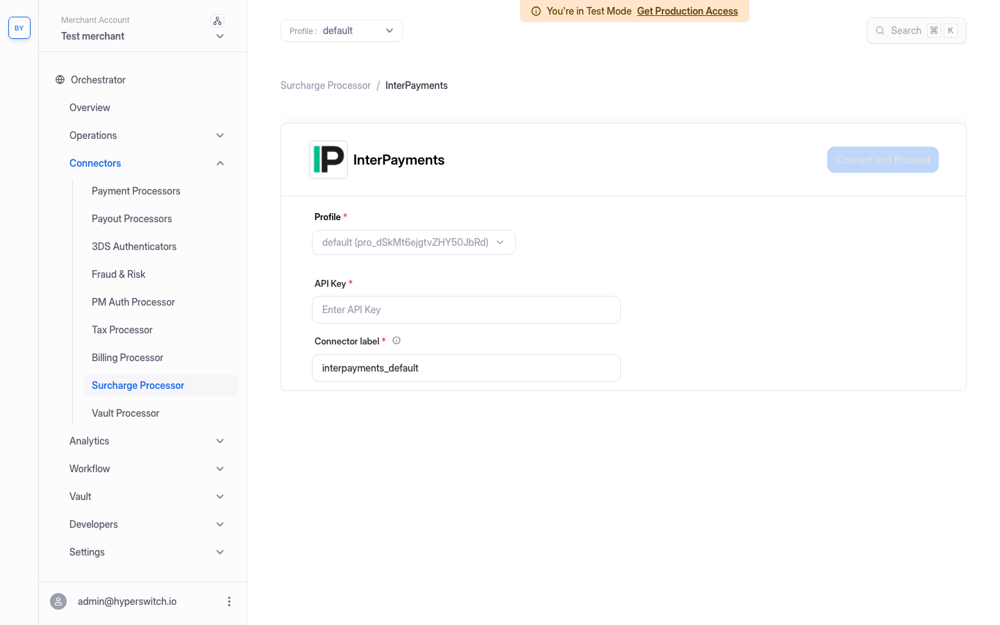
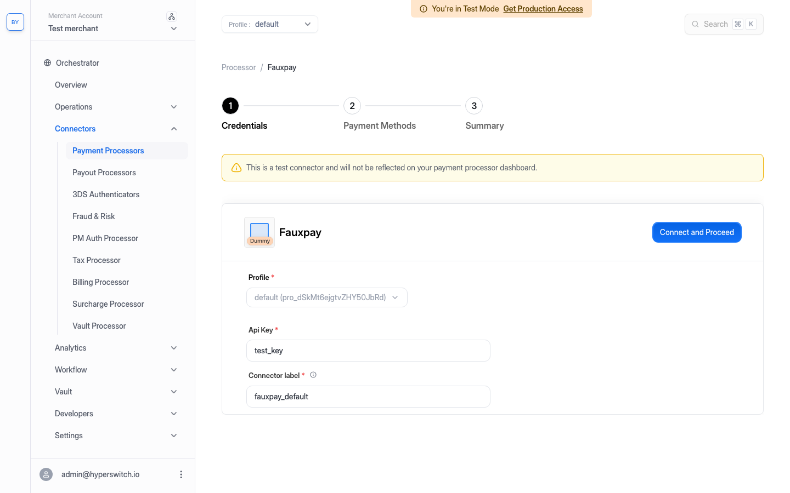
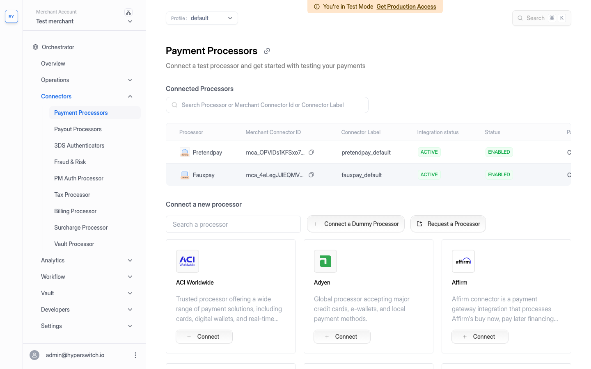
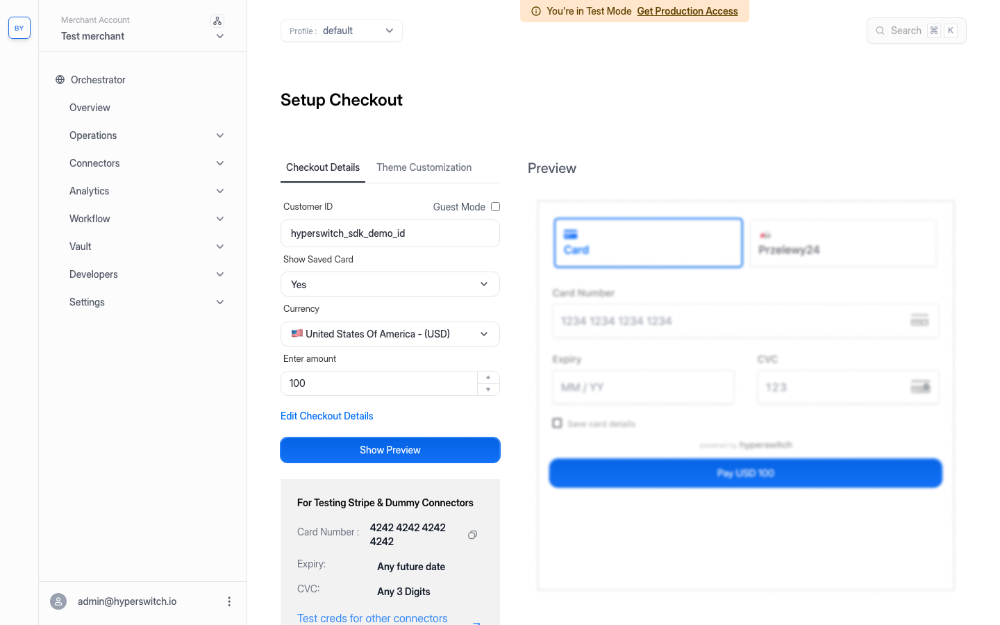
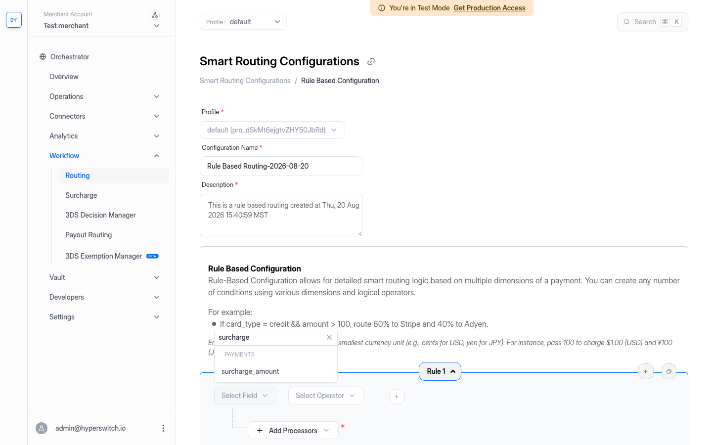
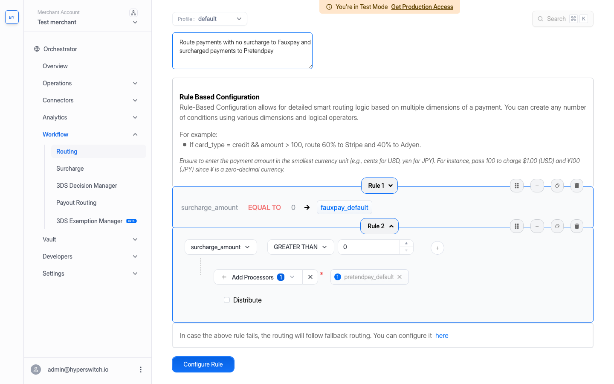
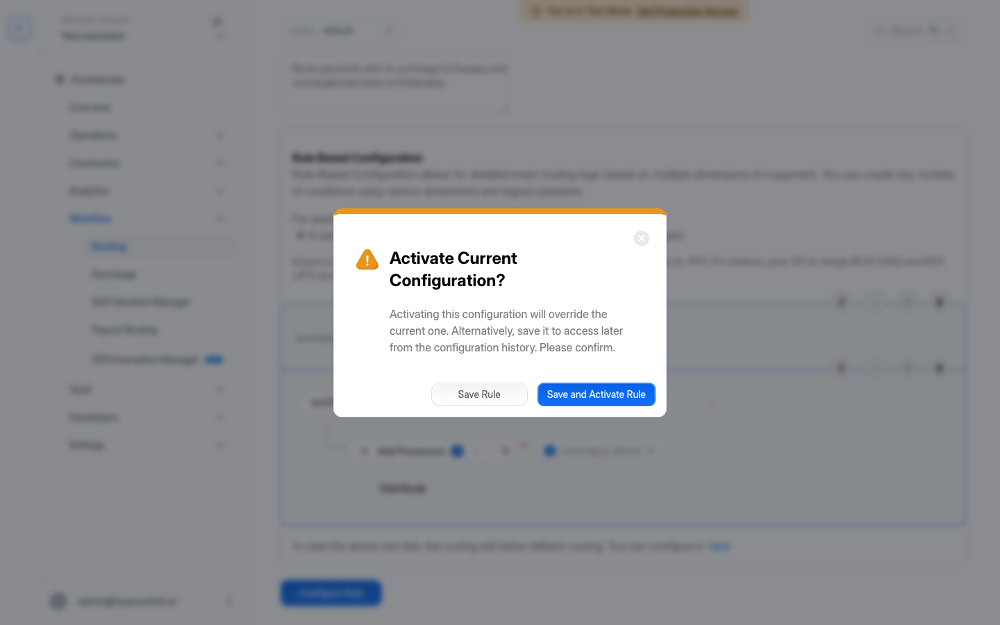
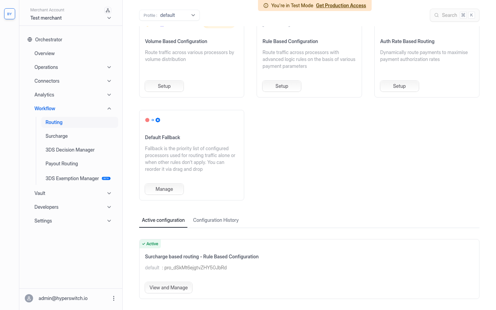

# External Surcharge


This page covers **external surcharge** — letting a third-party surcharge processor decide the surcharge for each payment. If you want to define your own surcharge rules inside Hyperswitch instead, see [Surcharge](README.md) and the [Surcharge Setup guide](surcharge-setup-guide.md).


## Overview

Card surcharging is heavily regulated. The amount you are allowed to add — and whether you are allowed to add anything at all — depends on the card brand, the card type, the issuing country, and the cardholder's state or region. Those rules change often, and getting them wrong carries real compliance risk.

**External surcharge** lets you hand that decision to a specialist. Instead of you maintaining surcharge rules in Hyperswitch, Hyperswitch calls an external surcharge processor during checkout, passes it the card details the shopper has entered, and applies the surcharge that comes back.

This gives you two things:

* **Compliance is maintained for you.** The surcharge processor keeps up with card-network and jurisdictional rules. Debit cards, for example, generally cannot be surcharged in the US — the processor returns a zero surcharge for them automatically, without you writing a rule.
* **The shopper sees the fee before they commit.** The surcharge is fetched as soon as the card number identifies the card, so the updated total is shown on the payment form rather than appearing as a surprise on the statement.

**InterPayments** is the surcharge processor currently supported by Hyperswitch.

### How it differs from rule-based surcharge

| | Rule-based surcharge | External surcharge |
| --- | --- | --- |
| Who decides the amount | You, via rules in the Surcharge Manager | The external surcharge processor |
| Compliance responsibility | Yours | Handled by the surcharge processor |
| Inputs | Payment parameters you choose (amount, currency, payment method, card network, …) | The card the shopper actually entered |
| Setup | Configure rules per profile | Connect the surcharge processor once |

You can also use the surcharge returned by the external processor as an input to routing — see [Routing to payment processors based on surcharge value](#routing-to-payment-processors-based-on-surcharge-value) below.

## Enabling external surcharge on Hyperswitch

This guide assumes you already have a Hyperswitch merchant account and a business profile. If you do not, start with [Quick Start: Create Your Hyperswitch Account](../../account-management/multiple-accounts-and-profiles/quick-start.md).

### Step 1: Connect InterPayments as a surcharge processor

You will need an **InterPayments API key** for the profile you are configuring. Request one from InterPayments if you do not already have it.

In the Control Center, go to **Connectors → Surcharge Processor**. InterPayments appears under *Connect a new processor*. Click **Connect**.

<figure><figcaption>
Connectors → Surcharge Processor
</figcaption></figure>

Select the **Profile** this surcharge processor should apply to, paste your InterPayments **API Key**, and give the connection a **Connector label** — the label defaults to `interpayments_default` and is how this connection is identified elsewhere in the Control Center.

<figure><figcaption>
Configuring the InterPayments surcharge processor
</figcaption></figure>

Click **Connect and Proceed**. Surcharge is now fetched from InterPayments for payments on this profile.


Surcharge processors are configured **per profile**. If you operate several profiles and want external surcharge on each of them, repeat this step for every profile.


### Step 2: Connect a payment processor

External surcharge only changes the *amount* that gets authorized — you still need a payment processor to authorize it. If you already have one connected, skip this step.

Go to **Connectors → Payment Processors** and connect a processor. For testing you can use one of the dummy processors — the example below uses **Fauxpay**, which needs no real credentials.

<figure><figcaption>
Connecting a payment processor
</figcaption></figure>

Work through the **Credentials → Payment Methods → Summary** steps, making sure **Card** is enabled as a payment method, since surcharge is determined from the card the shopper enters.

Once connected, the processor shows as *Active* and *Enabled* in the list.

<figure><figcaption>
Connected payment processors
</figcaption></figure>

### Step 3: Make a test payment

Go to **Try a test payment** in the Control Center to open the hosted checkout playground. Pick a currency and an amount, then click **Show Preview** to render the payment form.

<figure><figcaption>
Setting up a test checkout
</figcaption></figure>

### Step 4: Watch the surcharge appear as the card is entered

The payment form initially shows the base amount on the pay button. As soon as you type a card number long enough to identify the card, the SDK requests a surcharge quote, and the form updates to show the surcharge and the new total.

> **TODO — screenshot pending.** Capturing this requires a live InterPayments API key, which was not available when this page was drafted. Add a screenshot of the payment form showing a credit card entered, the surcharge line item, and the pay button reflecting the surcharged total.

The shopper therefore always sees the surcharge, and the total they are agreeing to, before they submit the payment.

### Step 5: Confirm that a debit card is not surcharged

Surcharging debit cards is prohibited in most jurisdictions, and this is exactly the kind of rule the external processor handles for you. Repeat the test payment with a **debit** test card: the surcharge quote comes back as zero, no surcharge line is shown, and the pay button stays at the base amount.

> **TODO — screenshot pending.** Requires a live InterPayments API key. Add a screenshot of the payment form with a debit card entered showing no surcharge applied.

No configuration on your side is needed to get this behaviour — it is the surcharge processor applying the rules for the card in question.

## Routing to payment processors based on surcharge value

The surcharge returned by the external processor is available as a routing dimension, so you can send surcharged and non-surcharged payments to different payment processors. A common reason to do this is that the economics of a transaction change once a surcharge is applied, and you may have a processor better suited to each case.

The example below routes payments with **no surcharge to Fauxpay**, and **surcharged payments to Pretendpay**.

### Step 1: Connect InterPayments

Same as [Step 1](#step-1-connect-interpayments-as-a-surcharge-processor) above. Routing on surcharge needs a surcharge value to route on, so the surcharge processor must be connected first.

### Step 2: Connect two payment processors

Go to **Connectors → Payment Processors** and connect the two processors you want to route between. In this example, **Fauxpay** and **Pretendpay** are both connected, with connector labels `fauxpay_default` and `pretendpay_default`.

<figure><figcaption>
Both payment processors connected
</figcaption></figure>

### Step 3: Create a rule-based routing configuration

Go to **Workflow → Routing** and choose **Setup** on the **Rule Based Configuration** card. Give the configuration a name and description.

In the rule builder, click **Select Field**. Searching for `surcharge` surfaces **`surcharge_amount`** under *PAYMENTS* — this is the surcharge returned by your surcharge processor, expressed in the smallest currency unit.

<figure><figcaption>
<code>surcharge_amount</code> as a routing dimension
</figcaption></figure>

Build two rules:

* **Rule 1** — `surcharge_amount` **EQUAL TO** `0` → `fauxpay_default`
* **Rule 2** — `surcharge_amount` **GREATER THAN** `0` → `pretendpay_default`

<figure><figcaption>
Routing rules based on surcharge amount
</figcaption></figure>


Rules are evaluated top to bottom and the first match wins, so order them from most specific to least specific. If no rule matches, the payment falls through to your [Default Fallback](../intelligent-routing/default-fallback-routing.md) processor list — it is worth checking that the fallback order is what you want, since a payment that reaches it will still be processed.


Amounts are entered in the **smallest currency unit** — `100` means $1.00 for USD.

### Step 4: Activate the configuration

Click **Configure Rule**. Hyperswitch asks whether to activate the configuration immediately or save it for later; activating replaces whatever routing configuration is currently live on the profile.

<figure><figcaption>
Activating the routing configuration
</figcaption></figure>

Choose **Save and Activate Rule**. The configuration then shows as *Active* under the **Active configuration** tab on the Routing page.

<figure><figcaption>
The surcharge-based routing configuration, active
</figcaption></figure>

Only one routing configuration is active per profile at a time. Previous configurations remain available under **Configuration History**.

### Step 5: Verify the routing with test payments

Make two test payments from **Try a test payment**:

1. A **debit** card, which the surcharge processor returns no surcharge for — this should match Rule 1 and be processed by Fauxpay.
2. A **credit** card that does attract a surcharge — this should match Rule 2 and be processed by Pretendpay.

Then open **Operations → Payments** and check the **Connector** column for each payment to confirm which processor handled it.

> **TODO — verification pending.** These two payments could not be run while drafting this page, because distinguishing the two branches requires a live InterPayments API key to produce a non-zero surcharge. Add screenshots of the Payments list showing the two payments routed to different connectors.


When you verify routing, make sure the processor a rule points to is **not** also the first entry in your Default Fallback list. If it is, a payment landing on that processor does not tell you whether your rule fired or whether the payment simply fell through to the fallback. Point the rule at a different processor from the fallback head while testing.


## FAQs

**Which surcharge processors does Hyperswitch support?**\
InterPayments is the supported external surcharge processor.

**Can I use external surcharge and the Surcharge Manager together?**\
They answer the same question — how much surcharge to apply — so configure one or the other for a given profile. Use the external surcharge processor when you want compliance handled for you, and the [Surcharge Manager](surcharge-setup-guide.md) when you want to define the rules yourself.

**What happens if I send `surcharge_details` in the payments/create request?**\
An explicit `surcharge_details` in the [payments/create request](https://api-reference.hyperswitch.io/v1/payments/payments--create) takes precedence, and no surcharge decision is made on your behalf for that payment.

**In what unit is `surcharge_amount` expressed?**\
The smallest unit of the payment currency — cents for USD, yen for JPY. This is the same convention used everywhere in the routing rule builder.

**Is the surcharge shown to the shopper before they pay?**\
Yes. The quote is fetched while the card is being entered, and the payment form shows the surcharge and the updated total before the payment is submitted.
