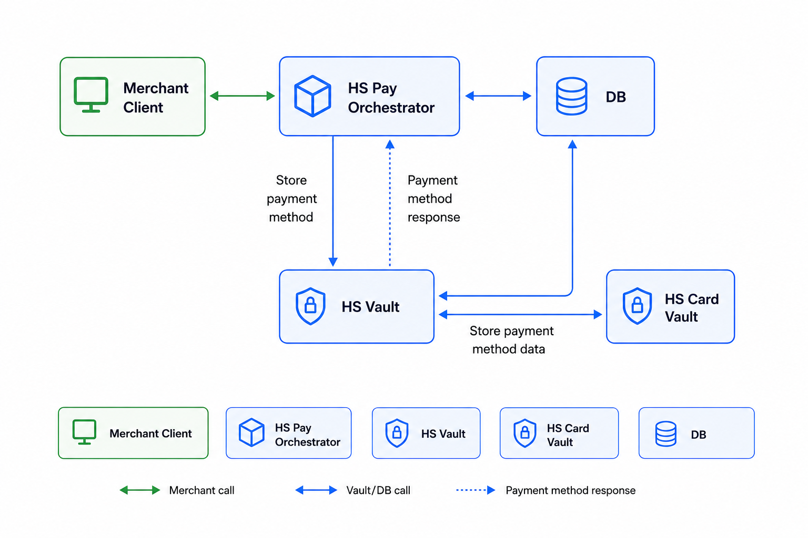

# Vault

Juspay Hyperswitch Vault is a PCI-compliant service for securely storing customer payment methods (cards, wallets, bank accounts) and generating reusable tokens (`payment_method_id`). It can be used **standalone** (vault-only, no orchestration) or **alongside** the Hyperswitch Payments Orchestrator.

### Key Features

* **PCI DSS Compliant Storage** — Card data is stored in Juspay's certified vault; your servers never handle raw card numbers.
* **Reusable Tokens** — Every stored payment method gets a unique `payment_method_id` that works across new payments, recurring charges, and MITs.
* **Network Tokenization** — When a card is saved, Hyperswitch automatically provisions a Visa or Mastercard network token and manages its lifecycle (renewal, updates).
* **Flexible Deployment** — Use Juspay's hosted vault, bring your own PCI infrastructure, or connect a third-party vault (VGS, TokenEx, etc.).
* **Proxy Payments** — Send PSP API calls through the Vault Proxy so raw card data never touches your servers or the PSP directly.
* **Customer Payment Method Management** — Customers can view, add, and delete saved cards via an embeddable SDK widget.

---

### Getting Started with Vault

<table data-view="cards"><thead><tr><th></th><th></th><th data-hidden data-card-target data-type="content-ref"></th></tr></thead><tbody>
<tr><td><strong>Integration</strong></td><td>How to connect to the Vault — Server-to-Server API or the Vault SDK (React / JS)</td><td><a href="integration.md">integration.md</a></td></tr>
<tr><td><strong>Vault Deployment Models</strong></td><td>Choose the right deployment model for your PCI profile and hosting preference</td><td><a href="deployment-models.md">deployment-models.md</a></td></tr>
</tbody></table>

---

### Modular Vaulting Architecture

Modular Vaulting is the foundation of Hyperswitch's payment infrastructure — it gives merchants the flexibility to use Hyperswitch's built-in PCI-compliant vault or connect any third-party vault provider, without re-architecting their payment stack.

Merchants can start with the simplest model and migrate to a more sophisticated one as their compliance posture or infrastructure evolves. All models share the same `payment_method_id` token standard.

---

### When to Use Vault Standalone vs. with the Payments Orchestrator

| | Vault Standalone | Vault with Orchestrator |
|---|---|---|
| **Purpose** | Store cards and generate tokens; payments are made separately via your own or a third-party PSP | Store cards **and** process payments through Hyperswitch routing, retries, and analytics |
| **Typical flow** | Vault-Then-Pay using your own payment infrastructure or Proxy API | Pay-Then-Vault (card saved after payment) or Vault-Then-Pay via Hyperswitch Orchestration |
| **PCI scope** | Managed entirely by Juspay Vault | Managed by Juspay (SaaS) or shared (self-hosted) |
| **Where to start** | [Vault Integration](integration.md) | [Vault with Payments Orchestrator](../../payment-suite/payment-method-card/README.md) |
