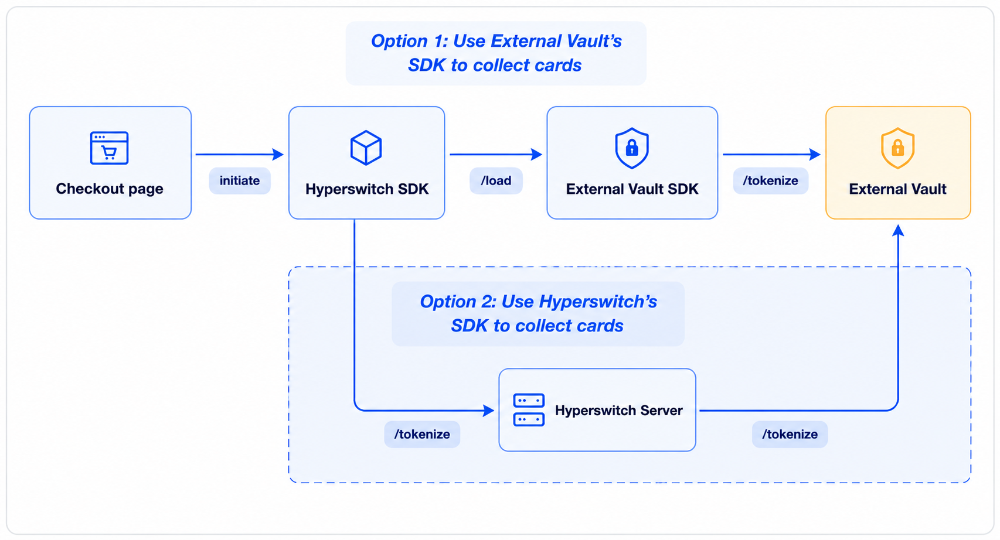
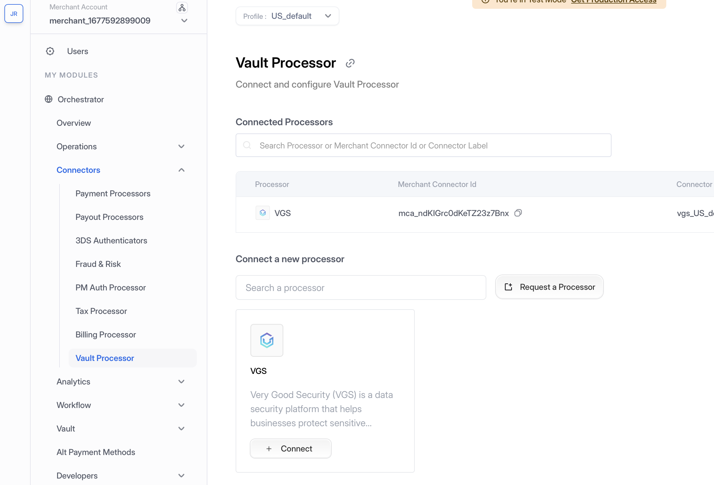
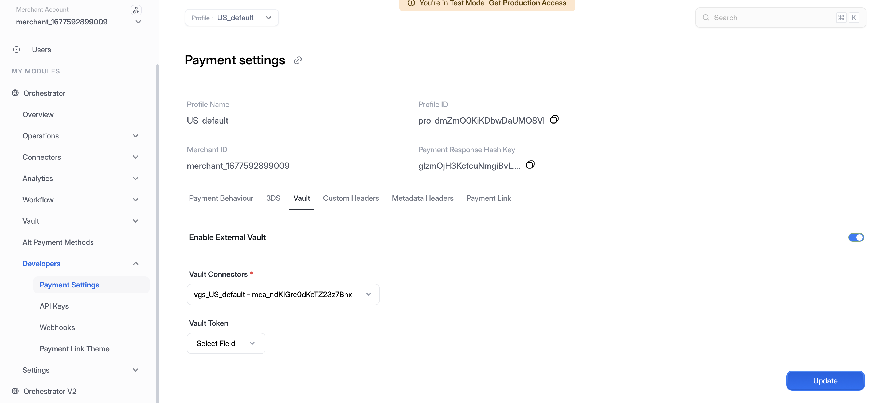
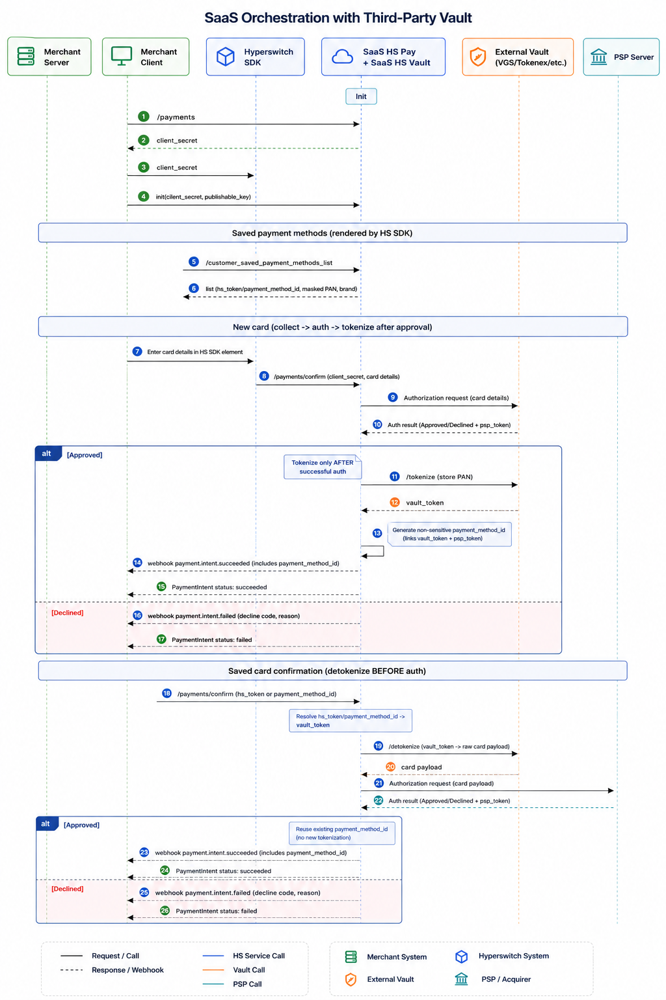

# SaaS Hyperswitch Vault with Third-Party Vault

## Overview

Through Hyperswitch, merchants can add external vault providers such as VGS, HashiCorp, and Voltage, leveraging their SDKs to collect and tokenize cards. This ensures flexibility in vault selection while maintaining compliance, security, and seamless token management across multiple payment processors. Additionally, we also support other extended features such as:

* **Network Tokenization** — Merchants can configure Network Tokenization through either Juspay as TSP or use the External Vault as TSP, ensuring flexibility and control over token provisioning
* **Proxy Payments through External Vaults** — Support for processing payments through Proxy layers to ensure PCI compliance
* **Card Forwarding & Receiving** — To seamlessly transfer tokenized data across third-party endpoints, enabling effortless PSP migration

---

## Hyperswitch Unified Checkout SDK

Cards are collected via the Hyperswitch Unified Checkout SDK and sent to the Hyperswitch server, which tokenizes them in an third-party vault. When processing payments, the Hyperswitch server retrieves the raw card details using the vault token and forwards the complete payment request to the PSP.

<em> Hyperswitch SDKs for Card Collection and vaulting with thrid-party vault</em> 

### Key Highlights

* Merchants using Juspay Hyperswitch SaaS can still integrate a third-party PCI-compliant vault. This setup is ideal for merchants who already have existing token infrastructure (e.g., VGS, Tokenex and more).
* Combines the scalability of SaaS orchestration with third-party vault flexibility.

---

## Configuration

To integrate with the Hyperswitch Vault and third-party vault, you'll need to configure your API credentials and profile settings.

### **Step 1: Generate API Key**

1. **Access Dashboard** — Log into the Hyperswitch Control Centre.
2. **Navigate to API Keys** — In the left-hand navigation menu, select **Developers > API Keys**.
3. **Create Key** — Click **Create New API Key**.
4. **Secure Storage** — Copy the generated key immediately and store it securely (it will not be shown again). Use this key in the `Authorization: api-key=<YOUR_VAULT_API_KEY>` header for all Vault API calls.

<figure><figcaption>
Navigate to Developers > API Keys to create and manage your API credentials
</figcaption></figure>

### **Step 2: Access Profile ID**

1. **Navigate to Payment Settings** — In the left-hand navigation menu, select **Developers > Payment Settings**.
2. **Copy Profile ID** — Locate and copy your **Profile ID** from the Payment Settings page. This ID is required for API calls that need to specify which merchant profile to use.

<figure><figcaption>
Navigate to Developers > Payment Settings to access your Profile ID
</figcaption></figure>

### **Step 3: Enable Vault Connector**

1. **Navigate to Vault Processor** — In the left-hand navigation menu, select **Connectors > Vault Processor**.
2. **Configure Vault Provider** — Add your third-party vault provider credentials and configuration.

<figure><figcaption>
Navigate to Connectors > Vault Processor to configure your third-party vault
</figcaption></figure>

3. **Enable in Payment Settings** — Navigate to **Developers > Payment Settings**, under **Vault** tab, enable the external vault and choose the vault processor from the dropdown, then click **Update**.

<figure><figcaption>
Navigate to Developers > Payment Settings to enable your third-party vault
</figcaption></figure>

---

## Payment Flows

In this approach, the Hyperswitch SDK is used to capture card details, but card storage and tokenization are handled by a third-party vault. Hyperswitch backend orchestrates payments using tokens issued by the third-party vault.

<em>Payment flows with third-party vault integration</em> 

### New User Payments Flow

1. Load the Hyperswitch [Payments SDK](../../payment-experience/payment/) via [Payments Create API request](https://api-reference.hyperswitch.io/v1/payments/payments--create). The end-user enters their payment credentials for the selected payment option
2. The [Payment Confirm API request](https://api-reference.hyperswitch.io/v1/payments/payments--confirm) containing the payment method is sent to the PSP from Hyperswitch
3. Once the PSP responds with the outcome `approved` or `declined` along with the PSP token, Hyperswitch then proceeds to store and tokenize the card.
4. The card is stored in third-party vault, which returns a `vault_token`
5. Upon receiving the `vault_token`, Hyperswitch generates a `payment_method_id`. A `payment_method_id` is a versatile token and connects a lot of entities together like `customer_id`, `psp_token`, `vault_token`
6. This `payment_method_id` is returned to the merchant via webhooks

### Repeat User Payments Flow

1. In a repeat-user payment, the Hyperswitch SDK will load the stored payment methods of the customer based the `customer_id` sent as part of the [Payments Create API request](https://api-reference.hyperswitch.io/v1/payments/payments--create).
2. The end-user can select the desired payment option and add their `CVV`
3. The SDK sends the [Payment Confirm API request](https://api-reference.hyperswitch.io/v1/payments/payments--confirm) when the user hits `Pay`
4. The Hyperswitch backend resolves the `payment_method_id` to identify available `vault_token`
5. Hyperswitch can use the `detokenize` flow to obtain the raw card in exchange for the `vault_token`. It will then send payload with the raw card credential to the payment provider or PSP downstream.

### Merchant Initiated Transaction (MIT) Flow

1. The merchant can perform the [MIT or Recurring transactions](../../payment-suite/payments/recurring-payments.md) using `payment_method_id`

---