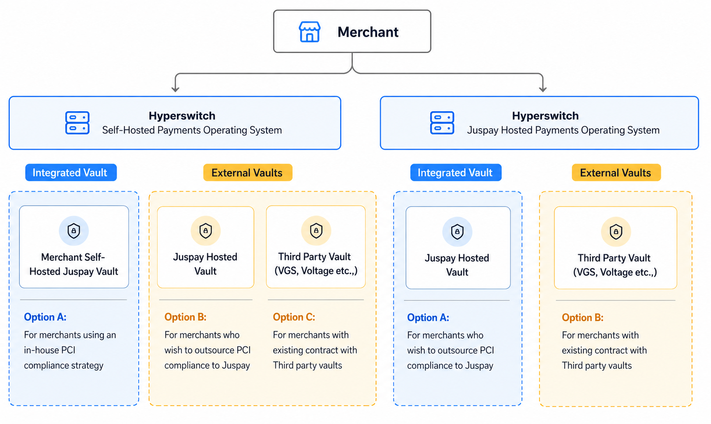

# Vault Deployment Models

Juspay Hyperswitch supports multiple vault deployment models to match your PCI profile and infrastructure preferences. The table below summarizes each option; click a row to read the full integration guide.

<table>
<thead>
<tr>
<th width="250">Deployment Model</th>
<th width="200">Vault Options</th>
<th width="200">PCI Ownership / Scope</th>
<th>Example Use Case</th>
</tr>
</thead>
<tbody>
<tr style="background-color: rgba(100, 100, 100, 0.1);">
<td rowspan="3" style="vertical-align: middle;"><strong>Vault Standalone</strong></td>
<td><a href="self-hosted-and-in-house-pci.md">SaaS Hyperswitch Vault</a></td>
<td>Merchant PCI Environment</td>
<td>Financial institutions requiring full data sovereignty and PCI control with raw payment method responses</td>
</tr>
<tr style="background-color: rgba(100, 100, 100, 0.1);">
<td><a href="hyperswitch-vault-pass-through-proxy-payments.md">SaaS Hyperswitch Vault</a></td>
<td>Non PCI Scope</td>
<td>Merchants wanting to avoid PCI scope while maintaining existing PSP relationships via Proxy API</td>
</tr>
<tr style="background-color: rgba(100, 100, 100, 0.1);">
<td><a href="connect-external-vaults-to-hyperswitch-orchestration.md">Third-Party Vault</a></td>
<td>Merchant PCI Environment</td>
<td>Merchants already using third-party vault providers like VGS, TokenEx, or similar services</td>
</tr>
<tr style="height: 10px;"><td colspan="4"></td></tr>
<tr style="background-color: rgba(120, 120, 120, 0.1);">
<td rowspan="3" style="vertical-align: middle;"><strong>Self-Hosted Pay Orchestrator</strong></td>
<td><a href="self-hosted-and-in-house-pci.md">Self-Hosted Hyperswitch Vault</a></td>
<td>PCI Environment</td>
<td>Large enterprises requiring full control over both orchestration and payment data</td>
</tr>
<tr style="background-color: rgba(120, 120, 120, 0.1);">
<td><a href="self-hosted-orchestration-with-external-or-third-party-pci-vault.md">SaaS Hyperswitch Vault</a></td>
<td>Non-PCI</td>
<td>Mid-size merchants needing orchestration flexibility without PCI burden</td>
</tr>
<tr style="background-color: rgba(120, 120, 120, 0.1);">
<td><a href="self-hosted-orchestration-with-external-or-third-party-pci-vault.md">Third-Party Vault</a></td>
<td>Non-PCI</td>
<td>Businesses with existing vault investments (VGS, TokenEx) adding orchestration</td>
</tr>
<tr style="height: 10px;"><td colspan="4"></td></tr>
<tr style="background-color: rgba(100, 100, 100, 0.1);">
<td rowspan="2" style="vertical-align: middle;"><strong>SaaS Pay Orchestrator</strong></td>
<td><a href="saas-orchestration-with-juspay-vault.md">SaaS Hyperswitch Vault</a></td>
<td>Managed by Hyperswitch</td>
<td>Growing businesses seeking fully managed payment infrastructure</td>
</tr>
<tr style="background-color: rgba(100, 100, 100, 0.1);">
<td><a href="saas-orchestration-with-third-party-vault.md">Third-Party Vault</a></td>
<td>Shared / External PCI Responsibility</td>
<td>SaaS companies with compliance requirements for specific vault providers</td>
</tr>
</tbody>
</table>

All deployment models share the same `payment_method_id` token standard and are compatible with the [Vault-Then-Pay](../../payment-suite/payment-method-card/README.md) payment flow.
