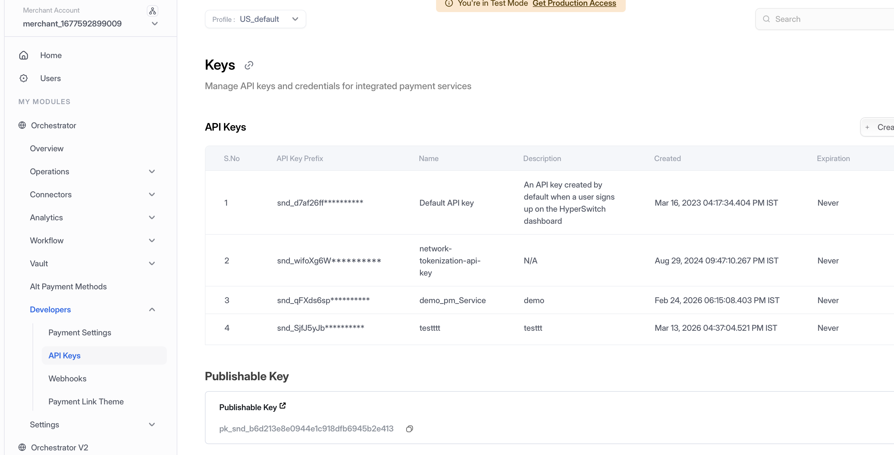
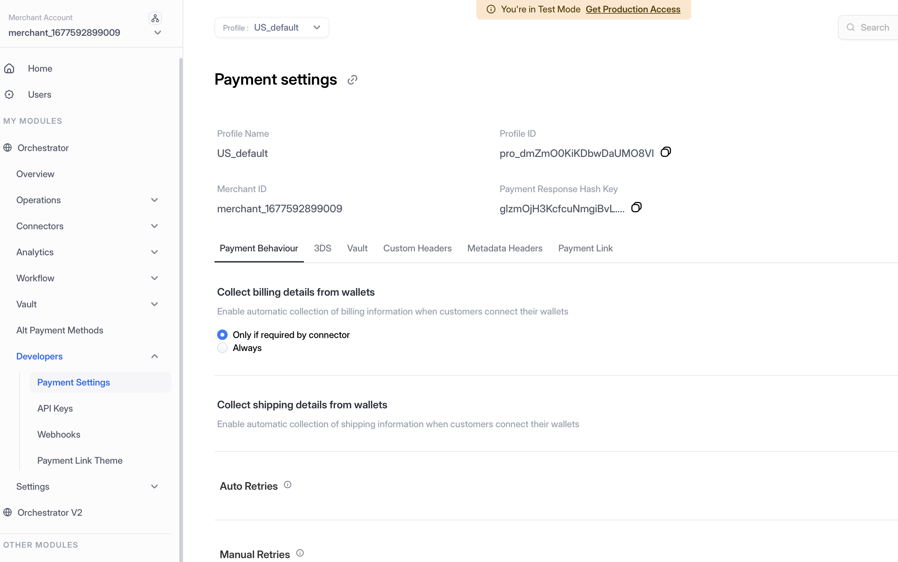
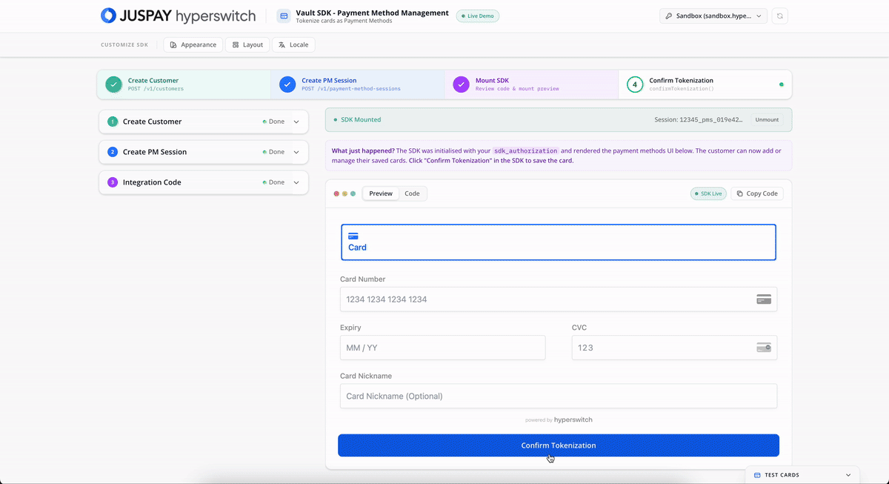

# SDK

The Juspay Hyperswitch Vault SDK provides a secure, PCI-compliant iframe for merchants to collect, store, and manage customer payment methods - without raw card data ever touching your servers.

## What the Widget Does

The `PaymentMethodsManagementElement` / `paymentMethodsManagement` widget embeds a secure iframe that lets customers:

* **View** all saved payment methods
* **Add** a new card (captured and tokenized without touching your servers)
* **Delete** an existing saved payment method

After a successful `confirmTokenization()`, you receive a `payment_method_id` that can be reused in future [Vault-Then-Pay](../../payment-suite/payment-method-card/) flows - no need to re-collect card details.

***

## Key Benefits

* **Minimal PCI scope** - Card data is captured inside a Hyperswitch-hosted iframe; your servers only ever see tokens.
* **Pre-built Payment Methods Management UI** - Customers can view, add, and delete saved cards through the embedded widget.
* **One-click repeat purchases** - Reuse a `payment_method_id` for future payments without re-collecting card details.
* **Customizable appearance** - Theme the widget to match your brand.

***

## Before You Start

To integrate with the Hyperswitch Vault, configure your API credentials and profile settings first.

### Step 1: Generate API Key

1. **Access Dashboard** - Log into the Hyperswitch Control Centre.
2. **Navigate to API Keys** - In the left-hand navigation menu, select **Developers > API Keys**.
3. **Create Key** - Click **Create New API Key**.
4. **Secure Storage** - Copy the generated key immediately and store it securely (it will not be shown again). Use this key in the `Authorization: api-key=<YOUR_VAULT_API_KEY>` header for all Vault API calls.

<figure><figcaption><p>Navigate to Developers > API Keys to create and manage your API credentials</p></figcaption></figure>

### Step 2: Access Profile ID

1. **Navigate to Payment Settings** - In the left-hand navigation menu, select **Developers > Payment Settings**.
2. **Copy Profile ID** - Locate and copy your **Profile ID** from the Payment Settings page. This ID is required for API calls that specify which merchant profile to use.

<figure><figcaption><p>Navigate to Developers > Payment Settings to access your Profile ID</p></figcaption></figure>

***

## Step 1 - Server-Side Setup: Create a Payment Method Session Endpoint

Your backend creates a payment method session and returns the `sdkAuthorization` to your frontend. The client uses this token to initialize the SDK.


Never expose your Vault API Key to your client application.


```javascript
const app = express();

app.post("/create-payment-method-session", async (req, res) => {
  try {
    const response = await fetch(
      `${HYPERSWITCH_SERVER_URL}/v1/payment-method-sessions`,
      {
        method: "POST",
        headers: {
          "Content-Type": "application/json",
          "x-profile-id": YOUR_PROFILE_ID,
          Authorization: `api-key=${YOUR_VAULT_API_KEY}`,
        },
        body: JSON.stringify(req.body),
      }
    );
    const data = await response.json();

    if (!response.ok) {
      console.error("Hyperswitch API Error:", data);
      return res.status(response.status).json({
        error: data.error || "Failed to create payment method session",
      });
    }

    res.json({
      sdkAuthorization: data.sdk_authorization,
    });
  } catch (error) {
    console.error("Server Error:", error);
    res.status(500).json({ error: "Internal server error", message: error.message });
  }
});
```


Replace `YOUR_PROFILE_ID` and `YOUR_VAULT_API_KEY` with your credentials. See [Vault Configuration](configuration.md).

Ensure that `customer_id` is included in the request body. Refer to the [API reference for customer creation](https://api-reference.hyperswitch.io/v2/customers/customers--create-v1) for details.


**API reference:** [Payment Method Session — Create](https://api-reference.hyperswitch.io/v2/payment-method-session/payment-method-session--create-v1)

***

## Step 2 - Client-Side Integration

Choose your frontend framework:



**React Integration**

**2.1 Install Libraries**

```bash
npm install @juspay-tech/hyper-js
npm install @juspay-tech/react-hyper-js
```

**2.2 Initialize HyperLoader**

Configure with your **publishable key** and **profile ID** (safe for frontend use):

```javascript
import { loadHyper } from "@juspay-tech/hyper-js";
import { HyperManagementElements } from "@juspay-tech/react-hyper-js";

const hyperPromise = loadHyper({
  publishableKey: "YOUR_PUBLISHABLE_KEY",
  profileId: "YOUR_PROFILE_ID",
});
```

**2.3 Fetch Session Details**

```javascript
const [sdkAuthorization, setSdkAuthorization] = useState(null);

useEffect(() => {
  fetch("/create-payment-method-session", {
    method: "POST",
    headers: { "Content-Type": "application/json" },
    body: JSON.stringify({ customer_id: "YOUR_CUSTOMER_ID" }),
  })
    .then((res) => res.json())
    .then((data) => {
      setSdkAuthorization(data.sdkAuthorization);
    });
}, []);
```

**2.4 Mount the HyperManagementElements Component**

```javascript
const options = {
  sdkAuthorization: sdkAuthorization,
};

return (
  <div className="App">
    {sdkAuthorization && hyperPromise && (
      <HyperManagementElements options={options} hyper={hyperPromise}>
        <PaymentMethodsManagementElementForm />
      </HyperManagementElements>
    )}
  </div>
);
```

**2.5 Access Hyper Hooks in the Child Component**

```javascript
import { useHyper, useWidgets } from "@juspay-tech/react-hyper-js";

const hyper = useHyper();
const widgets = useWidgets();
```

**2.6 Render the Payment Methods Management Element**

```javascript
import { PaymentMethodsManagementElement } from "@juspay-tech/react-hyper-js";

const PaymentMethodsManagementElementForm = () => (
  <div>
    <h2>Your Saved Payment Methods</h2>
    <PaymentMethodsManagementElement id="payment-methods-management-element" />
  </div>
);
```

**2.7 Confirm Tokenization**

Call `confirmTokenization()` when the user submits. Hyper handles any required 3DS redirect and returns the user to `return_url`.

<pre class="language-javascript"><code class="lang-javascript">const handleSubmit = async (e) => {
  e.preventDefault();
  if (!hyper || !elements || isProcessing) return;

  setIsProcessing(true);
  setMessage(null);

  try {
    const response = await hyper.confirmTokenization({
      elements,
      confirmParams: {
        return_url: window.location.origin + "/complete",
      },
      redirect: "if_required", // or "always"
    });

    if (response?.id) {
<strong>      handleTokenRetrieval(response); // tokenization succeeded
</strong>    } else {
      const error = response?.error;
      setMessage(error?.message || "An unexpected error occurred.");
    }
  } catch (err) {
    setMessage(err.message || "An unexpected error occurred.");
  } finally {
    setIsProcessing(false);
  }
};
</code></pre>



**JavaScript Integration**

**2.1 Define the HTML Placeholder**

```html
<form id="payment-methods-management-form">
  <div id="payment-methods-management-elements">
    <!-- HyperLoader injects the Payment Methods Management SDK -->
  </div>
  <button id="submit">Save Payment Method</button>
  <div id="error-message"></div>
</form>
```

**2.2 Load HyperLoader.js, Fetch Session, and Mount the Widget**

```javascript
async function initialize() {
  // Step 1: Fetch session from your server
  const response = await fetch("/create-payment-method-session", {
    method: "POST",
    headers: { "Content-Type": "application/json" },
    body: JSON.stringify({ customer_id: "YOUR_CUSTOMER_ID" }),
  });
  const { sdkAuthorization } = await response.json();

  // Step 2: Load HyperLoader.js
  const script = document.createElement("script");
  script.type = "text/javascript";
  script.src = "https://beta.hyperswitch.io/v1/HyperLoader.js";

  let hyper;
  let paymentMethodsManagementElements;

  script.onload = () => {
    // Step 3: Initialize Hyper
    hyper = window.Hyper({
      publishableKey: "YOUR_PUBLISHABLE_KEY",
      profileId: "YOUR_PROFILE_ID",
    });

    // Step 4: Configure appearance (optional)
    const appearance = { theme: "default" };

    // Step 5: Create the elements group
    paymentMethodsManagementElements = hyper.paymentMethodsManagementElements({
      appearance,
      sdkAuthorization: sdkAuthorization,
    });

    // Step 6: Mount the widget
    const paymentMethodsManagement = paymentMethodsManagementElements.create(
      "paymentMethodsManagement"
    );
    paymentMethodsManagement.mount("#payment-methods-management-elements");
  };

  document.body.appendChild(script);

  // Step 7: Handle form submission
  document
    .getElementById("payment-methods-management-form")
    .addEventListener("submit", async (e) => {
      e.preventDefault();
      if (!hyper || !paymentMethodsManagementElements) return;

      const result = await hyper.confirmTokenization({
        paymentMethodsManagementElements,
        confirmParams: {
          return_url: "https://example.com/complete",
        },
        redirect: "if_required",
      });

      if (result?.id) {
        handleTokenRetrieval(result);
      } else {
        const error = result?.error;
        document.getElementById("error-message").textContent =
          error?.message || "An unexpected error occurred.";
      }
    });
}

initialize();
```



***

## See It in Action

### First-Time User: Saving a New Card

A new customer enters their card details inside the secure iframe. The card is tokenized and vaulted - your servers never see the raw number.

<figure><figcaption><p>New customer adding and vaulting a card through the Vault SDK widget</p></figcaption></figure>

***

### Returning User: Viewing Saved Cards

A returning customer opens the widget and instantly sees all their previously vaulted cards - no need to re-enter any details.

<figure><figcaption><p>Returning customer viewing their vaulted cards in the widget</p></figcaption></figure>

***

### Managing Saved Cards: Delete and Update

Customers can view all their saved cards, remove ones they no longer need, and update existing card details - all from within the widget.

<figure><figcaption><p>Deleting and updating saved cards through the Vault SDK widget</p></figcaption></figure>

***

### Customizing the SDK Appearance

The widget supports theming to match your brand - colors, fonts, and layout can all be configured via the customization options.

<figure><figcaption><p>Theming the Vault SDK widget to match your brand</p></figcaption></figure>
