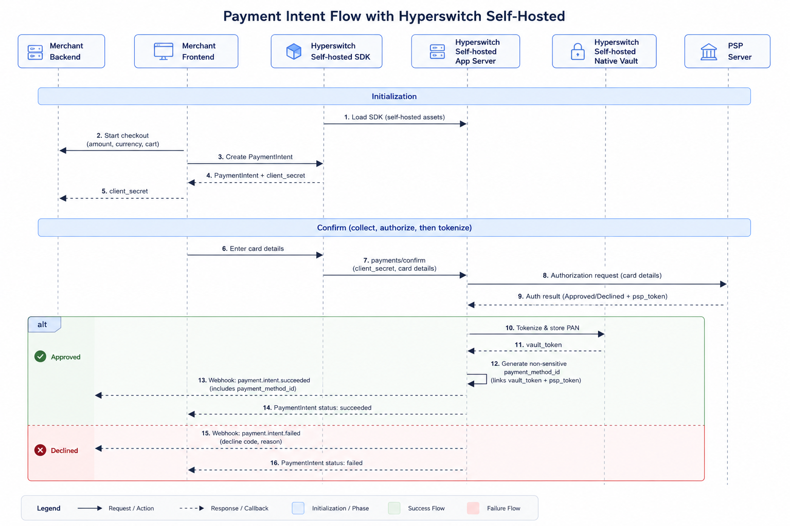

# Self-hosted & In-house PCI

In this deployment, merchants self-host Juspay Hyperswitch and also manage their own PCI DSS compliance.

All card storage and tokenization are handled through the native Hyperswitch Vault, which is deployed within the merchant's controlled environment.

This setup ensures full data ownership while leveraging Hyperswitch's built-in PCI-compliant vault stack.

### Key Highlights

* Native Hyperswitch Vault runs within the merchant's infrastructure.
* Merchant is fully responsible for PCI DSS certification and data handling.
* Enables seamless use of Network Tokenization, Volatile Tokenization, and Guest Checkout Tokenization.
* Ideal for highly regulated merchants (e.g., banks, payment institutions) that prefer on-prem control.

### Self-hosted orchestration - Payments and vaulting flow

<figure><figcaption></figcaption></figure>

The sequence diagram above outlines how a self-hosted merchant performs payments and vaulting.

#### **New user payments flow**

1. For self-hosting the Hyperswitch orchestration stack including vault follow the [self-hosting guide](/broken/pages/MfcX0idtB0lW4e2LNv0p)
2. Load the Hyperswitch SDK. The end-user enters their payment credentials for the selected payment option
3. The [Payments Create API request ](https://api-reference.hyperswitch.io/v1/payments/payments--create)containing the payment method is sent to the PSP from Hyperswitch (self-hosted endpoint)
4. Once the PSP responds with the outcome `approved` or `declined` along with the PSP token, Hyperswitch then proceeds to store and tokenize the card.
5. The card is stored in Hyperswitch vault and a `payment_method_id` is generated. A `payment_method_id` is a versatile token and connects a lot of entities together

Once the `payment_method_id` is generated, it serves as a reusable token. The business can pass this ID into the /payments API to execute any supported [Payment](https://docs.hyperswitch.io/~/revisions/Moc8cqgBbfb8T8KrBi8V/about-hyperswitch/payment-suite-1/payments-cards) functionality without re-collecting sensitive data.

The `payment_method_id` serves as a unique identifier mapped to a specific combination of a Customer ID and a unique Payment Instrument (e.g., a specific credit card, digital wallet, or bank account).

* Logic: A single customer can have multiple payment methods, each assigned a distinct ID. However, the same payment instrument used by the same customer will always resolve to the same `payment_method_id`.
* Scope: This uniqueness applies across all payment types, including cards, wallets, and bank details.

| **Customer ID** | **Payment Instrument**            | **Payment Method ID** |
| --------------- | --------------------------------- | --------------------- |
| 123             | Visa ending in 4242               | `PM1`                 |
| 123             | Mastercard ending in 1111         | `PM2`                 |
| 456             | Visa ending in 4242               | `PM3`                 |
| 123             | PayPal Account (`user@email.com`) | `PM4`                 |

6. This `payment_method_id` is returned to the merchant via webhooks

#### **Repeat user payments flow**

1. In a repeat-user payment, the Hyperswitch SDK will load the stored payment methods of the customer based the `customer_id` sent as part of the [Payments Create API request ](https://api-reference.hyperswitch.io/v1/payments/payments--create).
2. The end-user can select the desired payment option and add their `CVV`
3. The SDK sends the [Payment Confirm API request](https://api-reference.hyperswitch.io/v1/payments/payments--confirm) when the user hits `Pay`
4. The Hyperswitch backend resolves the `payment_method_id` to identify available payment credentials - card, PSP token, network token and more
5. It sends payload with appropriate credentials to the payment provider or PSP downstream based on the merchant configurations

#### **Merchant Initiated Transaction (MIT) flow**

1. The merchant can perform the [MIT or Recurring transactions](../../payment-suite/payments/recurring-payments.md) using `payment_method_id`

---

### Configuration Setup

To integrate with the Hyperswitch Vault, you'll need to configure your API credentials and profile settings.

#### **Step 1: Generate API Key**

1. **Access Dashboard** — Log into the Hyperswitch Control Centre.
2. **Navigate to API Keys** — In the left-hand navigation menu, select **Developers > API Keys**.
3. **Create Key** — Click **Create New API Key**.
4. **Secure Storage** — Copy the generated key immediately and store it securely (it will not be shown again). Use this key in the `Authorization: api-key=<YOUR_VAULT_API_KEY>` header for all Vault API calls.

<figure><figcaption>
Navigate to Developers > API Keys to create and manage your API credentials
</figcaption></figure>

#### **Step 2: Access Profile ID**

1. **Navigate to Payment Settings** — In the left-hand navigation menu, select **Developers > Payment Settings**.
2. **Copy Profile ID** — Locate and copy your **Profile ID** from the Payment Settings page. This ID is required for API calls that need to specify which merchant profile to use.

<figure><figcaption>
Navigate to Developers > Payment Settings to access your Profile ID
</figcaption></figure>
