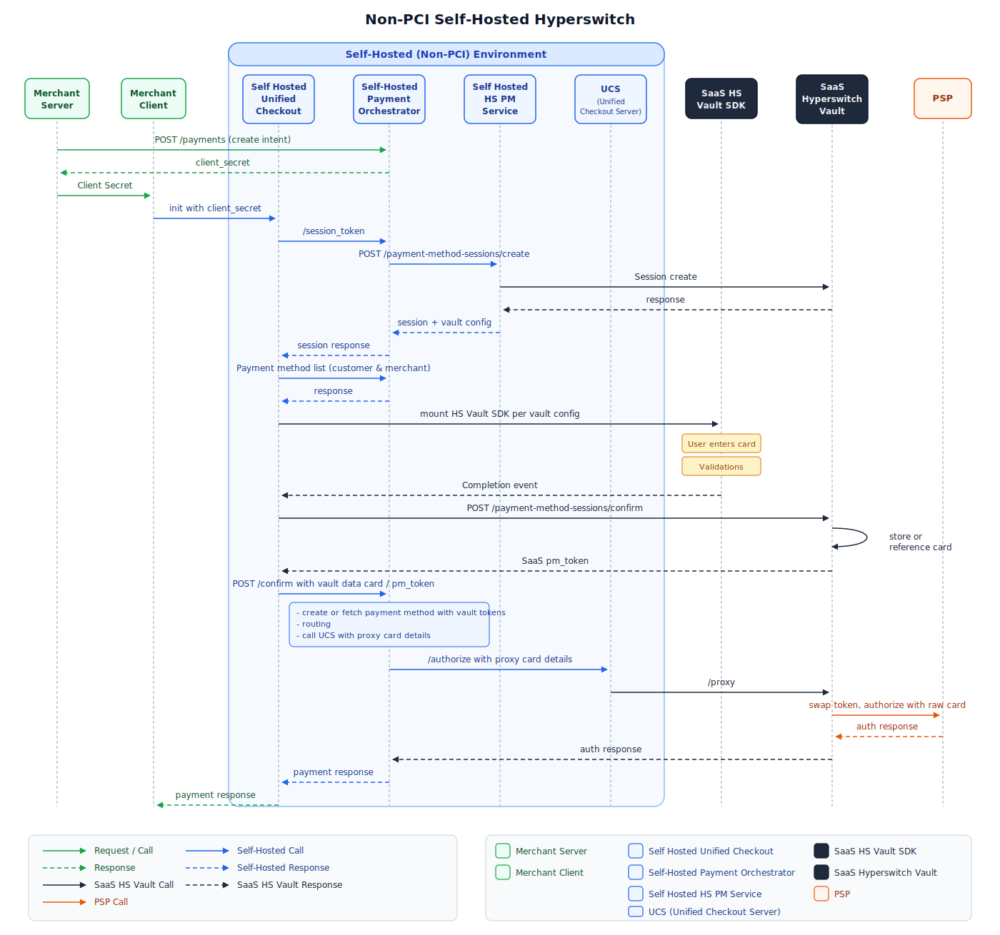

# Self-Hosted Payment Orchestrator with SaaS Hyperswitch Vault

> **Deployment Model:** Merchant self-hosts Hyperswitch Payment Orchestration Layer
>
> **PCI Scope:** Managed by SaaS Hyperswitch Vault

## Overview

In this deployment model, merchants **self-host** the Juspay Hyperswitch orchestration layer on their own infrastructure while using **SaaS Hyperswitch Vault** for all PCI DSS responsibilities. Sensitive cardholder data (PAN, CVV, expiry) is stored and managed by Hyperswitch's PCI-compliant SaaS Vault, never touching the merchant's servers.

This architecture gives merchants full control over orchestration logic, routing rules, and business configurations while completely eliminating the burden of achieving and maintaining PCI DSS Level 1 compliance in-house.

## Why This Model?

<table><thead><tr><th width="204.40625">Concern</th><th>How It's Addressed</th></tr></thead><tbody><tr><td><strong>PCI Compliance</strong></td><td>Fully managed by SaaS Hyperswitch Vault</td></tr><tr><td><strong>Hosting Independence</strong></td><td>Merchant retains complete control of the Hyperswitch orchestration deployment</td></tr><tr><td><strong>Sensitive Data Exposure</strong></td><td>Raw card data never enters the merchant's environment</td></tr><tr><td><strong>Token Portability</strong></td><td><code>payment_method_id</code> unifies <code>vault_token</code> + <code>psp_token</code> + <code>customer_id</code> for cross-platform use</td></tr><tr><td><strong>Operational Simplicity</strong></td><td>No need to manage HSMs, key rotation, or cardholder data environments</td></tr><tr><td><strong>Network Tokenization</strong></td><td>Automatic provisioning and lifecycle management of network tokens</td></tr></tbody></table>

## Key Benefits

- **Zero PCI Scope for Orchestration**: Your self-hosted orchestration layer operates completely outside PCI scope
- **Full Orchestration Control**: Customize routing rules, retry logic, and payment workflows
- **Managed Vault Infrastructure**: Hyperswitch handles vault scaling, security, and compliance
- **Seamless Integration**: Simple API integration between your orchestration layer and SaaS Vault
- **Cost-Effective**: Avoid infrastructure costs for PCI-compliant vault hosting

## Integration Steps

### SDK Integration

The merchant loads the **Hyperswitch Unified Checkout SDK**, which embeds the **SaaS Hyperswitch Vault SDK** to collect card information for tokenization via SaaS Hyperswitch Vault.

<strong>New User Payment Flow</strong>

1. The merchant loads the [Hyperswitch Payments SDK](../../payment-experience/payment/) via a [Payments Create API](https://api-reference.hyperswitch.io/v1/payments/payments--create) request from their self-hosted Hyperswitch backend which embeds SaaS Hyperswitch Vault SDK.
2. The end user enters their card details directly into the Hyperswitch Vault SDK's secure fields.
3. The SDK tokenizes the card via SaaS Hyperswitch Vault and returns a `payment_method_id` along with card metadata (last four digits, card brand, expiry).
4. The SDK sends a [Payment Confirm API](https://api-reference.hyperswitch.io/v1/payments/payments--confirm) request to the self-hosted Hyperswitch backend.
5. The self-hosted Hyperswitch backend processes the payment using the `payment_method_id` and sends the transaction to the PSP via [SaaS Hyperswitch Vault Proxy](hyperswitch-vault-pass-through-proxy-payments.md).
6. The PSP responds with `approved` or `declined` and sends back PSP token if `setup_future_usage` is `off_session`.

<strong>Repeat User Payment Flow</strong>

1. The Hyperswitch SDK loads stored payment methods using the `customer_id` from the [Payments Create API](https://api-reference.hyperswitch.io/v1/payments/payments--create) request.
2. The end user selects a saved card and optionally enters CVV.
3. The SDK sends a [Payment Confirm API](https://api-reference.hyperswitch.io/v1/payments/payments--confirm) request with the `payment_method_id`.
4. The self-hosted Hyperswitch backend resolves the `payment_method_id` to identify the associated SaaS Hyperswitch Vault Token.
5. The payment is processed by sending the transaction to the corresponding PSP via [SaaS Vault Proxy](hyperswitch-vault-pass-through-proxy-payments.md).

<strong>Merchant-Initiated Transaction (MIT) Flow</strong>

1. The merchant triggers an [MIT or Recurring transaction](../../payment-suite/payments/recurring-payments.md) using the `payment_method_id`.
2. The self-hosted Hyperswitch backend resolves the `payment_method_id` to identify the associated `psp_token`.
3. The payment is processed by sending the transaction to the corresponding PSP as a MIT.

<figure><figcaption>
Payment flow showing self-hosted orchestration layer with SaaS Hyperswitch Vault
</figcaption></figure>

## Configuration

### Step 1: Generate API Key

1. **Access Dashboard** — Log into the [Hyperswitch Control Centre](https://app.hyperswitch.io/dashboard/login).
2. **Navigate to API Keys** — In the left-hand navigation menu, select **Developers > API Keys**.
3. **Create Key** — Click **Create New API Key**.
4. **Secure Storage** — Copy the generated key immediately and store it securely (it will not be shown again).

<figure><figcaption>
Navigate to Developers > API Keys to create and manage your API credentials
</figcaption></figure>

### Step 2: Access Profile ID

1. **Navigate to Payment Settings** — In the left-hand navigation menu, select **Developers > Payment Settings**.
2. **Copy Profile ID** — Locate and copy your **Profile ID** from the Payment Settings page.

<figure><figcaption>
Navigate to Developers > Payment Settings to access your Profile ID
</figcaption></figure>

### Step 3: Enable Vault Connector

1. **Navigate to Connectors** — In the left-hand navigation menu, select **Connectors**.
2. **Add Vault Connector** — Search for **Hyperswitch Vault** and click **Connect**.
3. **Configure Credentials** — Enter your API Key and Profile ID.
4. **Enable Connector** — Toggle the connector to **Enabled** status.

<figure><figcaption>
Configure and enable the Hyperswitch Vault connector
</figcaption></figure>

<figure><figcaption>
Enter your API credentials to connect to SaaS Hyperswitch Vault
</figcaption></figure>

### Step 4: Configure Self-Hosted Backend

Configure your self-hosted Hyperswitch backend to connect to the SaaS Hyperswitch Vault:

1. Set the vault endpoint in your Hyperswitch configuration to point to `https://api.hyperswitch.io`
2. Configure your API key and Profile ID in the orchestration layer
3. Test the connection by creating a test payment method token

For detailed self-hosting setup instructions, refer to the [Self-Hosting Guide](../../../self-hosting-space/hyperswitch-open-source/).

## Key Concepts

### `payment_method_id`

A **universal, portable token** generated by Hyperswitch that serves as the single reference for a stored payment method. It connects:

| Entity        | Description                                                         |
| ------------- | ------------------------------------------------------------------- |
| `customer_id` | The Hyperswitch customer identifier                                 |
| `vault_token` | The token issued by SaaS Hyperswitch Vault representing the stored card |
| `psp_token`   | The token issued by the PSP after a successful transaction          |

This abstraction allows merchants to:

- Switch PSPs without re-collecting card data
- Use a single identifier across all payment flows (first-time, repeat, MIT/recurring)
- Maintain data portability across different deployment models

## Comparison: Self-Hosted Orchestration Models

<table><thead><tr><th width="138.015625">Feature</th><th>Self-Hosted + Self-Hosted Vault</th><th>Self-Hosted + SaaS Vault (This Model)</th><th>Self-Hosted + Third-Party Vault</th></tr></thead><tbody><tr><td><strong>Orchestration Hosting</strong></td><td>Merchant</td><td>Merchant</td><td>Merchant</td></tr><tr><td><strong>Vault Hosting</strong></td><td>Merchant</td><td>Hyperswitch SaaS</td><td>Third-Party (VGS, TokenEx)</td></tr><tr><td><strong>PCI Scope</strong></td><td>Merchant (Level 1)</td><td>Hyperswitch</td><td>Third-Party Provider</td></tr><tr><td><strong>Infrastructure Cost</strong></td><td>High</td><td>Medium</td><td>Medium-High</td></tr><tr><td><strong>Orchestration Control</strong></td><td>Full</td><td>Full</td><td>Full</td></tr><tr><td><strong>Setup Complexity</strong></td><td>High</td><td>Low</td><td>Medium</td></tr><tr><td><strong>Network Tokenization</strong></td><td>Manual Setup</td><td>Automatic</td><td>Depends on Provider</td></tr></tbody></table>

## Security Considerations

- **TLS Everywhere**: All communication between your orchestration layer and SaaS Vault uses TLS 1.2+
- **API Key Security**: Store API keys securely using environment variables or secrets management
- **Network Isolation**: Consider using VPC peering or private endpoints for enhanced security
- **Webhook Verification**: Always verify webhook signatures for `payment_method_id` callbacks
- **Regular Updates**: Keep your self-hosted orchestration layer updated with the latest Hyperswitch releases

## Use Cases

This deployment model is ideal for:

- **Mid-Size Businesses**: Companies wanting orchestration control without PCI burden
- **Multi-Region Operations**: Organizations needing regional orchestration with centralized vault
- **Custom Payment Logic**: Businesses with complex routing and retry requirements
- **Compliance-Conscious Teams**: Organizations wanting to minimize PCI scope while maintaining control

## Next Steps

1. [Set up your self-hosted Hyperswitch orchestration](../../../self-hosting-space/hyperswitch-open-source/)
2. [Configure vault integration](configuration.md) with SaaS Hyperswitch Vault
3. [Integrate the Hyperswitch SDK](../../payment-experience/payment/) for payment collection
4. [Set up webhooks](../../webhooks.md) for payment notifications

## Related Documentation

- [Self-Hosting Guide](../../../self-hosting-space/hyperswitch-open-source/)
- [Vault SDK Integration](sdk-integration.md)
- [Server-to-Server Tokenization](server-to-server-vault-tokenization.md)
- [Recurring Payments](../../payment-suite/payments/recurring-payments.md)
