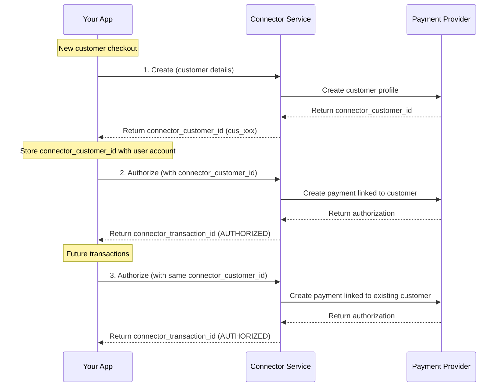
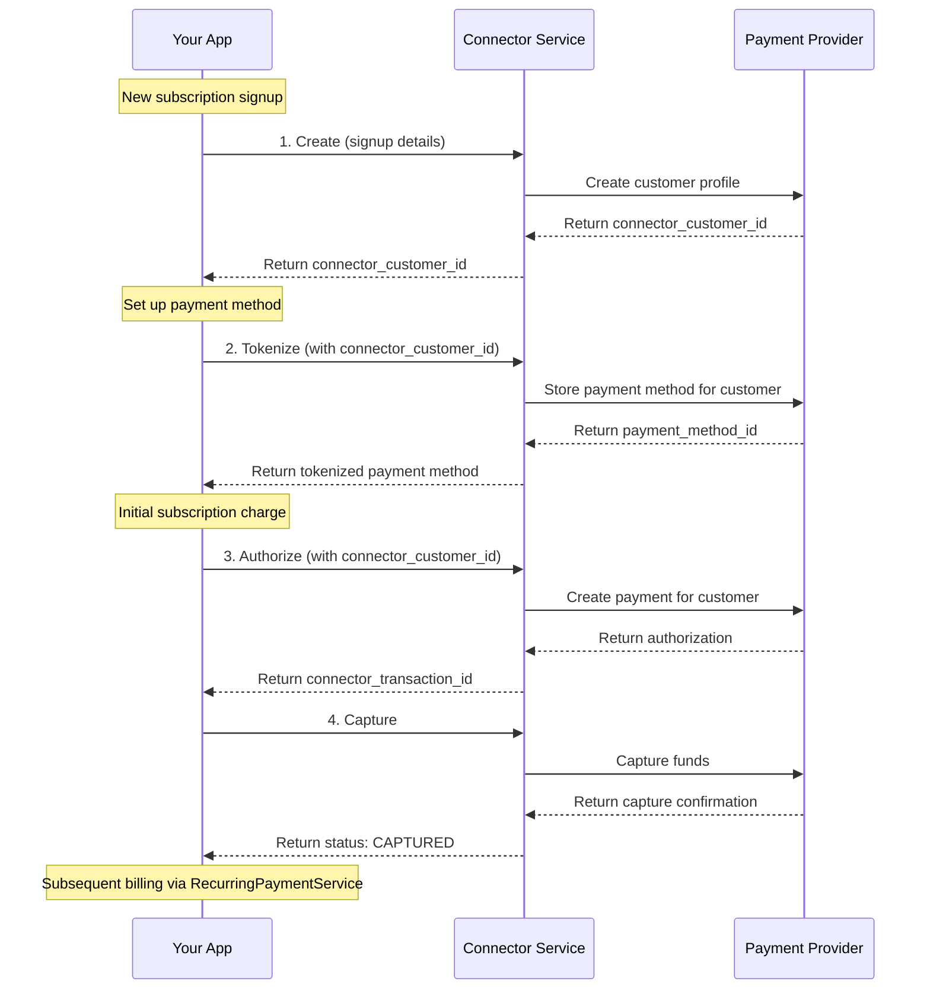

# Customer Service

<!--
---
title: Customer Service
description: Create and manage customer profiles for streamlined payment operations and improved authorization rates
last_updated: 2026-03-05
generated_from: crates/types-traits/grpc-api-types/proto/services.proto
auto_generated: false
reviewed_by: engineering
reviewed_at: 2026-03-05
approved: true
---
-->

## Overview

The Customer Service enables you to create and manage customer profiles at payment processors. Storing customer details with connectors streamlines future transactions, reduces checkout friction, and improves authorization rates by maintaining a consistent identity across multiple payments.

**Business Use Cases:**
- **E-commerce accounts** - Save customer profiles for faster checkout on return visits
- **SaaS platforms** - Associate customers with subscription payments and billing histories
- **Recurring billing** - Link customers to stored payment methods for automated billing
- **Fraud prevention** - Consistent customer identity improves risk scoring accuracy

The service creates customer records at the underlying payment processor (Stripe, Adyen, etc.), allowing you to reference the same customer across multiple transactions without resending personal information.

## Operations

| Operation | Description | Use When |
|-----------|-------------|----------|
| [`Create`](./create.md) | Create customer record in the payment processor system. Stores customer details for future payment operations without re-sending personal information. | First-time customer checkout, account registration, subscription signup |

## Common Patterns

### New Customer Checkout Flow

Create a customer profile during first-time checkout, then use the customer ID for future payments and payment method storage.

**Flow Explanation:**

1. **Create customer** - Send customer details (name, email, phone) to the Customer Service. The connector creates a profile at the payment processor and returns a `connector_customer_id` (e.g., Stripe's `cus_xxx`). Store this ID in your user database for future reference.

2. **Authorize payment** - When the customer makes a payment, call the Payment Service's `Authorize` RPC with the `connector_customer_id`. This reserves funds on the customer's payment method and links the transaction to their profile. The response includes a `connector_transaction_id` and status `AUTHORIZED`.

3. **Future transactions** - For subsequent payments, reuse the same `connector_customer_id`. The payment processor recognizes the returning customer, which improves authorization rates and enables features like saved payment methods.

**Benefits:**
- Streamlined checkout for returning customers
- Better authorization rates through customer history
- Simplified payment method management
- Unified customer view across payment processors

---

### SaaS Subscription Onboarding

Create customer during signup, then use the stored customer ID for initial subscription charge and recurring payments.

**Flow Explanation:**

1. **Create customer** - During signup, send customer details to Customer Service. The payment processor creates a customer profile and returns a `connector_customer_id`. This links all future transactions to this customer.

2. **Tokenize payment method** - Collect the customer's payment details and call Payment Method Service's `Tokenize` RPC with the `connector_customer_id`. The connector securely stores the payment method and returns a token that can be used for future charges without handling raw card data.

3. **Authorize payment** - For the initial subscription charge, call Payment Service's `Authorize` RPC with both the `connector_customer_id` and the tokenized payment method. This reserves the funds on the customer's card.

4. **Capture payment** - Once the authorization is confirmed, call the Payment Service's `Capture` RPC to finalize the charge and transfer funds. The status changes from `AUTHORIZED` to `CAPTURED`.

5. **Subsequent billing** - For future billing cycles, use the Recurring Payment Service's `Charge` RPC with the stored `connector_customer_id` and payment method token to process payments without customer interaction.

---

## Next Steps

- [Payment Service](../payment-service/README.md) - Process payments linked to customers
- [Payment Method Service](../payment-method-service/README.md) - Store and manage customer payment methods
- [Recurring Payment Service](../recurring-payment-service/README.md) - Set up recurring billing for customers
