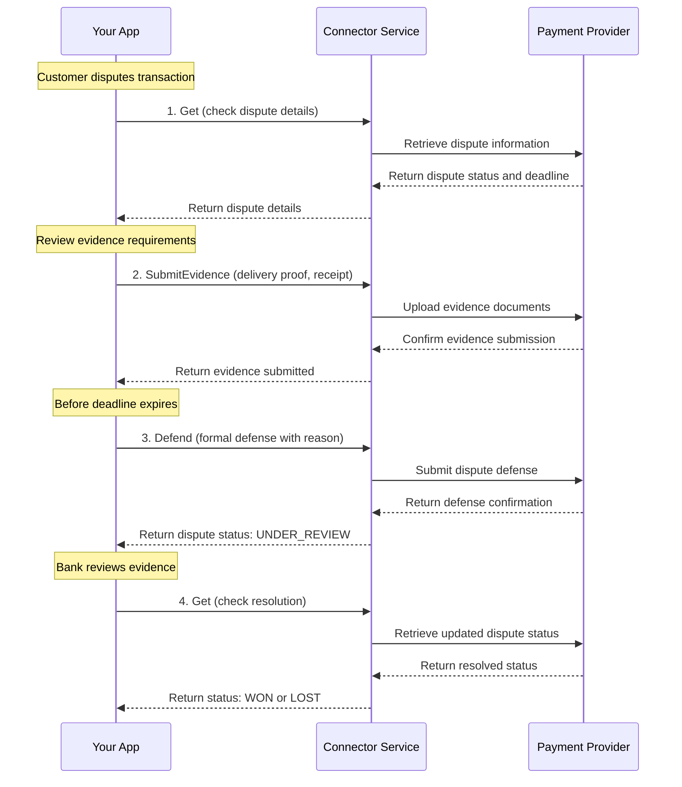
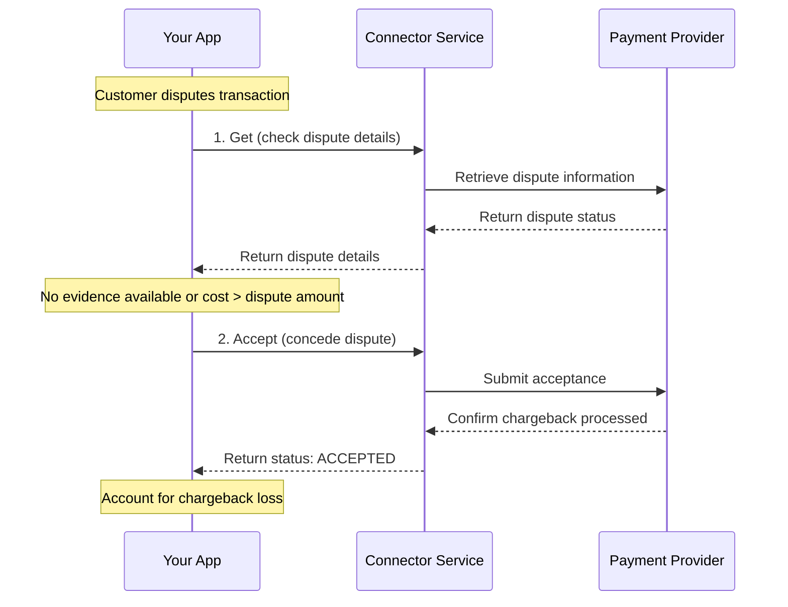

# Dispute Service

<!--
---
title: Dispute Service
description: Manage chargeback lifecycle, evidence submission, and defense against fraudulent transaction claims
last_updated: 2026-03-05
generated_from: crates/types-traits/grpc-api-types/proto/services.proto
auto_generated: false
reviewed_by: engineering
reviewed_at: 2026-03-05
approved: true
---
-->

## Overview

The Dispute Service helps you manage chargeback disputes across payment processors. When customers dispute transactions with their banks, this service enables you to track dispute status, submit evidence to defend against fraudulent claims, and make informed decisions about accepting or challenging disputes.

**Business Use Cases:**
- **E-commerce fraud defense** - Submit delivery proof and receipts to contest illegitimate chargebacks
- **Service businesses** - Provide service documentation and customer communication records
- **Subscription disputes** - Submit recurring transaction agreements and cancellation policies
- **Revenue recovery** - Defend valid transactions to minimize chargeback losses
- **Compliance management** - Meet card network deadlines for evidence submission

The service supports the full dispute lifecycle from initial notification through resolution, with structured evidence submission and status tracking.

## Operations

| Operation | Description | Use When |
|-----------|-------------|----------|
| [`SubmitEvidence`](./submit-evidence.md) | Upload evidence to dispute customer chargeback. Provides documentation like receipts and delivery proof to contest fraudulent transaction claims. | You have proof of delivery, service, or customer acceptance |
| [`Get`](./get.md) | Retrieve dispute status and evidence submission state. Tracks dispute progress through bank review process for informed decision-making. | Check dispute status, review evidence deadlines |
| [`Defend`](./defend.md) | Submit defense with reason code for dispute. Presents formal argument against customer's chargeback claim with supporting documentation. | Contesting the dispute with formal defense |
| [`Accept`](./accept.md) | Concede dispute and accepts chargeback loss. Acknowledges liability and stops dispute defense process when evidence is insufficient. | Evidence is insufficient, cost of defense exceeds dispute amount |

## Common Patterns

### E-commerce Chargeback Defense

Defend against fraudulent chargebacks by submitting delivery and purchase evidence.

**Flow Explanation:**

1. **Get dispute details** - When notified of a new dispute, call the `Get` RPC to retrieve dispute details including the reason code, amount, and evidence submission deadline. This helps you understand what evidence is needed and how much time you have.

2. **SubmitEvidence** - Gather and submit supporting documentation based on the dispute reason. For delivery disputes, submit shipping confirmation and tracking. For service disputes, submit service agreements and completion records. The connector uploads these to the payment processor's dispute system.

3. **Defend** - Before the evidence deadline, call the `Defend` RPC to formally contest the dispute with a reason code. This presents your case to the bank with the submitted evidence attached.

4. **Check resolution** - After submission, periodically call `Get` to check the dispute status. Banks typically take 60-75 days to review evidence and make a decision. The final status will be `WON` (funds returned) or `LOST` (chargeback stands).

---

### Accepting Disputes with Insufficient Evidence

When evidence is lacking, accept the dispute to avoid additional fees and focus on other priorities.

**Flow Explanation:**

1. **Get dispute details** - Retrieve dispute information to understand the claim amount and reason. Evaluate whether you have sufficient evidence to defend.

2. **Accept** - If evidence is insufficient, the dispute amount is small, or defense costs exceed potential recovery, call the `Accept` RPC to concede the dispute. This acknowledges liability and stops the defense process. The chargeback is processed and the funds are debited from your account.

**When to Accept:**
- No delivery confirmation available
- Customer complaint is valid
- Dispute amount is less than defense costs
- Evidence deadline has passed

---

## Next Steps

- [Payment Service](../payment-service/README.md) - Review original payment details
- [Refund Service](../refund-service/README.md) - Process voluntary refunds to avoid disputes
- [Event Service](../event-service/README.md) - Handle dispute webhook notifications
