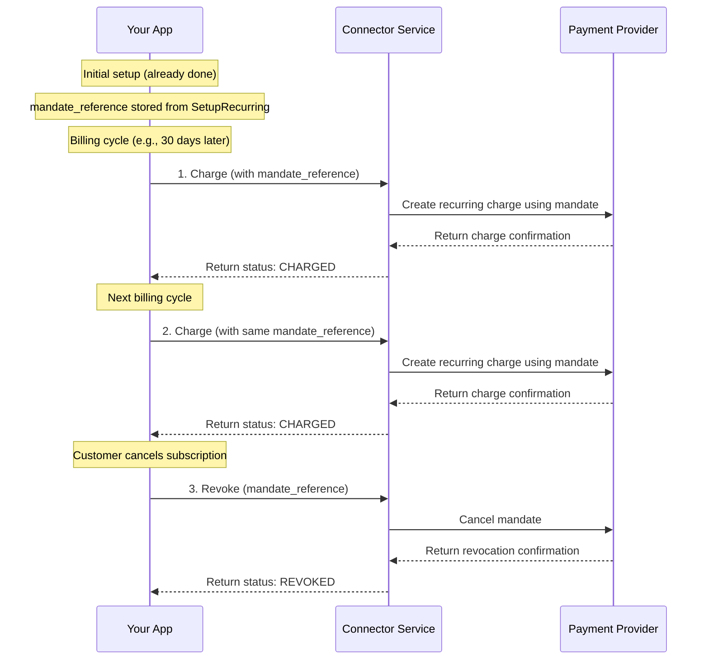
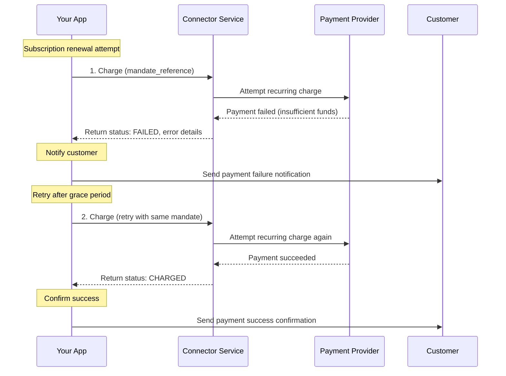
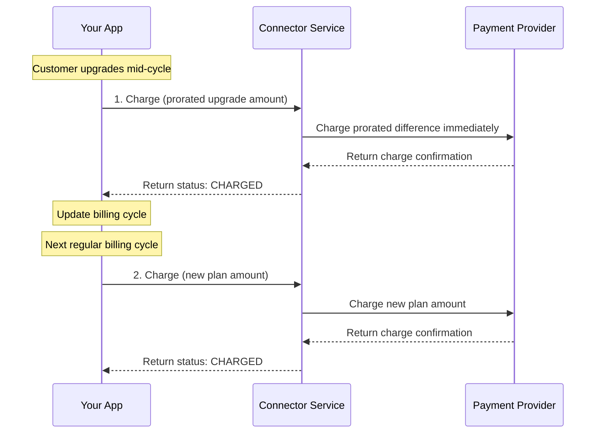

# Recurring Payment Service

<!--
---
title: Recurring Payment Service
description: Process subscription billing and manage recurring payment mandates for SaaS and recurring revenue businesses
last_updated: 2026-03-05
generated_from: crates/types-traits/grpc-api-types/proto/services.proto
auto_generated: false
reviewed_by: engineering
reviewed_at: 2026-03-05
approved: true
---
-->

## Overview

The Recurring Payment Service enables you to process subscription billing and manage recurring payment mandates. Once a customer has set up a mandate (through the Payment Service's `SetupRecurring`), this service handles subsequent charges without requiring customer interaction, making it ideal for SaaS subscriptions, membership fees, and automated billing scenarios.

**Business Use Cases:**
- **SaaS subscriptions** - Charge customers monthly/yearly for software subscriptions
- **Membership fees** - Process recurring membership dues for clubs and organizations
- **Utility billing** - Automate monthly utility and service bill payments
- **Installment payments** - Collect scheduled payments for large purchases over time
- **Donation subscriptions** - Process recurring charitable donations

The service manages the complete recurring payment lifecycle including charging existing mandates and revoking mandates when customers cancel their subscriptions.

## Operations

| Operation | Description | Use When |
|-----------|-------------|----------|
| [`Charge`](./charge.md) | Process a recurring payment using an existing mandate. Charges customer's stored payment method for subscription renewal without requiring their presence. | Subscription renewal, recurring billing cycle, automated payment collection |
| [`Revoke`](./revoke.md) | Cancel an existing recurring payment mandate. Stops future automatic charges when customers end their subscription or cancel service. | Subscription cancellation, customer churn, mandate revocation |

## Common Patterns

### SaaS Subscription Billing Cycle

Process monthly subscription renewals using stored mandates and payment methods.

**Flow Explanation:**

1. **Charge (recurring)** - When a subscription billing cycle triggers (e.g., 30 days after signup), call the `Charge` RPC with the stored `mandate_reference` from the initial `SetupRecurring`. The processor creates a charge using the saved payment method without requiring customer interaction.

2. **Subsequent charges** - For each subsequent billing cycle, repeat the `Charge` RPC call with the same `mandate_reference`. The processor handles the recurring charge using the stored payment credentials.

3. **Revoke on cancellation** - When a customer cancels their subscription, call the `Revoke` RPC with the `mandate_reference` to cancel the mandate. This stops all future automatic charges associated with that mandate.

**Benefits:**
- Fully automated billing without customer intervention
- Consistent cash flow from recurring revenue
- Reduced payment friction improves retention
- Compliance with stored credential protocols

---

### Failed Recurring Payment Recovery

Handle failed recurring payments with retry logic and customer notification.

**Flow Explanation:**

1. **Initial charge attempt** - Call the `Charge` RPC at the scheduled billing time. If the payment fails (e.g., insufficient funds, expired card), the response includes error details and FAILED status.

2. **Notify customer** - Send a notification to the customer informing them of the failed payment and requesting they update their payment method or ensure sufficient funds.

3. **Retry charge** - After a grace period (e.g., 3 days), call the `Charge` RPC again with the same `mandate_reference`. If the customer has resolved the issue (added funds, updated card), the charge succeeds.

4. **Confirm success** - Notify the customer that the payment succeeded and their subscription remains active.

**Retry Best Practices:**
- Implement exponential backoff between retries (1 day, 3 days, 7 days)
- Limit total retry attempts to avoid excessive failures
- Provide clear customer communication at each step
- Consider offering alternative payment methods after repeated failures

---

### Subscription Upgrade/Downgrade with Prorated Charges

Handle plan changes with prorated billing using incremental charges.

**Flow Explanation:**

1. **Prorated charge** - When a customer upgrades their plan mid-cycle, calculate the prorated difference and call the `Charge` RPC immediately with the `mandate_reference` to collect the upgrade fee.

2. **Regular billing** - At the next regular billing cycle, call the `Charge` RPC with the new plan amount. The mandate continues to work for the new amount.

**Benefits:**
- Immediate revenue capture for upgrades
- Seamless plan transitions for customers
- No need to create new mandates for plan changes

---

## Next Steps

- [Payment Service](../payment-service/README.md) - Set up initial mandates and process first payments
- [Payment Method Service](../payment-method-service/README.md) - Store payment methods for recurring use
- [Customer Service](../customer-service/README.md) - Manage customer profiles for subscriptions
