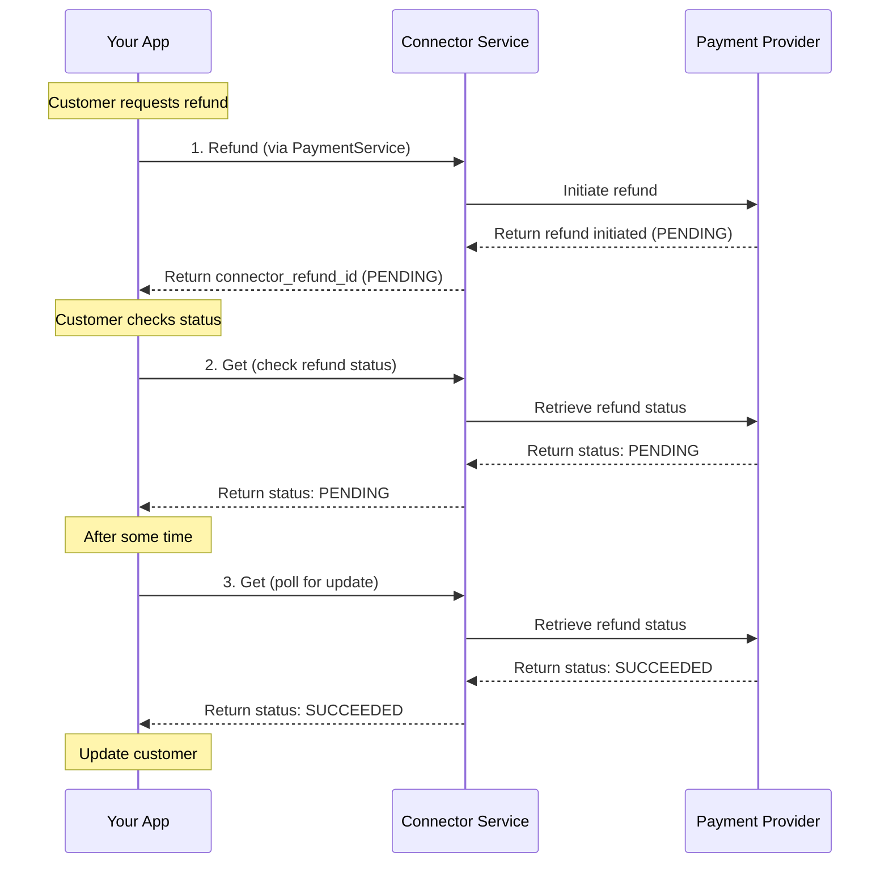
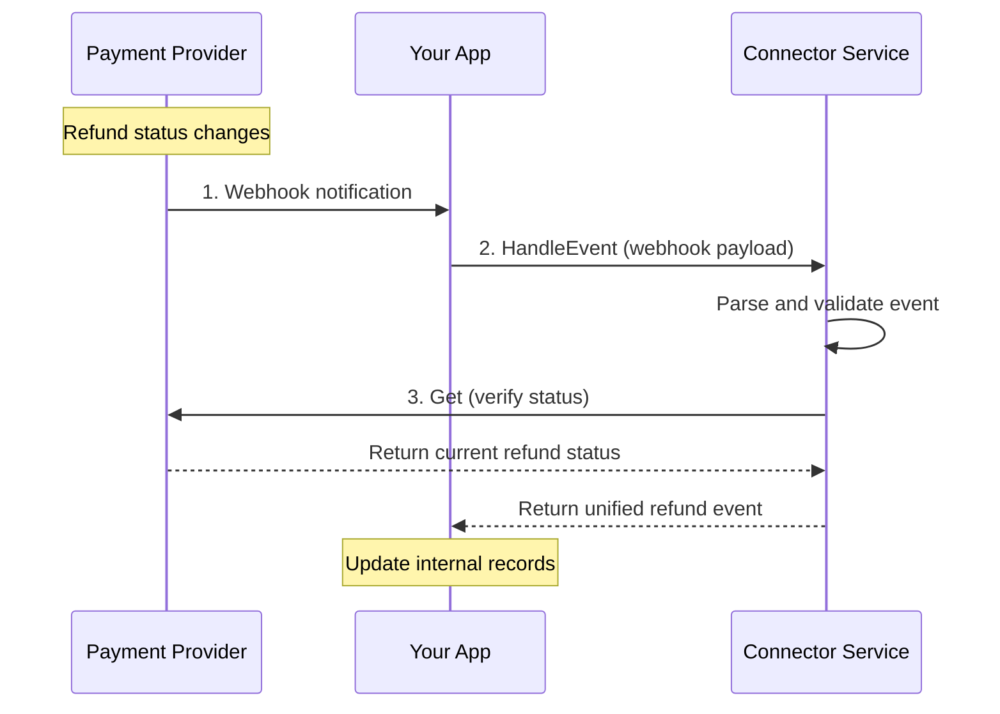
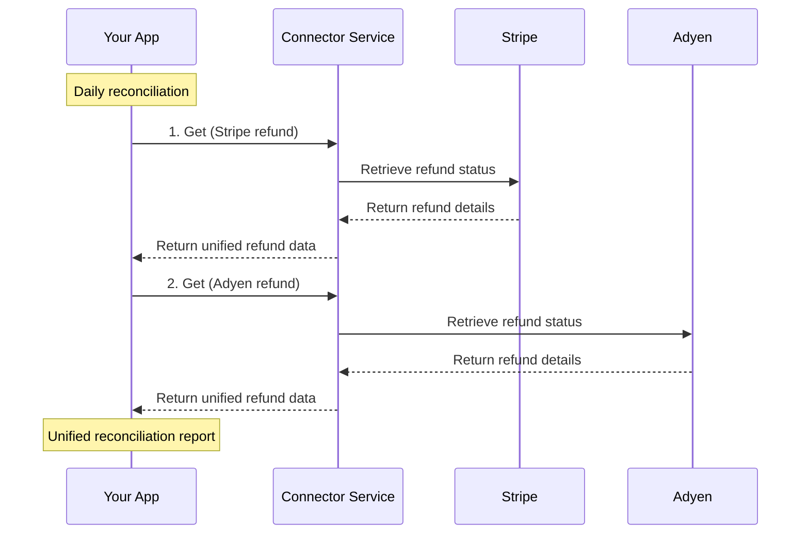

# Refund Service

<!--
---
title: Refund Service
description: Retrieve and synchronize refund statuses across payment processors for accurate customer communication
last_updated: 2026-03-05
generated_from: crates/types-traits/grpc-api-types/proto/services.proto
auto_generated: false
reviewed_by: engineering
reviewed_at: 2026-03-05
approved: true
---
-->

## Overview

The Refund Service helps you track and synchronize refund statuses across payment processors. While the Payment Service handles initiating refunds, this service provides dedicated operations for retrieving refund information and handling asynchronous refund events, ensuring accurate customer communication and financial reconciliation.

**Business Use Cases:**
- **Refund status tracking** - Check the current status of pending refunds to inform customers
- **Financial reconciliation** - Synchronize refund states with your internal accounting systems
- **Webhook processing** - Handle asynchronous refund notifications from payment processors
- **Customer service** - Provide accurate refund status information to support teams

The service complements the Payment Service's refund operations by providing status retrieval and event handling capabilities specifically focused on refund lifecycle management.

## Operations

| Operation | Description | Use When |
|-----------|-------------|----------|
| [`Get`](./get.md) | Retrieve refund status from the payment processor. Tracks refund progress through processor settlement for accurate customer communication. | Checking refund status, reconciling refund states, customer inquiries |

## Common Patterns

### Refund Status Tracking Flow

Monitor refund progress from initiation through completion to keep customers informed.

**Flow Explanation:**

1. **Initiate refund** - First, call the Payment Service's `Refund` RPC to initiate the refund. The payment processor returns a pending status and a `connector_refund_id` (e.g., Stripe's `re_xxx`).

2. **Check status** - When a customer inquires about their refund or your system needs to update status, call the Refund Service's `Get` RPC with the `connector_refund_id`. This retrieves the current status from the payment processor.

3. **Poll for updates** - For refunds that start as PENDING, periodically call `Get` to check for status updates. Refunds typically transition from PENDING to SUCCEEDED (or FAILED) within minutes to hours depending on the processor.

**Status Values:**
- `PENDING` - Refund is being processed by the payment processor
- `SUCCEEDED` - Refund has been completed and funds are being returned to the customer
- `FAILED` - Refund could not be processed (insufficient funds, transaction too old, etc.)

---

### Webhook-Based Refund Updates

Process asynchronous refund notifications from payment processors to maintain accurate refund states.

**Flow Explanation:**

1. **Receive webhook** - When a refund status changes, the payment processor sends a webhook notification to your application with event details.

2. **Process event** - Call the Event Service's `Handle` RPC (or the Refund Service's `HandleEvent` RPC) with the raw webhook payload. The connector parses and validates the event, extracting refund status changes.

3. **Verify status** - The service may call the processor's API to verify the current status and ensure data consistency before returning the unified event.

4. **Update records** - Use the returned unified event to update your internal refund records and notify the customer of status changes.

**Benefits:**
- Real-time refund status updates without polling
- Reduced API calls to payment processors
- Consistent event handling across different connectors

---

### Multi-Processor Refund Reconciliation

Synchronize refund statuses across multiple payment processors for unified reporting.

**Flow Explanation:**

1. **Retrieve Stripe refunds** - Call the `Get` RPC with Stripe connector headers to retrieve refund statuses from Stripe. The response is in the unified format regardless of processor-specific fields.

2. **Retrieve Adyen refunds** - Call the `Get` RPC with Adyen connector headers to retrieve refund statuses from Adyen. The response structure is identical to the Stripe response.

3. **Unified reporting** - Combine the unified responses from both processors into a single reconciliation report. The consistent response format simplifies multi-processor financial tracking.

**Benefits:**
- Single API for all refund status queries
- Consistent data format across processors
- Simplified financial reconciliation
- Reduced integration complexity

---

## Next Steps

- [Payment Service](../payment-service/README.md) - Initiate refunds and process payments
- [Dispute Service](../dispute-service/README.md) - Handle chargebacks that may result in refunds
- [Event Service](../event-service/README.md) - Process asynchronous refund notifications
